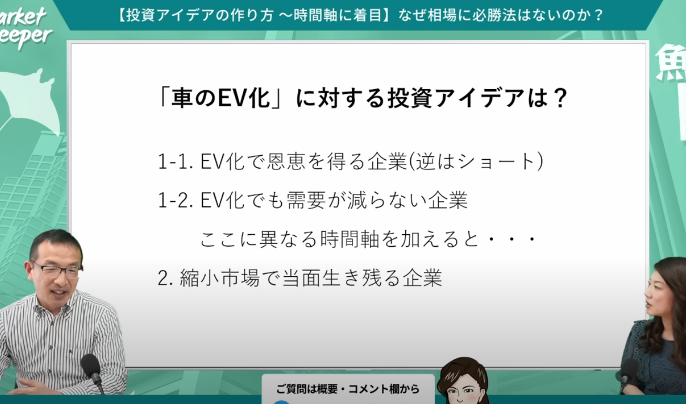

# [【投資アイデアの作り方〜時間軸に注目】なぜ相場に必勝法はないのか？（清川鉉徳さん） マーケットディーパー](https://www.youtube.com/watch?v=tIqdE0OCxKo)

みておこうと思っていた動画のメモ。
- 
    - 1-1はEVのメーカーやバッテリーなどの部材を生産する会社
    - 1-2はタイヤやワイパー、サスペンションなど既存の「車」と共通項のある会社
    - 加えてアイデア
      - EVは重い→タイヤやサスペンション、ブレーキに付加価値が生まれる
    - 加えて時間軸
      - 普通は超長期的に（将来的に内燃車はEVに置き換えられる）
      - 短期的には縮小市場で生き残る企業
        - その企業が市場での数字を増やしていく
        - 例えばNGK（日本特殊陶業）は排気ガスのセンサーやプラグ
        - 例えば、原油・石炭とか