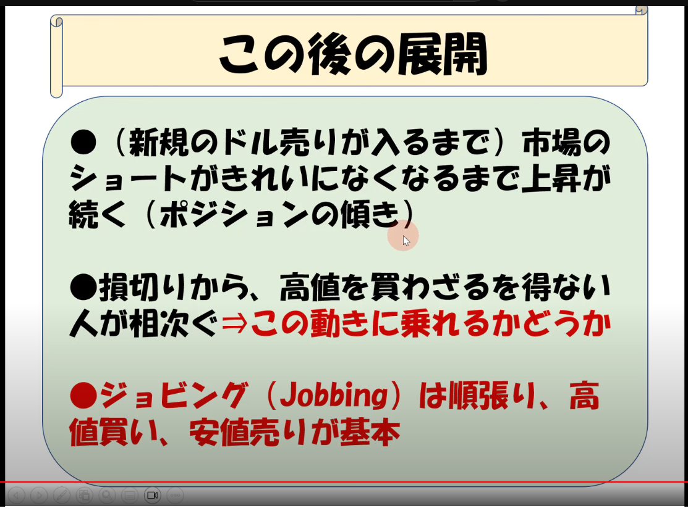
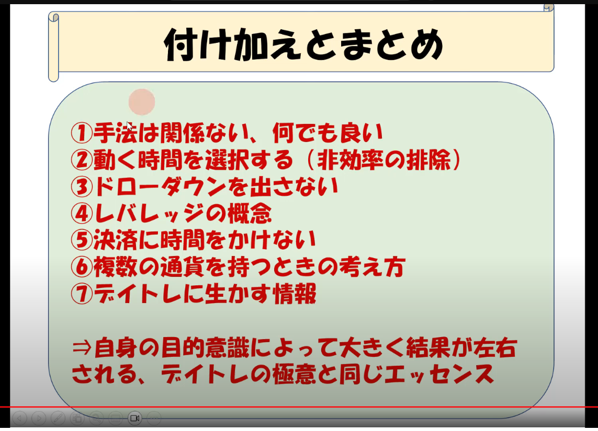

# [【2024年7月21日】為替取引 短期売買のイロハ 順張りの極意はコレだ　突き詰めると簡単な相場を見逃さないこと　それは水準訂正の動きをしっかり見極めて相乗りすること　これに尽きます](https://www.youtube.com/watch?v=6i6Ey2dTwbM)

ポジションの傾きをみる、ってなんだろうと思ってたところにいい動画。
- 
- 市場の水準訂正
  - 間違ったポジションが一掃されていく過程
  - ポジションの売買をひっくり返す過程
- 