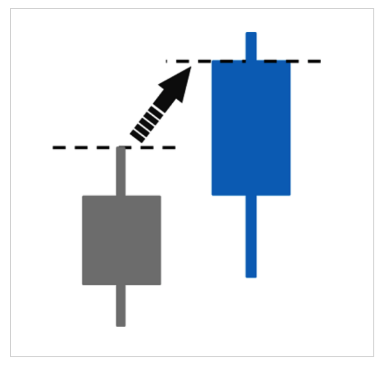

## [チャートパターン（フォーメーション分析）](https://www.oanda.jp/lab-education/beginners/technical_analysis/formation_analysis/)

そもそもチャートパターンの完成は、ネックラインを超えることが条件らしい。トリプルトップであれば、谷の2回の安値を割った時に成立する。  
大きな用途として
- トレンド転換の予想
- トレンド転換からの値幅の予測  
  例えば、ダブルトップでは、最高値から谷（ネックライン）までの値幅が下落幅の目安となる
があるらしい。  
また、チャートパターンは主に「反転型」と「継続型」の2種類に分けられるのだとか。  
ネックラインを超える（抵抗線を越える？）ことが大事なわけは、含み損が損切りされるタイミングであり、それがトレンドの変換を意味するのだとか。たぶん。

### 反転型

主に高値圏と安値圏で発生し、トレンド転換を示唆する。文字通り。
####  ヘッド＆ショルダーズトップ（三尊天井）／ボトム（逆三尊）

同じ水準の高値（安値）を2回と中央にさらに高値（安値）をつけ山の字を書いたあ後にネックライン超えたら、いったんそのトレンドが終わったと予測できる。
#### トリプルトップ／ボトム

同じ水準の高値（安値）を3回つけた後にネックラインを超えた時に、いったんそのトレンドが終わったと予測できる。

#### ダブルトップ／ボトム

同じ水準の高値（安値）を2回つけた後にネックラインを超えた時に、いったんそのトレンドが終わったと予測できる。

#### ソーサートップ／ボトム

もみあいからネックラインを超える／割ることをいう。それぞれブレイクした方向へのトレンドを示唆する。

### 継続型

トレンドが一休みするタイミングで発生し、文字通りそのトレンドの継続を示唆する。  
抵抗線で三角形ができたら気をつけよ。

#### アセンディング／ディアセンディングトライアングル

下値もしくは上値の抵抗線が切り上がり／切り下がり、もう一方の抵抗線が並行である時、その並行な抵抗線をブレイクした方向へのトレンド継続を示唆する。

#### 上昇・下降フラッグ

上値下値それぞれの抵抗線が並行であり（菱形にみえる）、
- それが右肩下がりの場合に上値抵抗線をブレイクを上昇フラッグ（上昇トレンドの継続を示唆）といい
- 右肩上がり場合に下値抵抗線をブレイクすることを下降フラッグ（下降トレンドの継続を示唆）
という。

#### 上昇・下降ペナント

上値抵抗線と下値抵抗線が2等辺三角形を示し、
- チャートの最初の頂点が下値から形成され、上値抵抗線をブレイクすると上昇ペナントと呼ばれ、上昇の継続を示唆し、
- チャートの最初の頂点が上値から形成され、下値抵抗線をブレイクすると下降ペナントと呼ばれ、下降の継続を示唆する

#### 上昇・下降ウェッジ

その時のトレンドに反し、上値抵抗線と下値抵抗線の幅を狭めながらチャートが進んだ場合、トレンド方向に抵抗線をブレイクすることをウェッジという。
- 下降トレンド中にウェッジが発生した時には下降トレンドの継続を示唆する
- 上昇トレンド中にウェッジが発生した時には上昇トレンドの継続を示唆する

#### レクタングル

上値抵抗線と下値抵抗線が並行で、上値下値が一定の時、いずれかの抵抗線をブレイクした方向へのトレンド形成が示唆される。

## ローソク足のパターン

覚えていないので覚えよう

### [平均足](https://hirose-fx.co.jp/category/market/tec/content_tec/17.html#:~:text=%E5%B9%B3%E5%9D%87%E8%B6%B3%E3%81%A8%E3%81%AF%E3%80%81%E6%9C%AC%E6%9D%A5,%E7%B5%82%E5%80%A4%E3%81%AE%E5%B9%B3%E5%9D%87%E3%81%8B%E3%82%89%E5%B0%8E%E3%81%8D%E5%87%BA%E3%81%99%E3%80%82)

通常のローソク足の始値に、その一本前のローソク足の実体部の中央値を用い、高値・安値はその足のものを用いる。終値はその足のすべての値の平均値を用いる。ってことなのかな。

#### 見方

平均足の売買の方向が一致して、並んでいる時にトレンドを示唆する。

#### 陽・陰線とヒゲの組み合わせ

- 陽線＋上ヒゲ＝「強い買いシグナル」
- 陰線＋下ヒゲ＝「強い売りシグナル」
- 陽線＋下ヒゲ＝「売りへの転換が迫っているシグナル」
- 陰線＋上ヒゲ＝「買いへの転換が迫っているシグナル」

#### 実体部（ローソクの本体部分）の長さ

- 前日の実体部より短い＝「トレンド転換が迫っているシグナル」
- 非常に短い実体部＝「トレンド転換のシグナル」

## [出来高](https://www.oanda.jp/lab-education/technical_analysis/volume_index/meaning_volume/)  

ある一定期間に売買が成立した数量のことで、FXやCFDにおいては、価格が変動した回数が表示される。  
そのほかの指標と組み合わせて使用するようにしよう。

- 上昇局面において
  - 出来高の増加→上昇を示唆する
  - 出来高の減少→トレンドの終了・反転を示唆する
- 下落局面において
  - 出来高の増加→トレンドの終了・反転を示唆する
  - 出来高の減少→下落を示唆する

# プライスアクション

一般的に日足で見るものらしい。

## ピンバー

- どちらか一方に髭が伸びた足→安値・高値が実体より遠いことを示す
- 抵抗帯・支持帯を示す

### スパイクハイ・スパイクロー

- 高値底値圏でで高値底値方向に発生する長い髭つきの足→高値底値圏のポジションの手仕舞い・転換を示す
- ダマシの場合もある

## スラストアップ・スラストダウン

- 前の足の最高値・最安値を次の足の実態で抜けること
- 強い上昇・下落のサインを示す
- ダマシもしくは途切れた場合は、トレンドレスを示すのかも（あるいはトレンドの終わりなのかも）

## ランウェイアップ・ランウェイダウン

# 読んだ記事

- チャートの見方について
  - [FXチャートの見方｜コツや相場分析方法を初心者向けに詳しく解説](https://www.oanda.jp/lab-education/beginners/aboutfx/read_fx_chart/)