# やること

- ちゃんと考えながらいっぱい取引する（連続損、3つまでのリソースを最大限活用する）
- エントリーする前にしばらくチャート・値動きを眺める
- 指標の前に値動き方向感を考えておく

# やらないこと

- なんピン
- パッと見てエントリー
- 乗れそうだったチャンスに乗れなかった時に慌てる
- 自宅以外で触らない

# 2024-08-19

| IN      | →時間   | OUT     | →時間   | 売買  | 損益    | メモ                                                                 |
| ------- | ----- | ------- | ----- | --- | ----- | ------------------------------------------------------------------ |
- 22:15	米)ウォラーFRB理事の発言(投票権あり)	
- 23:00	米)景気先行指数
# 2024-08-20

オーダーは43%対57%でロングが優勢、ポジションは44%対56%でロングが優勢。
昨晩より全体的にほんの少し円安にふれている。
146.329→146.702

| IN      | →時間  | OUT     | →時間  | 売買   | 損益    | メモ                                                           |
| ------- | ---- | ------- | ---- | ---- | ----- | ------------------------------------------------------------ |
| 146.491 | 0902 | 149.401 | 0904 | sell | 900   | 大きく売られていたので順張り、ちゃんと利食い損切りの設定もできる。また、トレイリングストップはもう少し使い方を考えたい。 |
| 146.374 | 0905 | 146.247 | 0909 | sell | 1270  | 同上                                                           |
| 146.310 | 0912 | 146.305 | 0913 | sell | 50    | 同上                                                           |
| 146.361 | 1000 | 146.198 | 1001 | sell | 1630  | 同上                                                           |
| 146.081 | 1014 | 146.202 | 1020 | sell | -1210 | フィボナッチの戻りの水準で売るも、そこから反発してもう一段上にタッチして損切り                      |
| 146.270 | 1055 | 146.350 | 1058 | sell | -800  | 損切り浅め。移動平均5を下に割ったので。足が確定する前に入ってしまった。                         |
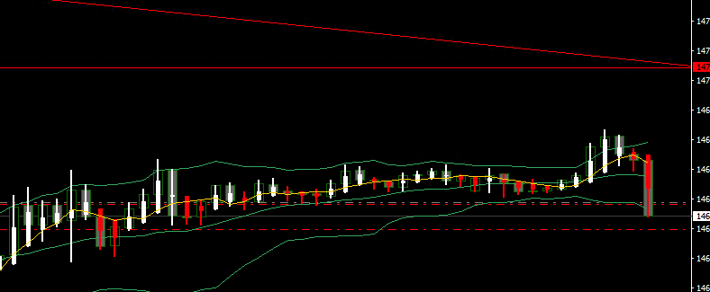
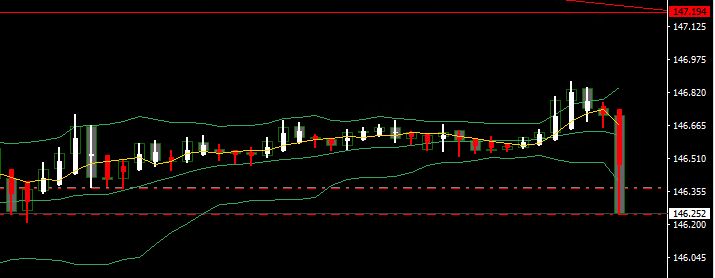 
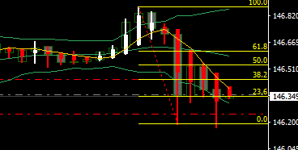
↓失敗
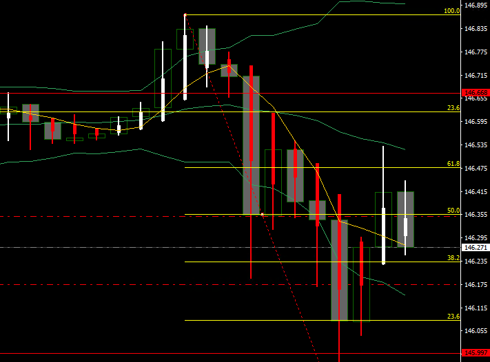

- 07:45	NZ)貿易収支	米国以外
- 10:30	豪)RBA議事録公表(8月6日開催分)
- 18:30	ス)ジョーダンSNB総裁の発言
- 20:00	ト)TCMB政策金利＆声明発表
- 21:30	加)消費者物価指数
- 26:35	米)ボスティック：アトランタ連銀総裁の発言(投票権あり)	米国
- 27:45	米)バーFRB副議長の発言(投票権あり)
# 2024-08-21

オーダーは44%対56%でロングが優勢、ポジションは48%対52%でロングが優勢。
ドル安感がある。
146.702→145.330
1y:4.43
5y:3.7
10y:3.82
30y:4.07

| IN      | →時間  | OUT     | →時間  | 売買   | 損益  | メモ                                                   |
| ------- | ---- | ------- | ---- | ---- | --- | ---------------------------------------------------- |
| 145.564 | 2231 | 145.552 | 2234 | sell | 90  | 狙っていたとこで売れなかったけど、トレイリングストップを試してみたかったので参入。あまり良くないですね。 |

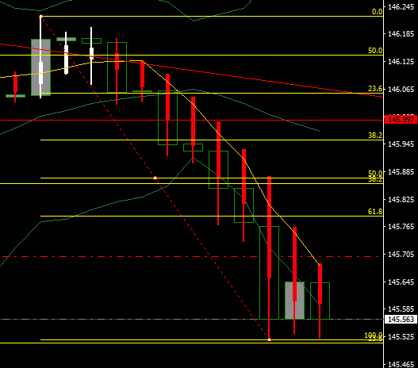
- 20:00	米)MBA住宅ローン申請指数	米国
- 2300	米国雇用統計の改定値発表  
  →81.8万人減で発表前の水準より上にいく
- 23:30	米)週間原油在庫
- 26:00	米)20年債入札
- 27:00	米)FOMC議事録公表(7月30日・31日開催分)
# 2024-08-22

オーダーは40%対60%でロングが優勢、ポジションは48%対52%でロングが優勢。
昨日の昼間はドル円も上昇していたけど、一日すぎて、行ってこいっだったみたい。
145.330→145.224
1y:4.36
5y:3.64
10y:3.79
30y:4.06

| IN      | →時間  | OUT     | →時間  | 売買   | 損益   | メモ                                                                 |
| ------- | ---- | ------- | ---- | ---- | ---- | ------------------------------------------------------------------ |
| 145.253 | 1001 | 145.351 | 1003 | sell | -980 |                                                                    |
| 145.554 | 1115 | 145.577 | 1121 | buy  | 230  |                                                                    |
| 145.475 | 1124 | 145.467 | 1132 | sell | 80   |                                                                    |
| 145.442 | 1145 | 145.426 | 1149 | sell | 160  |                                                                    |
| 145.396 | 1149 | 145.450 | 1158 | sell | -540 |                                                                    |
| 145.392 | 1200 | 145.372 | 1212 | sell | 200  |                                                                    |
| 146.001 | 2153 | 145.893 | 2209 | sell | 1080 | ダブルトップ？                                                            |
| 146.975 | 2224 | 145.900 | 2226 | buy  | -750 | 上の売りは調整に乗じたつもりだったので。前の足が長めの下髭／ちょっと早かったし、エントリーするなら遅かった／損切りが浅かった？→だ！ |
自分は下だと思っているけど、午後からはずっと上方向に動いている。なんでだろう。
目線が違った時に冷静についていけるようになりたい。

- 16:15	仏)製造業PMI【速報値】	米国以外  
  仏)非製造業PMI【速報値】
- 16:30	独)製造業PMI【速報値】  
  独)非製造業PMI【速報値】
- 17:00	欧)製造業PMI【速報値】  
  欧)非製造業PMI【速報値】
- 17:30	英)製造業PMI【速報値】  
  英)非製造業PMI【速報値】
- 20:00	欧)ECB理事会議事要旨公表(7月18日開催分)
- 21:30	米)新規失業保険申請件数	米国  
  米)シカゴ連銀全米活動指数
- 22:45	米)製造業PMI【速報値】  
  米)非製造業PMI【速報値】
- 23:00	米)中古住宅販売件数
- 23:30	米)週間天然ガス貯蔵量
- 24:00	米)カンザスシティ連銀製造業活動指数
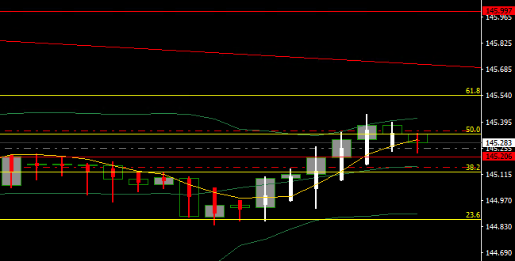
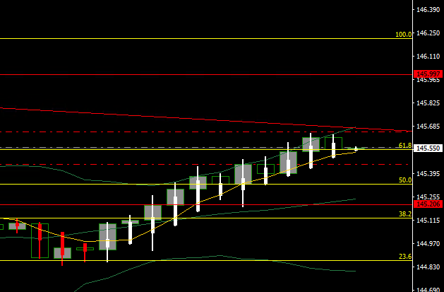
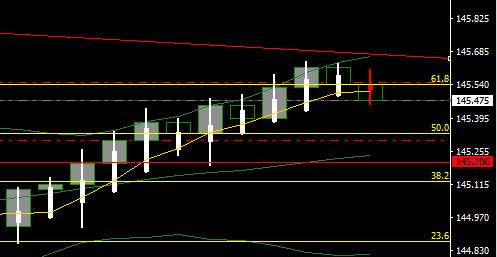
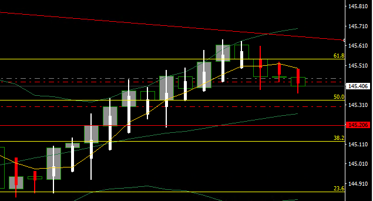
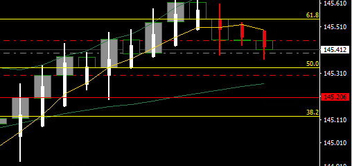
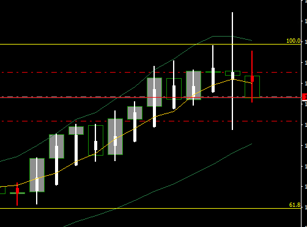
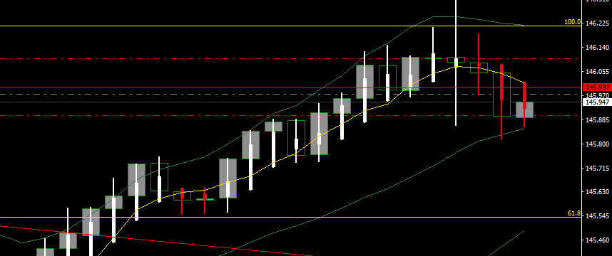  
PMI上振れていい感じ〜まで妄想してたポジションだけど、結果としてそうなった。損切りラインの設定がむずかしいなぁ〜。
# 2024-08-23

| IN  | →時間 | OUT | →時間 | 売買  | 損益  | メモ  |
| --- | --- | --- | --- | --- | --- | --- |

- 07:45	NZ)第2四半期小売売上高	米国以外
- 08:30	日)全国消費者物価指数＆【除生鮮】  
  未定	日)植田日銀総裁の発言(閉会中審査に出席、株価乱高下について)  
  日)鈴木財務相の発言(閉会中審査に出席、株価乱高下について)
- 21:30	加)小売売上高＆【除自動車】
- 24:00	英)ベイリーBOE総裁の発言(ジャクソンホール会議での講演)
- 23:00	米)新築住宅販売件数	米国  
  米)パウエルFRB議長の発言(ジャクソンホール会議での講演)

# 総括
| IN  | pips | 損益  | 対目標 | 勝ち  | 負け  | 元本      |
| --- | ---- | --- | --- | --- | --- | ------- |
| 月   |      |     |     |     |     |         |
| 火   |      |     |     |     |     |         |
| 水   |      |     |     |     |     |         |
| 木   |      |     |     |     |     |         |
| 金   |      |     |     |     |     |         |
| 計   |      |     |     |     |     | 50,0000 |

| 通貨ペア | 今週末 | 前週末 | 騰落  |
| ---- | --- | --- | --- |
|      |     | 0   |     |

- 反省のためにチャートに印をつけておこう
- 乗り遅れたた焦りと苛立ちから無謀なエントリーをしがちなのを反省しよう
- 指値・逆指値の使い方を上手くなりたい
- MT4の注文周りを改善したい