# やること

- ちゃんと考えながらいっぱい取引する（連続損、3つまでのリソースを最大限活用する）
- エントリーする前にしばらくチャート・値動きを眺める
- 指標の前に値動き方向感を考えておく
- その日の終わりに値動きをスクショしておく

# やらないこと

- なんピン
- パッと見てエントリー
- 乗れそうだったチャンスに乗れなかった時に慌てる
- 自宅以外で触らない
- 足の完成を見る前のエントリー
- ポジションをぐちゃぐちゃ触る
- 取引をしすぎない
- 目標が高いので、いちいちがっかりしない

ドル円のIMM通貨先物ポジションは先週末も買い越し
# 2024-08-26

オーダーは45%対55%でロングが優勢、ポジションは47%対53%でロングが優勢。

145.999→143.667
1y:4.43→4.36
5y:3.72→3.73
10y:3.86→3.81
30y:4.13→4.1
金:2514.81
原油:76.253
日経:37894
ナスダック:19728

一日方向感がつかめなかった。円売りらしい。

| 0売買  | →時間  | IN      | →時間  | OUT     | 損益    | メモ                                                    |
| ---- | ---- | ------- | ---- | ------- | ----- | ----------------------------------------------------- |
| sell | 1029 | 143.584 | 1033 | 143.726 | -1420 | 平均足とローソク足の反転が戻り売りになるかなと思ったら、吹っ飛ばされた。直近の底値が固い点を見逃していた。 |
| sell | 1100 | 143.729 | 1118 | 143.583 | 1380  | ローソク足の反転を見てからエントリー。リグエルも設定をいじりすぎてポジションが消滅。            |
| sell | 1129 | 143.590 | 1127 | 143.750 | -1680 | ×ほんとに良くない。上の対応が正しかったみたい。やられてよくをかいている。                 |
| sell | 1131 | 143.721 | 1154 | 143.908 | -1870 | ×ほんとに良くない。そこが固いのが見えているのに売りに固執してしまった。                  |
| sell | 2150 | 143.980 | 2203 | 143.972 | 80    | 逆指値+トレイリングストップでやってみようか                                |
| buy  | 2239 | 144.206 | 2242 | 144.251 | 450   | 狙い通りの細かい利食いができた。順張りは細か利食いたい。                          |
|      |      |         |      |         | -3070 |                                                       |

- 17:00	独)IFO景況指数	米国以外
- 21:30	米)耐久財受注＆【除輸送用機器】	米国
- 23:30	米)ダラス連銀製造業活動指数

×

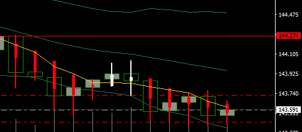
○
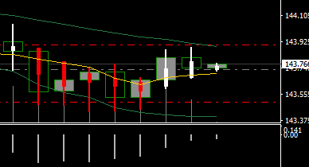
×
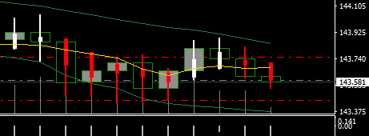
△
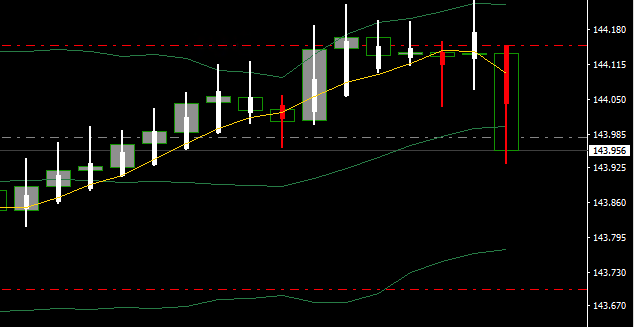

今日の値動き
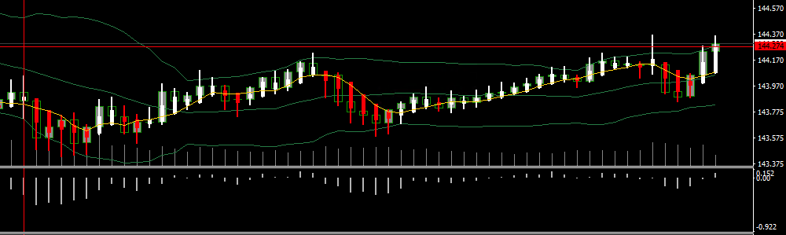
# 2024-08-27

オーダーは43%対57%でロングが優勢、ポジションは45%対55%でロングが優勢。
円売り・ドル買いの両方だったのかも。
143.667→144.819
金:2514.81→2512.72
原油:76.253→77.815
日経:37894→38061
ナスダック:19728→19504
1y:4.43→4.36→4.38
5y:3.72→3.65→3.66
10y:3.86→3.81→3.82
30y:4.13→4.1→4.11

| 売買   | 時間   | →IN     | 時間   | →OUT    | 損益    | メモ                                         |
| ---- | ---- | ------- | ---- | ------- | ----- | ------------------------------------------ |
| sell | 1030 | 144.723 | 1040 | 144.690 | 330   | 下落に乗って5pips狙いも、トレーリングストップで決済               |
| sell | 1115 | 144.657 | 1116 | 144.711 | -540  | 覚えておくべきチャートパターンを無視してしまった。                  |
| sell | 1150 | 144.871 | 1218 | 144.904 | -330  | ダブルトップからの反落を狙う。なんか決済がつかずに逆指値で消滅。           |
| buy  | 1606 | 144.724 | 1606 | 144.924 | 500   | ロングの順張りで細かく利食いたい。直近の高値を抜けてからのエントリーでよかった。反省 |
| buy  | 1647 | 145.06  | 1650 | 144.990 | -700  | 直近の高値をとっていたのでついて行こうと思ったら反落。当初の方針は戻り狙いだった。  |
| buy  | 1701 | 145.023 | 1715 | 145.022 | -10   | 移動平均5を支えに下髭が出ていたのでロング／ほぼどうね撤退。             |
| sell | 1802 | 145.005 | 1815 | 144.898 | 1070  | なんかで反転したと判断したんだと思う                         |
| sell | 2112 | 144.454 | 2117 | 144.525 | -710  | ボリンジャーバンド下限タッチの順張り                         |
| sell | 2138 | 144.479 | 2138 | 144.397 | 820   | 直近の下値を超えたため                                |
| sell | 2201 | 144.295 | 2211 | 144.410 | -1150 | だめ／狙っていた位置でエントリーできずに諦められなかった               |
| sell | 2214 | 144.415 | 2240 | 144.296 | 1190  | 移動平均5で頭を抑えられたように見えたので                      |
|      |      |         |      |         | 370   |                                            |
- 22:00	米)S＆P/ケース・シラー住宅価格指数	米国  
  米)住宅価格指数＆第2四半期住宅価格指数
- 23:00	米)消費者信頼感指数  
  米)リッチモンド連銀製造業指数   
  消費者の間では悲観ムードがあるらしい。データも良くないとか。
- 26:00	米)2年債入札
○
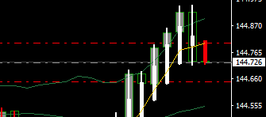
×
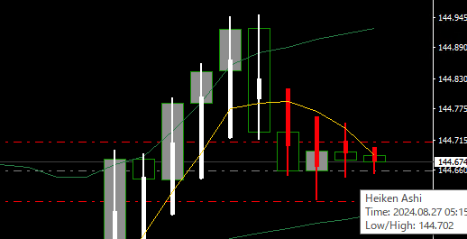
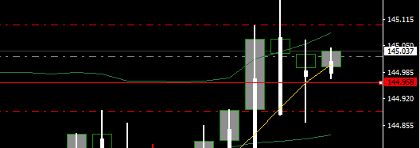
×
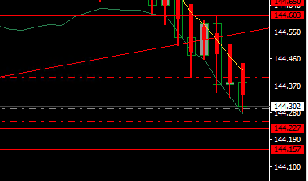
○
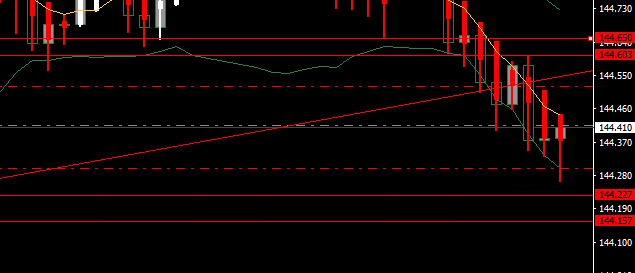
今日の値動き
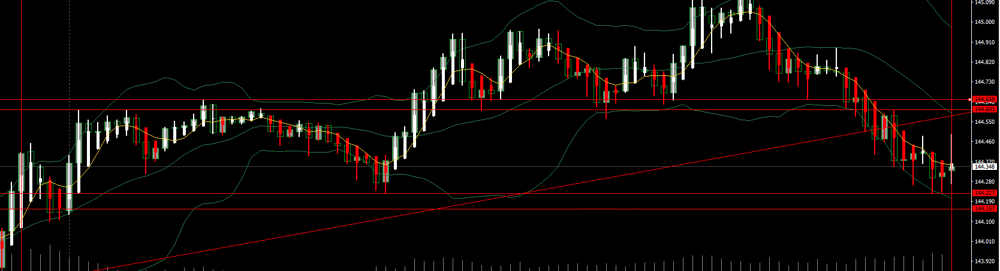
# 2024-08-28
オーダーは44%対56%でロングが優勢、ポジションは48%対52%でロングが優勢。
値幅はあるけど、大きなレンジの中にいるのかなぁ。難しい。産油国か強い。
143.667→144.819→144.213
金:2514.81→2512.72→2524.32
原油:76.253→77.815→76.794
日経:37894→38061→38277
ナスダック:19728→19504→19358
1y:4.43→4.36→4.38→
5y:3.72→3.65→3.66→
10y:3.86→3.81→3.82→
30y:4.13→4.1→4.11→

| 売買  | 時間   | →IN     | 時間   | →OUT    | 損益  | メモ                          |
| --- | ---- | ------- | ---- | ------- | --- | --------------------------- |
| buy | 1137 | 144.339 | 1158 | 144.403 | 640 | 移動平均５を抵抗に売りが否定されているように見えるため |
|     |      |         |      |         | 640 |                             |
- 8月の月末スポット応当日(2営業日後に決済)	
- 14:15	米)ウォラーFRB理事の発言(投票権あり)
- 10:30	豪)消費者物価指数	
- 20:00	米)MBA住宅ローン申請指数
- 23:30	米)週間原油在庫
- 26:00	米)5年債入札
- 米株引後	米)NVIDIA決算
○
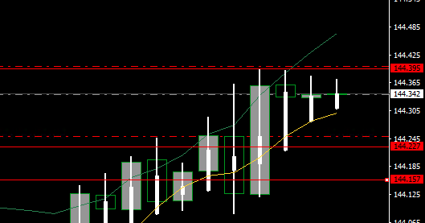
今日の値動き
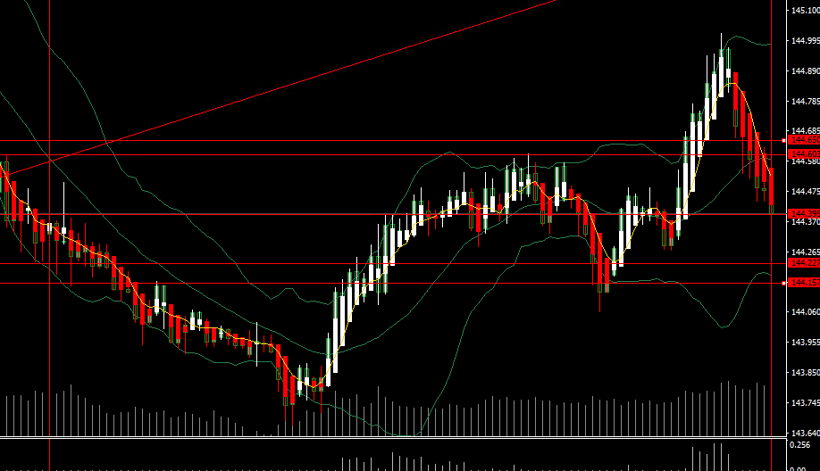

# 2024-08-29
オーダーは41%対59%でロングが優勢、ポジションは47%対53%でロングが優勢。
ウォッチしている通貨ペア間で大きな値動きはない。そのほか金融商品にも大きな動きがないように見える。短期の金利が下がっている？
143.667→144.819→144.213→144.559
金:2514.81→2512.72→2524.32→2512.64
原油:76.253→77.815→76.794→75.342
日経:37894→38061→38277→38166
ナスダック:19728→19504→19358→19177
1y:4.43→4.36→4.38→4.36
5y:3.72→3.65→3.66→3.63
10y:3.86→3.81→3.82→3.84
30y:4.13→4.1→4.11→4.13

| 売買   | 時間   | →IN     | 時間   | →OUT    | 損益    | メモ                                          |
| ---- | ---- | ------- | ---- | ------- | ----- | ------------------------------------------- |
| sell | 1018 | 144.350 | 1025 | 144.450 | -1000 | 包足をみたので下がるかなと思ったら損切り水準にタッチ。ちょっと焦って入るのが早すぎた？ |
|      |      |         |      |         | -1000 |                                             |
-  07:00	米)ボスティック：アトランタ連銀総裁の発言(投票権あり)	米 
- 10:00	NZ)ANZ企業景況感	米国以外
- 10:30	豪)第2四半期民間設備投資
- 21:00	独)消費者物価指数【速報値】
- 21:30	加)第2四半期経常収支
- 25:00	ス)ジョーダンSNB総裁の発言
- 21:30	米)新規失業保険申請件数  
  新規申請はこれまでの水準の中にあるけど、継続受給者数は徐々に増えている
  米)第2四半期GDP【改定値】/個人消費【改定値】  
  米)卸売在庫【速報値】
- 23:00	米)中古住宅販売保留
- 23:30	米)週間天然ガス貯蔵量
- 26:00	米)7年債入札
- 28:30	米)ボスティック：アトランタ連銀総裁の発言(投票権あり)
# 2024-08-30

オーダーは42%対58%でロングが優勢、ポジションは43%対57%でロングが優勢。

143.667→144.819→144.213→144.559→144.820
金:2514.81→2512.72→2524.32→2512.64→2518.16
原油:76.253→77.815→76.794→75.342→76.735
日経:37894→38061→38277→38166→38517.27
ナスダック:19728→19504→19358→19177→19381
1y:4.43→4.36→4.38→4.36→4.38
5y:3.72→3.65→3.66→3.63→3.66
10y:3.86→3.81→3.82→3.84→3.87
30y:4.13→4.1→4.11→4.13→4.15

| 売買  | 時間  | →IN | 時間  | →OUT | 損益  | メモ  |
| --- | --- | --- | --- | ---- | --- | --- |
- 08:30	日)東京都区部消費者物価指数＆【除生鮮】	米国以外  
  意外と注目されているかも。
- 10:30	豪)小売売上高
- 18:00	欧)消費者物価指数【速報値】＆【コア】
- 21:30	加)GDP/第2四半期GDP
- 21:30	米)個人所得/個人支出/PCEデフレーター/PCEコア・デフレーター
- 22:45	米)シカゴ購買部協会景気指数
- 23:00	米)ミシガン大学消費者信頼感指数【確報値】

# 総括
| IN  | pips | 損益    | 対目標 | 勝ち  | 負け  | 元本      |
| --- | ---- | ----- | --- | --- | --- | ------- |
| 月   |      | -3070 |     | 3   | 3   |         |
| 火   |      | 370   |     | 6   | 5   |         |
| 水   |      | 640   |     | 1   | 0   |         |
| 木   |      | -1000 |     | 0   | 1   |         |
| 金   |      |       |     |     |     |         |
| 計   |      | -3060 |     | 10  | 9   | 50,0000 |
