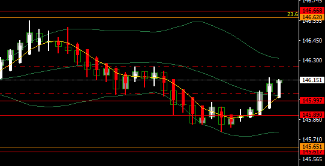
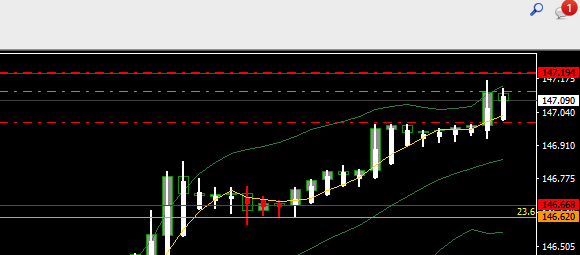
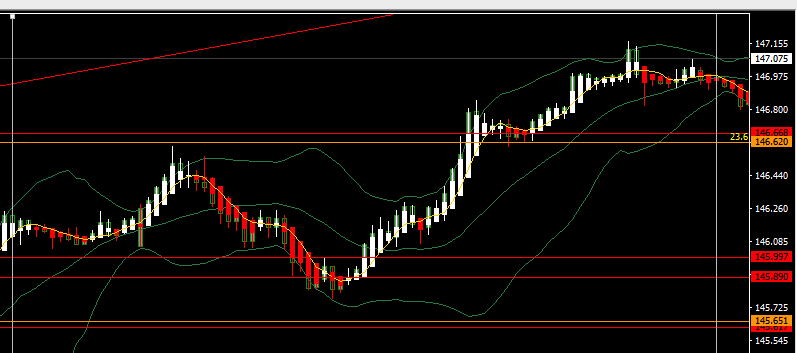
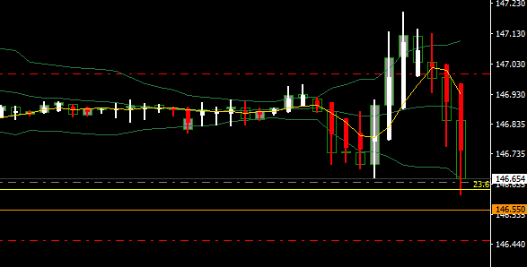
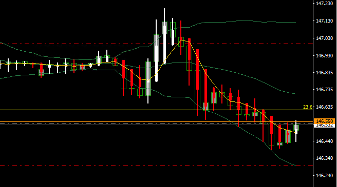
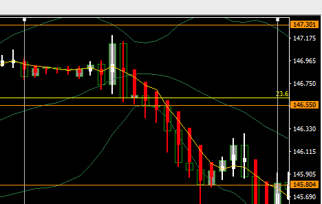
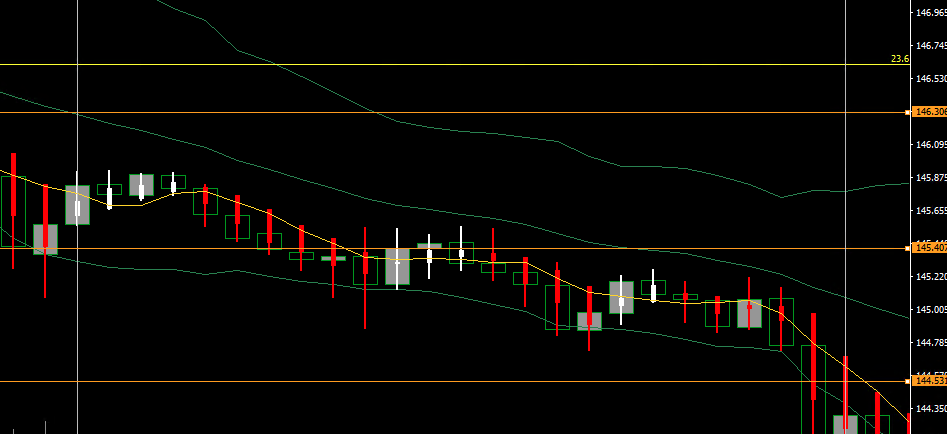
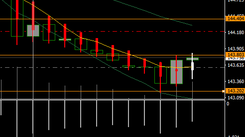
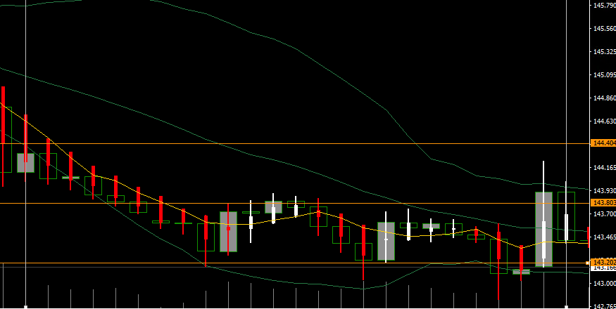
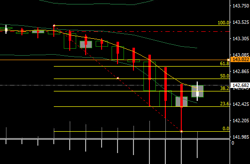

# やること

- ちゃんと考えながらいっぱい取引する（連続損、3つまでのリソースを最大限活用する）
- エントリーする前にしばらくチャート・値動きを眺める
- 指標の前に値動き方向感を考えておく
- その日の終わりに値動きをスクショしておく
- 想定レンジを作って、その中で取引する
- 月の最終週に為替と株式の騰落を調べておく（資金フローを調べる）
# やらないこと
- なんピン
- パッと見てエントリー
- 乗れそうだったチャンスに乗れなかった時に慌てる
- 自宅以外で触らない
- 足の完成を見る前のエントリー
- ポジションをぐちゃぐちゃ触る
- 取引をしすぎない
- 目標が高いので、いちいちがっかりしない
- 想定レンジを超えての取引
***
# 前週の点検と今週の方針

ドル円のIMM通貨先物ポジションは先週末も買い越し
先週の値動きはあまり方向感がない前半から週の後半にかけた上昇みたいな感じだった（？）エヌヴィディアの決算や失業率・PCEは問題なくクリアできたので上に抜けたのかな。今週はとりあえず買い目線？
## 前週の値動き
ドル円：143.667→144.820
金：2514.81→2518.16
原油：76.253→76.735
日経：37894→38517.27
ナスダック：19728→19381
1y：4.43→4.38
5y：3.72→3.66
10y：3.86→3.87
30y：4.13→4.15
## 月初の値
ドル円：146.230
金：2503.46
原油：73.964
日経：38932.61
ナスダック：19566
1y：4.21
5y：3.7
10y：3.9
30y：4.2
***

# 2024-09-02

オーダーは41%対59%でロングが優勢、ポジションは42%対58%でロングが優勢。

ドル円：144.820→146.230
金：2518.16→2503.46
原油：76.735→73.964
日経：38517.27→38932.61
ナスダック：19381→19566
1y：4.38→4.21
5y：3.66→3.7
10y：3.87→3.9
30y：4.15→4.2
→リスクオンっぽい値動きに思う

| 売買  | →時間  | IN      | →時間  | OUT     | 損益    | メモ                                                             |
| --- | ---- | ------- | ---- | ------- | ----- | -------------------------------------------------------------- |
| buy | 1431 | 146.155 | 1509 | 146.251 | 960   | 前の前の足の高値を前の足で更新が確定したので                                         |
| buy | 2230 | 147.125 | 2249 | 146.929 | -1960 | ブレイクしたので大きく動くと思ったら、反転サインが出た／ブレイク前に下髭陽線が続いていたのでそのタイミングでロングがよかった |
|     |      |         |      |         | -1000 |                                                                |
- アメリカ・カナダおやすみ
- 10:30	豪)住宅建設許可件数
- 10:45	中)財新製造業PMI
-	米)注目度の高い経済指標の発表はない	米国
○

×

本日の値動き

# 2024-09-03

オーダーは40%対60%でロングが優勢、ポジションは42%対58%でロングが優勢。

ドル円：144.820→146.230→147.049
金：2518.16→2503.46→2495.32
原油：76.735→73.964→74.497
日経：38517.27→38932.61→38915.90
ナスダック：19381→19566→19536
1y：4.38→4.21→4.39
5y：3.66→3.7→3.72
10y：3.87→3.9→2.92
30y：4.15→4.2→4.21
→円安なのかな

| 売買  | →時間  | IN      | →時間  | OUT     | 損益    | メモ                                                                             |
| --- | ---- | ------- | ---- | ------- | ----- | ------------------------------------------------------------------------------ |
| buy | 1056 | 146.641 | 1310 | 146.422 | -2190 | 想定レンジの中心に触れたのと、ボリンジャーバンド下限での下げ止まりを期待して                                         |
| buy | 1356 | 146.538 | 1418 | 146.3   | -2380 | 移動平均5を上回って、上のポジションを取り直そうと思ったら急落。なんだろう。→日銀の上田さんの発言が発端らしい。これはしょうがないか。いずれにしてもダメか。 |
|     |      |         |      |         |       |                                                                                |
- 10:30	豪)第2四半期経常収支	米国以外
- 22:45	米)製造業PMI【改定値】	米国
- 23:00	米)ISM製造業景況指数  
  米)建設支出
×

×

本日の値動き

# 2024-09-04

オーダーは43%対58%でロングが優勢、ポジションは46%対54%でロングが優勢。

ドル円：144.820→146.230→147.049→145.229
金：2518.16→2503.46→2495.32→2492.96
原油：76.735→73.964→74.497→70.422
日経：38517.27→38932.61→38915.90→37245
ナスダック：19381→19566→19536→18817
1y：4.38→4.21→4.39→4.31
5y：3.66→3.7→3.72→3.64
10y：3.87→3.9→3.92→3.83
30y：4.15→4.2→4.21→4.12
→円高・リスクオフに見える（金も上がっていないけど）
　ISM・PMIも下振れていたらしい。
　昨日夕方のドル円の急落は日銀植田総裁の発言によるものだとか（？）
　眺めるチャートを１時間足にしてみよう。

| 売買   | →時間  | IN      | →時間  | OUT     | 損益   | メモ                                                |
| ---- | ---- | ------- | ---- | ------- | ---- | ------------------------------------------------- |
| sell | 1100 | 145.424 | 1602 | 144.799 | 6250 | 上髭で下落を続け、反発で高値更新が見られなかったのでエントリー／夜には決済もしくは逆指値を設定する |

- 10:30	豪)第2四半期GDP
- 10:45	中)財新非製造業PMI
- 23:30	加)マックレムBOC総裁の記者会見
- 20:00	米)MBA住宅ローン申請指数
- 21:30	米)貿易収支  
  加)貿易収支
- 22:45	加)BOC政策金利＆声明発表
- 23:00	米)JOLTS求人  
  米)製造業受注指数
- 27:00	米)地区連銀経済報告(ベージュブック)
○
 
本日の値動き

# 2024-09-05

オーダーは41%対59%でロングが優勢、ポジションは46%対54%でロングが優勢。

ドル円：144.820→146.230→147.049→145.229→143.614
金：2518.16→2503.46→2495.32→2492.96→2496.25
原油：76.735→73.964→74.497→70.422→70.047
日経：38517.27→38932.61→38915.90→37245→36772
ナスダック：19381→19566→19536→18817→18933
1y：4.38→4.21→4.39→4.31→4.2
5y：3.66→3.7→3.72→3.64→3.56
10y：3.87→3.9→3.92→3.83→3.76
30y：4.15→4.2→4.21→4.12→4.06
→リスクオフ・円高なのかな？そこまでのドル安ではないっぽい？

| 売買   | →時間  | IN      | →時間  | OUT     | 損益   | メモ                                       |
| ---- | ---- | ------- | ---- | ------- | ---- | ---------------------------------------- |
| sell | 1051 | 143.597 | 1517 | 143.200 | 3970 | 焦ってエントリーしてしまった。状況によっては早めに損切りして入り直したい。悪癖。 |
- 10:30	豪)貿易収支	米国以外  
  日)高田日銀審議委員の発言[あいさつ]
- 11:00	豪)ブロックRBA総裁の発言
- 17:30	英)建設業PMI
- 18:00	豪)ブロックRBA総裁の発言
- 20:30	米)チャレンジャー人員削減予定数	米国
- 21:15	米)ADP雇用統計
- 21:30	米)新規失業保険申請件数  
  米)第2四半期非農業部門労働生産性【改定値】/単位労働費用【改定値】
- 22:45	米)非製造業PMI【改定値】
- 23:00	米)ISM非製造業景況指数
- 23:30	米)週間天然ガス貯蔵量
- 24:00	米)週間原油在庫
○

本日の値動き

# 2024-09-06

オーダーは42%対58%でロングが優勢、ポジションは44%対56%でロングが優勢。

ドル円：144.820→146.230→147.049→145.229→143.614→143.162
金：2518.16→2503.46→2495.32→2492.96→2496.25→2516.37
原油：76.735→73.964→74.497→70.422→70.047→69.835
日経：38517.27→38932.61→38915.90→37245→36772→36528
ナスダック：19381→19566→19536→18817→18933→18757
1y：4.38→4.21→4.39→4.31→4.2→4.18
5y：3.66→3.7→3.72→3.64→3.56→3.53
10y：3.87→3.9→3.92→3.83→3.76→3.73
30y：4.15→4.2→4.21→4.12→4.06→4.02
→リスクオフ継続？昨日のADP雇用統計は下振れ、ISM非製造業景況感指数は上振れだった。
　戻り売り方針で、なるべく高い位置で売ってポジションを持っておきたいかな。

| 売買   | →時間  | IN      | →時間  | OUT     | 損益   | メモ                                  |
| ---- | ---- | ------- | ---- | ------- | ---- | ----------------------------------- |
| sell | 1723 | 142.682 | 1828 | 142.753 | -710 | 戻り売りを狙ってみたけど、早く買いすぎたので損切り。小林社長をしんじる |
- 21:30	加)失業率＆雇用ネット変化	米国以外
- 23:00	加)Ivey購買部協会指数
- 21:30	米)雇用統計：非農業部門雇用者数/失業率/製造業雇用者数/平均時給	米国
- 21:45	米)ウィリアムズ：NY連銀総裁の発言(投票権あり)
- 24:00	米)ウォラーFRB理事の発言(投票権あり)
×

# 総括
| IN  | pips | 損益    | 対目標 | 勝ち  | 負け  | 元本      |
| --- | ---- | ----- | --- | --- | --- | ------- |
| 月   |      | -1000 |     | 1   | 1   |         |
| 火   |      | -4570 |     |     | 2   |         |
| 水   |      | 6250  |     | 1   |     |         |
| 木   |      | 3970  |     | 1   |     |         |
| 金   |      | -710  |     |     | 1   |         |
| 計   |      | 3940  |     | 3   | 4   | 50,0000 |
