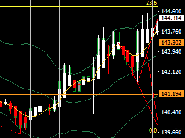

# やること

- ちゃんと考えながらいっぱい取引する（連続損、3つまでのリソースを最大限活用する）
- エントリーする前にしばらくチャート・値動きを眺める
- 指標の前に値動き方向感を考えておく
- その日の終わりに値動きをスクショしておく
- 想定レンジを作って、その中で取引する
- 月の最終週に為替と株式の騰落を調べておく（資金フローを調べる）
# やらないこと

- なんピン
- パッと見てエントリー
- 乗れそうだったチャンスに乗れなかった時に慌てる
- 自宅以外で触らない
- 足の完成を見る前のエントリー
- ポジションをぐちゃぐちゃ触る
- 取引をしすぎない
- 目標が高いので、いちいちがっかりしない
- 想定レンジを超えての取引
***
# 前週の点検と今週の方針

ドル円のIMM通貨先物ポジションは先週末も買い越し  
米国の利下げが0.5%で円高に進むかと思ったけど、経済も強いし、「予防的」というメッセージもあって、そんなにだった。さらに日銀据え置きで、円安方向で進んでいくのかな。かなりおサボり。

## 前週の値動き

ドル円：141.492→140.414→141.624→143.915→142.383
金：2558→2585→2573→2573→2588
原油：69.626→70.607→71.215→71.215→71.828
日経：36768→35895→36456→36456→37833
ナスダック：19447→19414→19464→19466→19807
2y：3.61→3.56→3.59→3.56→3.56
5y：3.43→3.41→3.43→3.52→3.47
10y：3.65→3.62→3.64→3.73→3.70
30y：3.97→3.93→3.95→4.04→4.04
## 月初の値
ドル円：146.230
金：2503.46
原油：73.964
日経：38932.61
ナスダック：19566
1y：4.21
5y：3.7
10y：3.9
30y：4.2
***

# 2024-09-24

オーダーは46%対54%でロングが優勢、ポジションは36%対64%でロングが優勢。

ドル円：142.383
金：2588
原油：71.828
日経：37833
ナスダック：19807
2y：3.56
5y：3.47
10y：3.70
30y：4.04

| 売買  | →時間 | IN  | →時間 | OUT | 損益  | メモ  |     |
| --- | --- | --- | --- | --- | --- | --- | --- |
- 13:30	豪)RBA政策金利＆声明発表
- 14:05	日)植田日銀総裁の発言[あいさつ]
- 14:30	豪)ブロックRBA総裁の記者会見
- 17:00	独)IFO景況指数
- 26:10	加)マックレムBOC総裁の発言
- 22:00	米)S＆P/ケース・シラー住宅価格指数
  米)住宅価格指数
  米)ボウマンFRB理事の発言(投票権あり)
- 23:00	米)消費者信頼感指数
  米)リッチモンド連銀製造業指数
- 26:00	米)2年債入札

# 2024-09-25

オーダーは46%対54%でロングが優勢、ポジションは36%対64%でロングが優勢。

ドル円：142.383→143.393
金：2588→2662
原油：71.828→72.156
日経：37833→38062
ナスダック：19807→19907
2y：3.56→3.54
5y：3.47→3.48
10y：3.70→3.74
30y：4.04→4.09

| 売買   | →時間  | IN      | →時間  | OUT     | 損益  | メモ                                                            |
| ---- | ---- | ------- | ---- | ------- | --- | ------------------------------------------------------------- |

- 10:30	豪)消費者物価指数
- 20:00	米)MBA住宅ローン申請指数
- 23:00	米)新築住宅販売件数
- 23:30	米)週間原油在庫
- 26:00	米)5年債入札
- 29:00	米)クーグラーFRB理事の発言(投票権あり)
# 2024-09-26

オーダーは43%対57%でロングが優勢、ポジションは39%対61%でロングが優勢。

ドル円：142.383→143.393→144.76
金：2588→2662→2684.80
原油：71.828→72.156→69.96
日経：37833→38062→38774
ナスダック：19807→19907→19972
2y：3.56→3.54→3.56
5y：3.47→3.48→3.53
10y：3.70→3.74→3.78
30y：4.04→4.09→4.13

| 売買   | →時間  | IN      | →時間  | OUT     | 損益  | メモ                                                            |
| ---- | ---- | ------- | ---- | ------- | --- | ------------------------------------------------------------- |

- 08:50	日)BOJ議事要旨公表(7月30日・31日開催分)
- 10:30	豪)RBA半期金融安定報告
- 16:30	ス)SNB政策金利＆声明発表
- 17:00	ス)ジョーダンSNB総裁の記者会見
- 21:30	米)新規失業保険申請件数
  米)第2四半期GDP【確報値】/個人消費【確報値】
  米)耐久財受注＆【除輸送用機器】
- 22:10	米)クーグラーFRB理事の発言(投票権あり)
  米)コリンズ：ボストン連銀総裁の発言(投票権なし)
- 22:15	米)ボウマンFRB理事の発言(投票権あり)
- 22:20	米)パウエルFRB議長の発言
- 22:25	米)ウィリアムズ：NY連銀総裁の発言(投票権あり)
- 22:30	欧)ラガルドECB総裁の発言
- 23:00	米)中古住宅販売保留
- 23:30	米)週間天然ガス貯蔵量
  米)バーFRB副議長の発言(投票権あり)
  米)クックFRB理事の発言(投票権あり)
- 24:00	米)カンザスシティ連銀製造業活動指数
- 24:15	米)イエレン財務長官の発言
- 26:00	米)7年債入札
  米)バーFRB副議長の発言(投票権あり)
  米)カシュカリ：ミネアポリス連銀総裁の発言(投票権なし)
# 2024-09-27

| 売買   | →時間  | IN      | →時間  | OUT     | 損益  | メモ                                                            |
| ---- | ---- | ------- | ---- | ------- | --- | ------------------------------------------------------------- |

- 08:30	日)東京都区部消費者物価指数＆【除生鮮】
- 07:00	米)クックFRB理事の発言(投票権あり)	米国
- 21:30	米)個人所得/個人支出/PCEデフレーター/PCEコア・デフレーター
  米)卸売在庫【速報値】
  加)GDP
- 22:30	米)クーグラーFRB理事の発言(投票権あり)
  米)コリンズ：ボストン連銀総裁の発言(投票権なし)
- 23:00	米)ミシガン大学消費者信頼感指数【確報値】
- 26:15	米)ボウマンFRB理事の発言(投票権あり)

# 総括
| IN  | pips | 損益  | 対目標 | 勝ち  | 負け  | 元本      |
| --- | ---- | --- | --- | --- | --- | ------- |
| 月   |      |     |     |     |     |         |
| 火   |      |     |     |     |     |         |
| 水   |      |     |     |     |     |         |
| 木   |      |     |     |     |     |         |
| 金   |      |     |     |     |     |         |
| 計   |      |     |     |     |     | 50,0000 |

[引用元（【9月23日～の週】今週の為替相場の注目材料スケジュールと焦点）](https://kissfx.com/article/20240923weekfx.html)