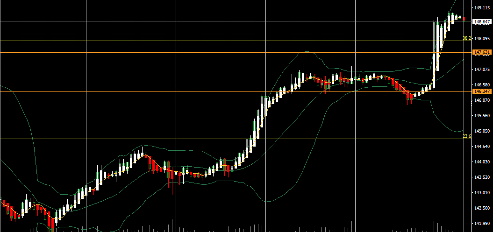
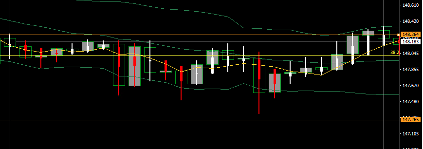
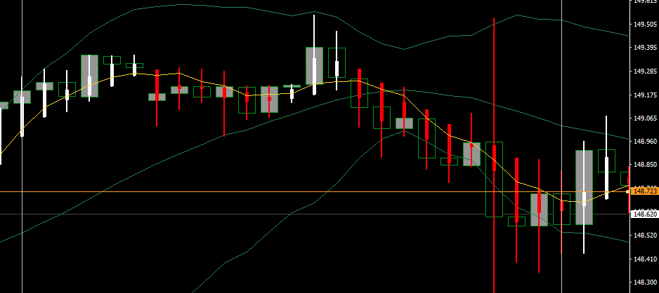

# やること

- ちゃんと考えながらいっぱい取引する（連続損、3つまでのリソースを最大限活用する）
- エントリーする前にしばらくチャート・値動きを眺める
- 指標の前に値動き方向感を考えておく
- その日の終わりに値動きをスクショしておく
- 想定レンジを作って、その中で取引する
- 月の最終週に為替と株式の騰落を調べておく（資金フローを調べる）
# やらないこと

- なんピン
- パッと見てエントリー
- 乗れそうだったチャンスに乗れなかった時に慌てる
- 自宅以外で触らない
- 足の完成を見る前のエントリー
- ポジションをぐちゃぐちゃ触る
- 取引をしすぎない
- 目標が高いので、いちいちがっかりしない
- 想定レンジを超えての取引
***
# 前週の点検と今週の方針

ドル円のIMM通貨先物ポジションは先週末も買い越し。まだそうなんですね。指値注文を続けよう。

## 前週の値動き

ドル円：144.76→141.95→143.93→146.75→146.60
金：2684.80→2680.40→2681.20→2676.10→2676
原油：69.96→69→70.86→70.95→73.80
日経：38774→37919→38074→38676→38629
ナスダック：19972→20008→19773→19802→19793
2y：3.56→3.57→3.60→3.64→3.69
5y：3.53→3.52→3.51→3.56→3.62
10y：3.78→3.76→3.73→3.79→3.84
30y：4.13→4.12→4.07→4.14→4.18
## 月初の値

ドル円：144.76
金：2684.80
原油：69.96
日経：38774
ナスダック：19972
2y：3.56
5y：3.53
10y：3.78
30y：4.13
***
# 記録
# 2024-10-07（月）

オーダーは40%対60%でロングが優勢、ポジションは41対59%でロングが優勢。

ドル円：146.60
金：2676
原油：73.80
日経：38629
ナスダック：19793
2y：3.69
5y：3.62
10y：3.84
30y：4.18

| 売買  | →時間 | IN  | →時間 | OUT | 損益  | メモ  |     |
| --- | --- | --- | --- | --- | --- | --- | --- |

- 26:00	米)ボウマンFRB理事の発言(投票権あり)
- 26:50	米)カシュカリ：ミネアポリス連銀総裁の発言(投票権なし)
- 28:00	米)消費者信用残高

# 2024-10-08（火）

オーダーは40%対60%でロングが優勢、ポジションは41対59%でロングが優勢。

ドル円：146.60→147.79
金：2676→2661
原油：73.80→76.72
日経：38629→38954
ナスダック：19793→19800
2y：3.69→3.95
5y：3.62→3.84
10y：3.84→4.01
30y：4.18→4.30

| 売買  | →時間 | IN  | →時間 | OUT | 損益  | メモ  |     |
| --- | --- | --- | --- | --- | --- | --- | --- |

- 07:00	米)ボスティック：アトランタ連銀総裁の発言(投票権あり)
- 07:30	米)ムサレム：セントルイス連銀総裁の発言(投票権なし)
- 09:30	豪)RBA議事録公表(9月24日開催分)
- 16:00	米)クーグラーFRB理事の発言(投票権あり)
- 19:00	米)NFIB中小企業楽観指数
- 21:30	米)貿易収支
  加)貿易収支
- 25:45	米)ボスティック：アトランタ連銀総裁の発言(投票権あり)
- 26:00	米)3年債入札
- 29:00	米)コリンズ：ボストン連銀総裁の発言(投票権なし

# 2024-10-09（水）

オーダーは42%対58%でロングが優勢、ポジションは42対58%でロングが優勢。

ドル円：146.60→147.79→148.37
金：2676→2661→2640
原油：73.80→76.72→73.95
日経：38629→38954→39231
ナスダック：19793→19800→20107
2y：3.69→3.95→3.96
5y：3.62→3.84→3.85
10y：3.84→4.01→4.01
30y：4.18→4.30→4.30

| 売買  | →時間  | IN      | →時間  | OUT     | 損益    | メモ                                                            |
| --- | ---- | ------- | ---- | ------- | ----- | ------------------------------------------------------------- |

- 08:30	米)ジェファーソンFRB副議長の発言(投票権あり)
- 10:00	NZ)RBNZ政策金利＆声明発表	米国以外
- 20:00	米)MBA住宅ローン申請指数
- 21:00	米)ボスティック：アトランタ連銀総裁の発言(投票権あり)
- 22:15	米)ローガン：ダラス連銀総裁の発言(投票権なし)
- 23:00	米)卸売在庫【確報値】
- 23:30	米)週間原油在庫
  米)グールズビー：シカゴ連銀総裁の発言(投票権なし)
- 25:30	米)ジェファーソンFRB副議長の発言(投票権あり)
- 26:00	米)10年債入札
- 27:00	米)FOMC議事録公表(9月17日・18日開催分)

# 2024-10-10（木）

オーダーは39%対61%でロングが優勢、ポジションは45対54%でロングが優勢。

ドル円：146.60→147.79→148.37→149.18
金：2676→2661→2640→2625
原油：73.80→76.72→73.95→73.56
日経：38629→38954→39231→38954
ナスダック：19793→19800→20107→19800
2y：3.69→3.95→3.96→4.01
5y：3.62→3.84→3.85→3.90
10y：3.84→4.01→4.01→4.06
30y：4.18→4.30→4.30→4.34

| 売買  | →時間  | IN      | →時間  | OUT     | 損益    | メモ                                                            |
| --- | ---- | ------- | ---- | ------- | ----- | ------------------------------------------------------------- |
| buy | 1627 | 148.898 | 2130 | 148.719 | -1790 | CPIは予想より上振れ、失業保険の値が悪く、反落。それでストップにタッチ。もう少し利食いのポイントを考えた方がいいのかも。 |

- 06:00	米)コリンズ：ボストン連銀総裁の発言(投票権なし)	米国
- 07:00	米)デイリー：サンフランシスコ連銀総裁の発言(投票権あり)
- 21:30	米)新規失業保険申請件数
  米)消費者物価指数＆【コア】
- 22:15	米)クックFRB理事の発言(投票権あり)
- 23:30	米)週間天然ガス貯蔵量
  米)バーキン：リッチモンド連銀総裁の発言(投票権あり)
- 24:00	米)ウィリアムズ：NY連銀総裁の発言(投票権あり)
- 26:00	米)30年債入札

# 2024-10-11（金）

オーダーは40%対60%でロングが優勢、ポジションは45対54%でロングが優勢。

ドル円：146.60→147.79→148.37→149.18→148.64
金：2676→2661→2640→2625→2650
原油：73.80→76.72→73.95→73.56→75.67
日経：38629→38954→39231→38954→39498
ナスダック：19793→19800→20107→19800→20241
2y：3.69→3.95→3.96→4.01→3.95
5y：3.62→3.84→3.85→3.90→3.88
10y：3.84→4.01→4.01→4.06→4.06
30y：4.18→4.30→4.30→4.34→4.36

| 売買  | →時間 | IN  | →時間 | OUT | 損益  | メモ  |     |
| --- | --- | --- | --- | --- | --- | --- | --- |

- 15:00	英)GDP
  英)鉱工業生産/製造業生産高
- 20時頃	米)JPモルガン・チェース決算	米国
- 21:30	米)生産者物価指数＆【コア】
  加)失業率＆雇用ネット変化
- 22:45	米)グールズビー：シカゴ連銀総裁の発言(投票権なし)
- 23:00	米)ミシガン大学消費者信頼感指数【速報値】
- 23:45	米)ローガン：ダラス連銀総裁の発言(投票権なし)
- 26:10	米)ボウマンFRB理事の発言(投票権あり)

[引用元（【10月7日～の週】今週の為替相場の注目材料スケジュールと焦点）]https://kissfx.com/article/20241007weekfx.html)