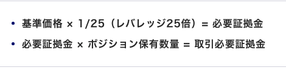

# FXの取引のルール

<iframe src="https://docs.google.com/spreadsheets/d/1caBkYnxcjxqnboEa1UE3p33CXSxBzqYcYIiTXhL-DcU/edit?usp=editing" width="100%" height="500"></iframe>

## 主に取引する時間

為替取引の大部分を占めるロンドン〜ニューヨークの時間に取引するようにしよう。  
21時〜26時。

## 証拠金

運用資金のルール内＋実現損益で検討する。

## 取引するポジションのサイズ

### 一回のトレードのリスク

トレードの負けは自分が思っている以上にショッキングだと念頭に置いておこう。1日に許容できる「負け」を設定してダメな時は割り切って気分を切り替えよう。

__1回のトレードのリスクは2％程度まで（10連敗しても資金が80%残る）__

一回のトレードにおけるリスクの計算方法は  
「A：保有したポジションの大きさ＊B：損切り水準」  
らしい。つまりは最大いくらの損失が発生するかという計算をする。  
リスクのコントロールの方法は前述の計算方法の項のいずれかを調整して考えるので、コントロールしやすいのは前者のポジションの大きさということになる（損切り水準を少なく設定するとわずかな値動きでリスクが実現する場合がある）。  

### 損切り水準の考え方

- 一般的にはチャート分析で、流れが変わる水準に損切りを置く場合が多いので、そこから逆算してポジションの大きさを設定する
- クロス円とそのほかの通貨ペアの場合で計算方法を調整しなくてはならない
  - ドル円／A：10000円 / B：( 60pips / 100 ) = 1.666...ドル
  - ユーロドル／A：(10000円 / 100USD(ドル円のレート)) / B：(60pips / 1000)=1.666...ドル
- MT4用のツール「Mini Terminal」があるらしい（サーバごとに提供されるのかな？）

## 目標収益／日

- 一日の目標を設定することで、無用な焦りに駆られない。
- 上記のリスク算出方法をもとに計算する方法を考えよう

## 撤退する損失／日

Oanda Alarm ManagerというMT4用のツールで下記を設定してアラートを出すようなトレード画面を作ることができる。

### 損益

運用資金の1%までの損失。
- 運用資金からの割合で設定する
- 連続した負けている場合リスク許容度をルールで下げる

### 勝率

1日に最大3連敗したらその日はトレードから撤退するというようなルール。

## まとめ

## そのほか決まり事

- まずはドル円のみの取引のみとする≒同時に保有する通貨ペアを制限する
  - しかし通貨ペアは複数確認する（主要通貨＋新興国通貨：メキシコペソ中国元など）
  - 日経平均先物・日経225オプションのストライク表・株価先物・金利・原油・金
  - もし同時に複数の通貨ペアのトレードをする場合、それぞれの通貨の相関性には気をつけよう（Oanda Correlation Matrixというツールがあるらしい）
- 市場のポジションの傾きを確認する
- 決済に時間をかけない
- 難しいマーケットに参加しない
- 1日のトレード数を制限する

# 情報源
情報は有料なんだぁ〜。
- Forexlive・zerohedge

## 情報の優先度
1. ファンダメンタルズ
2. 有料の売買情報・市場参加者の情報
3. ポジションの傾き
4. テクニカル

# ツール
- MT4＋TwinCloud

# チャート

基本的な内容はなんとなく頭に入っているので省く。

## 出来高

株式のトレードでは一般的な相場分析の材料らしい。  
FXでも確認できる場合はあるけど、「相対取引」が一般出来である市場では全体を把握した出来高を確認することができないとか。確認できる場合は参考地として確認すること。

## AIの動向

なんらかの条件に基づいて、セオリー通り自動で売買するAIがその時々の時流と異なる売買をすることがあるので、経済指標の発表後に動く方向性のセオリーは知っておきたい。あとAIのくせ。

## おまじない

# 読んだ記事

- [FXとは？初心者向けにゼロからわかるFXの基礎知識](https://www.oanda.jp/lab-education/beginners/aboutfx/fx_trading/)  
  この中の内容は基本的に頭に入っていそう。チャートパターンとかその辺りは覚えておきたい。  
- リスク設定について
  - [FX資金管理のやり方②適切なポジションサイズの設定](https://www.oanda.jp/lab-education/beginners/aboutfx/moneymanagement2/)
  - [FX資金管理のやり方③1日の最大損失額、連敗数の設定](https://www.oanda.jp/lab-education/beginners/aboutfx/moneymanagement3/)
  - [FX資金管理のやり方④1日のトレード回数、同時に保有する銘柄数について](https://www.oanda.jp/lab-education/beginners/aboutfx/moneymangement4/)
  - [必要証拠金とは？FXで必要となる資金の計算方法](https://www.sbifxt.co.jp/beginner/step03_5.html)  
    
  - [FXのロット（Lot）とは｜計算式・目安や決め方について解説](https://www.oanda.jp/lab-education/beginners/aboutfx/fx-lot/#:~:text=MT4%E3%80%81MT5%E3%81%AF%E3%80%811%2C000%E9%80%9A%E8%B2%A8,%E5%8F%96%E5%BC%95%E3%82%92%E5%A7%8B%E3%82%81%E3%82%89%E3%82%8C%E3%81%BE%E3%81%99%E3%80%82)
