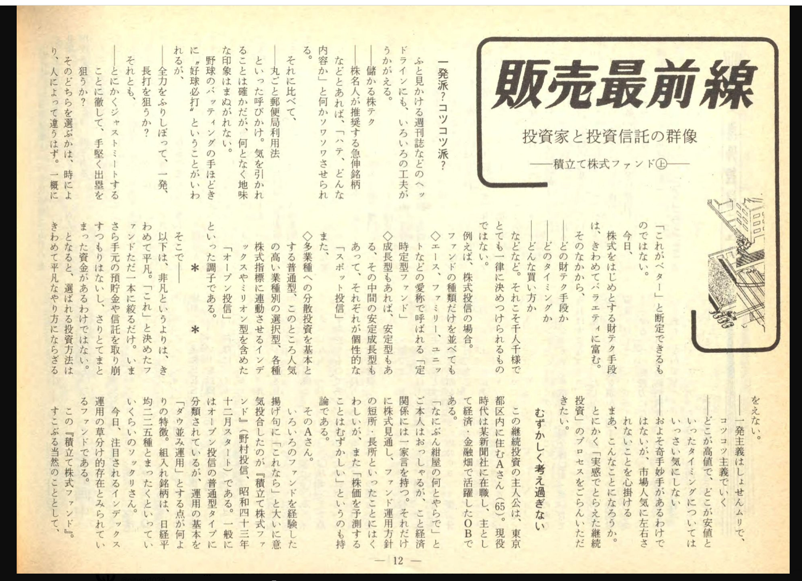

# 資金の分配と生活防衛資金

- 生活費って何を含めたらいいんだろう
- 月の生活費のおよそ3ヶ月分らしい
  - 自分の場合は30万程度か
- [月々のNISAの積立は5〜6万円ほど](2022-11-14-NISAについて.md)
  - VT（全世界）
  - VWO（新興国）
  - HDV（アメリカ）
  - eMAXISオールカントリー
  - 日経高配当50
  - その他興味があること
      - [新NISAで買う金（ゴールド）関連銘柄](https://media.rakuten-sec.net/articles/-/43385?page=5)
      - [NISAでインデックスファンドに投資をしている人へ、侮ってはいけないリスクについて](https://media.rakuten-sec.net/articles/-/45738)
      - NISAでスイングトレード
        - 
- [idecoでコモディティや債券を一定数積み立てる？](https://dc.rakuten-sec.co.jp/service/product/)  
  - [たわらノーロード　先進国債券](https://www.rakuten-sec.co.jp/web/fund/detail/401k.html?ID=JP90C000CML2&401k_no=015&401k_name=ONE%E3%81%9F%E3%82%8F%E3%82%89%E5%85%88%E9%80%B2%E5%9B%BD%E5%82%B5%E6%A5%BD%E5%A4%A9%EF%BC%A4%EF%BC%A3)
  - [ステートストリート・ゴールドファンド（為替ヘッジあり）](https://www.rakuten-sec.co.jp/web/fund/detail/401k.html?ID=JP90C0008QL7&401k_no=028&401k_name=SS%E3%82%B4%E3%83%BC%E3%83%AB%E3%83%89%E7%82%BA%E6%9B%BFH%E3%81%82%E3%82%8A%E6%A5%BD%E5%A4%A9%EF%BC%A4%EF%BC%A3)
    超イマイチ。金は為替ヘッジなしで持っておきたい。
- [ゴールド・ファンド（為替ヘッジなし）](https://www.dcnenkin.jp/search/product.php?mode=detail&code=02312177)  
  松井証券で取り扱いがある
  - リスクは知っておきたい

# インデックスの積立をルール通りに続けても上手くいかないかも（いつ相場を降りようか）

- [日経平均が前回最高値をつけた頃、1989年の投資家に心が締め付けられます。](https://x.com/ActiveIndex/status/1750192613507154321)  
    
  >2024年現在のインデックス投資家像に似ていますね。しかも驚くべきことにAさんはNISAもブログもネットもない時代にこの方法にたどり着いていたということです。一つだけ誤算があったとしたら、日経平均株価はこの直後の89年12月末の大納会の最高値の後に、30年を超える長き低迷の時代に突入することを予測できなったことでしょう。日経平均はこの後3年で半分に、13年後には約80％下落することになります。
  >   Aさんのその後は明らかではありませんが、単純計算のために記事の時点で積立を止めて投資だけ続けたと仮定すると、68歳時点で評価額は432万円に、78歳時点では223万円と投資元本すら下回った可能性があります。お元気であれば今年99歳でしょうか。昨年末には854万円まで評価額は回復したはずです。もしお元気なら、お話を伺ってみたいものです。
  >  上記の試算は配当を含まない日経平均株価を使っていますし、投資信託の信託報酬や金融商品の売買コストを含んでいませんから単純な試算にとどまりますが、この記事の後のAさんは、どんな経験をして、どんな事を思われたかを想像するための値動きはイメージできることでしょう。
  >  しかしながら、Aさんは当時からするとかなり最先端の投資家だと言えます。日本でオープンエンドのインデックスファンドの運用が始まったのは1985年（うろ覚え）ですので、Aさんはもしかすると日本で最も早い時期にインデックスファンドでの積立投資を始めた投資家かもしれません。また当時は投資信託といえば、おおよそ日本株ファンドでした。海外株式ファンドにインデックス・ファンドは無く、残高も全部合わせて1兆円なかったのではないでしょうか、投信全体で当時60兆円弱なので小ささがわかります。オルカンなんていうものは当然有りません。Aさんはその時にできうる最善の選択、最善の分散投資をしたといえます。けれども恐らく、この後のAさんの資産運用は苦難の時を迎えたのではないかと思います。
  >  記事の末尾に綴られた、「今月1万円、来月また1万円、再来月またまた1万円、の限りない前進が続けられるに違いない」「20年間での平均利回りは年率27.85％」「（資産は）更に一回り二周り大きくなっていくだろう」という下りに、ホロリと涙が出てきました。
  >  Aさんの頃と今はまた違う市場環境ではあるものの、マーケットを操ることなどはできないですし、市場環境には山（米株、日本株）があれば、谷（中国株など）もあるわけです。投資家に仕える身としては、投資家に損をしてほしくないとは思えど、なかなかそんな上手い話はありません。少しづつ少しづつ前進していると思いたい、多少は世の役も立っているといいのだけれど、でもその前に自分たちが儲からなくなっておまんま食い上げかもなあ、とそんな事を思いながら布団に潜り込むといたします。
  >  出典：投資信託事情 （89年11月号から90年2月号）

# [「国際収支から見た日本経済の課題と処方箋」懇談会 ](https://www.mof.go.jp/policy/international_policy/councils/bop/20240702.pdf)

 - 日本は経常収支黒字国で、世界最大の対外純資産を持つ
 - しかし、近年のIT関連の貿易赤字や、NISA、企業利益の海外への再投資など将来に向けて楽観はしていられない
 - 今後少子化とともに、経常収支黒字はやがて赤字転化するかも
 - これらは日本経済の構造的課題の現れであるから、改革に取り組もう
 - 貿易・サービス収支は赤字だけど、それそのものが悪いわけではない
 - 日本の貿易黒字は輸送機器（自動車など）や半導体製造装置が安的的に黒字らしいが、かつては黒字だった電気機器は輸入超過に転化している
 - 自動車に依存しているけど、昨今の電動化などの趨勢から将来が危ぶまれる
 - 鉱物製燃料の輸入依存
   - 国際情勢の影響が大きい
   - 原発の廃止から、化石燃料によった発電への依存が大きい
 - 産業の空洞化
   - 円高や産業の合理化などの影響
 - マーケティング手法の変化から円安であっても安く製品を販売できず、結果として輸出量が伸びていないらしい
 - インバウンドが好調なので旅行収支の黒字は過去最大規模
 - 金融・デジタル・研究開発は赤字が拡大
   - クラウドなど海外のデジタル産業への依存は今後増えていく見込み
 - 第一次所得収支（ってなに？）は過去最高を記録してるらしい
 - 国内の設備投資は20年間ほぼ横ばいらしい
 - 証券市場は改善が進んでいるらしい
 - 政府債務残高対GDP比がかなり高く、日本国債の格付けが低い
 - あんまり良くないので持続可能な財政構造を目指したい
 - 日本国債は海外投資家の間でも取引されるようになってきているらしい
 - 日本人の海外への投資が増えており、この傾向は国内金利が海外の金利へ接近していく状況を生むかもしれない
 - そうじて金利が上がっていく可能性が高い
 - 最低賃金の向上から、労働力がより生産性の高い環境に移譲されていくことを狙っているらしい
 - 核融合炉のほか、超伝導送電とかいう技術もあるらしい（リニアモーターカーと同じ理屈ですな）
 - 日本国内での製造設備への投資が少なかった理由は「労働投入に対して機械設備などの資本の導入が割安になるため」つまり、人間にやらせた方がましだったってことなのか

ううむ、借金は早めの方がいいのだろうか。円安は止まる道理がなさそうだなぁ。