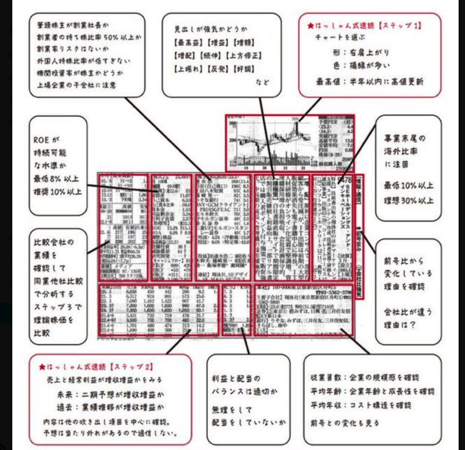
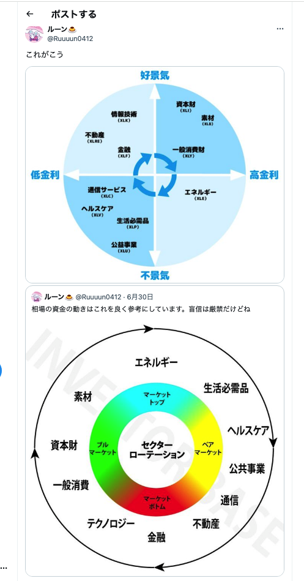
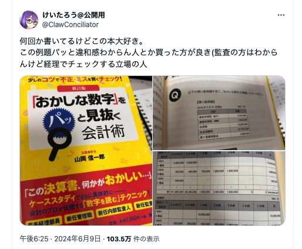

# 新NISAで取引できる個別株をスクリーニングしたい

# 四季報の読み方

- 
- [「清原流会社四季報の読み方」](https://x.com/activistTIMES/status/1835452865277837676)  
  

# 情報商材に手を出してみる

いやいや、無料ですよ。証券口座を開くと一ヶ月分無料だというので試してみたいと思ったんです。たぶん、考え方の基礎として、一緒にもらったpdfを頭に入れておく必要がある気がするので、ざっくり内容をまとめておこう。

- 信用度の高い債権（とくに米国債）の格付けが下げられたとして、結果として価格が上昇する
    - 資金の逃避先として機能するから
    - ポートフォリオの平均格付けを底上げする必要があるため（岡崎さんがいってたやつ）
- 米国債とゴールドは安全資産
- コモディティも含め、広い知識があると、儲けられる局面があるでよ
    - 自分だと、日々のニュースが投資のポジションまで結びつかないですね

# ツイッター（現X）で見かけた知見

- [CFD取引とその口座を作るメリットについて](https://x.com/utbuffett/status/1727614690086486481)  
  - レバレッジが効く
  - 売りのポジションを作れる
  - 時間外の取引ができる（時間外に発生したリスクに対応できる）
  - 税金支払いの繰延
      - 両建てにして年明けに決済すると翌年の損益に繰り越すことができる
  - 景気循環とセクターの関係
    
- 会計の数字を読む  
  
- [オプション取引について](https://x.com/noatake1127/status/1822429514007494708)  
    
- [「投信に載ってる銘柄注意深く見てるといいよ」](https://x.com/A16998464/status/1827285131297706295)  
  ちょっと検証してみたい。GPIFの銘柄とリバランスと値動きならやれるかな。  
  
- [かんちさん(@kanti990)(資産8億円、年間配当2000万円)の本を読んで候補銘柄を抽出](https://x.com/toushi_kenshou/status/1835438786681167968/photo/1)  
  上記の景気循環のやつとうまく組み合わせていい感じにポートフォリオ考えられないかな。  
  
  