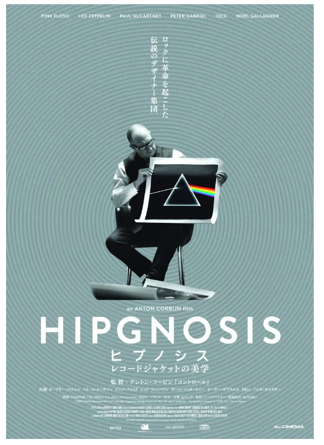
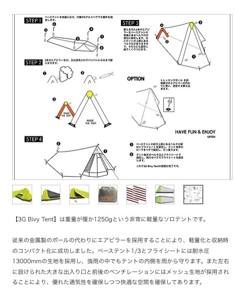

# 生活

- [「97問題」という高齢化社会の現実](http://finalvent.cocolog-nifty.com/fareastblog/2024/12/post-3d5d46.html)  
  今の介護を取り巻く状況がまとまっていた。つまり、じゃないけどずっと悩んでいるお金の使い道みたいな問題とも近いのかも。両親とも話をしなくてはならないのか。
- [黄金頭さんのイベントは刃傷沙汰でなく人情沙汰やで](https://goldhead.hatenablog.com/entry/2024/12/09/002349)  
  いつになく文章の角が取れている感じがしますね。わいも会ってみたくもあるし、そうでもない気もする。
- [2024年、買って良かったワインたち](https://p-shirokuma.hatenadiary.com/entry/20241209/1733749200)  
  常温で置いておけるデイリーワイン、あるといいですね。
- [セロトニンを補う薬がびっくりするほど効く人たち](https://blog.tinect.jp/?p=88475)  
  該当するかしないかわからないけど、身に覚えがあることがたくさん書いてある気がする。地方に住んでいるから病まないでいられるのか。
- [「岐阜といえば岐阜タンメン」と言われるほどの岐阜タンメンとはなんなのか](https://dailyportalz.jp/kiji/gifutanmen_in_gifu)  
  近所のベトコンラーメン、結構美味しそう。生卵入れ放題らしい。
- [第二次世界大戦で日本を欺いたナバホ族最後の「コードトーカー」が107歳で死去](https://gigazine.net/news/20241212-john-kinsel-language-navajo/)  
  あんまり残しておく気がなかったけど、ちょっといい一文があった。  
  > 「私(I)」ではなく「我々(We)」を使ったといわれています。
- [「田舎vs都会」じゃない経営学の話。](https://www.1101.com/n/s/hidemichi_miyake)  
  三宅秀道先生のはなし。そもそもの倫理観の違いが相互蔑視を産んでいるんじゃないか。と、背景の違うものがうまく噛み合うことが強みだったのではないか、みたいな話だったと思う。たしかに工業高校とか、そういうものって結構すばらしいよな。今更ながら自分は窪地に落ちているのだと気づいた。
# 仕事

- [手に職がない35歳エンジニアが如何にしたら転職できるか考えてほしい](https://anond.hatelabo.jp/20241206191432)  
  自分の現状をまとめてエージェントへGOが答えらしい。せやなぁ。
- [問い合わせフォームを実装しただけなのにスパムメールの加害者になっていた話](https://qiita.com/kabuakantech/items/8b0de7ed460471c2fb5e)  
  自動返信メールを悪用されたという話らしい。reCaptureは必須なんだろうな、気をつけよう。
- [気づかずやっていませんか？危険なSSH,SFTPの使い方](https://io.cyberdefense.jp/entry/dangerous_ssh_sftp_usage/)  
  暗号化されていても、接続先が正しいかどうかも問題だぞ、という話だった。なるほどなぁ。
# 趣味

## デザイン

- [伝説のデザイン集団の長編ドキュメンタリー『ヒプノシス　レコードジャケットの美学』が、2025年2月7日から全国順次公開](https://www.japandesign.ne.jp/news/2024/12/79670/)  
  ちかくで上映されていたらみに行ってみようかな。有名なあれを作った人たちらしい。これによってアルバムジャケットがえらくなったみたいな。ジャズのレコードってカッコいいイメージあるけど、後の話なんかな。  
  
- [2024年度グッドデザイン・ニューホープ賞決定](https://kenchiku-blog.blogspot.com/2024/12/2024_01686807736.html)  
  長期入院中の子供に、遊びを届けるというものがとったらしい。こういう章があるのを知らなかった。イマイチサービスの概要がわからないけど、実際に動いているんだろうな。プロダクトはあるし（？）。
- [POUL KJÆRHOLM IN KYOTO](https://www.japandesign.ne.jp/event/poulkjaerholm-ryosokuin/)  
  友達が言ってたやつの巡回展かな。いい家具、一つだけ買うとしたらなんだろう。照明かな。  
  > 京都の両足院にて、「POUL KJÆRHOLM IN KYOTO」が2024年12月21日から2025年1月19日まで開催されます。
## 読書

- [そして、思う。持ち回りなのかもしれない。――「愛がありふれている ＃1」向坂くじら](https://nhkbook-hiraku.com/n/n3d59d04f88eb)  
  いわゆる、大きな物語から逸脱している自分の心苦しさを言い当てられている気がする。同世代にこういう文章を書く人がいるのはありがたいことだなぁ。

## 制作

- [初心者向け！GitHub Actions をはじめる](https://zenn.dev/kiwichan101kg/articles/2d6850ff72bc98)  
  いつか、ブログが完成したら使おうか。そもそもGitHubの正しい使い方を知らないな。
- [【完全ガイド】CSS論理プロパティから見る 新しいCSSの考え方](https://qiita.com/ngtnysk/items/0ab68b8a6ba8228d92a6)  
  聞いたことはあったけど、あまり知らなんだ。「コンテンツの向き」にマージンを施したりできるらしい。  
```
  .logical-button {
  margin-inline-start: 20px;
  padding-block-start: 10px;
  border-inline-end: 1px solid black;
}
```
- [CSSの「interactive-widget」キーワードを使用すると、スマホでキーボードを表示した時でも高さいっぱいに対応できる](https://coliss.com/articles/build-websites/operation/css/viewport-resize-behavior-on-mobile-with-interactive-widget.html)  
  キーボードが表示された場合の挙動をどう制御するかをメタタグで指示できるらしい。
  > <meta name="viewport" content="width=device-width, initial-scale=1">
   > contentには2つのプロパティがあり、それぞれに値が設定されています。
  >width: ICBの幅のサイズを設定、device-widthはデバイスの幅に応じてサイズが決まることを示します。
  >initial-scale: ページが最初に読み込まれたときのズームレベルを設定、デフォルトの1が設定されます。
  >ビューポートのmetaタグで使用する新しいキーワードは、interactive-widgetです。これを使用すると、バーチャルキーボードなどのインタラクティブウィジェットが表示されたときにビューポートがどのように動作するかを設定できます。
  >resizes-visual: ビジュアルビューポートのみをサイズ変更し、レイアウトビューポートのサイズ変更はしません。
  >resizes-content: ビジュアルビューポートとレイアウトビューポートの両方をサイズ変更します。
  >overlays-content: どのビューポートもサイズ変更しません。これはoverlaysContentをtrueに設定してVirtual Keyboard APIを使用するのと似ています。

## ガジェット・グッズ

- [室温マイナス３度でも「豆炭コタツ」だけで過ごせた話。](https://tabkul.com/?p=296715&utm_source=rss&utm_medium=rss&utm_campaign=post-296715)  
  何を熱源にするかはおいておいて、エアコンよりおこたのほうがいいよな。そうすると、いい感じの座椅子が欲しい。見つけたことない。
- [小型全固体電池がいよいよ離陸へ、コイン電池代替も視野](https://xtech.nikkei.com/atcl/nxt/column/18/00001/10043/)  
  すごいですね。電池は思ったより色々なところで活躍しているな。
- [Macに指紋認証を外付けする](https://zenn.dev/k_omo/articles/a0d99029e1e815)  
  MagicKeyboardのリーダーを使うらしい。ジャンクだと安く済む。
- [10の25乗年かかる計算を5分未満で　Google、新量子チップ「Willow」発表　量子エラー訂正で「閾値以下」達成](https://www.itmedia.co.jp/news/articles/2412/10/news106.html)  
  そのうち漁師コンピューティングの時代が来るのかな。計算ができても、検証に10の25乗年かかるというツッコミがおもしろかった。
- [「CUDA」～マンガでプログラミング用語解説](https://codezine.jp/article/detail/19936?p=5)  
  > 　「CUDA」（Compute Unified Device Architecture）は、NVIDIAが開発・提供している、GPUで汎用的なプログラムを実行するための開発・実行環境です。CUDAを利用すれば、GPUのメモリーにデータを転送して並列的に処理をおこない、その結果を受け取ることができます。

## アウトドア

- [西表島にリュウキュウイノシシの狩猟文化を訪ね、獲物を刺身で食らった！](https://www.bepal.net/archives/491976)  
  甘みがあって歯応えがあり、うまいらしい。怖いなぁと思っていたら、息子に食わせて妻に怒られたのだとか。そらそうか。
- [自転車キャンプ向けテント5選｜バイクパッキング仕様も！軽量コンパクトなおすすめモデルを紹介](https://www.bepal.net/archives/491337)  
  ちょっと感動的なモデルがあった。そんなに高くない（安くはない）。  
  [UPON 3G Bivyテント(1P)](https://www.kuwahara-bike.com/product-page/3g-bivy-tent)  
  

## 展覧会

## お勉強

## 豆知識

- [｢大気からのCO2除去｣は、温暖化対策にあまり意味がなさそう](https://www.gizmodo.jp/2024/12/remove-carbon-dioxide-from-the-air.html)  
  現状では効果が薄そう、くらいのタイトルにして欲しいところ。あまりにもコストがかかりすぎて、現状だと他の方法の方が効果が高そうなのだとか。

# お金儲け