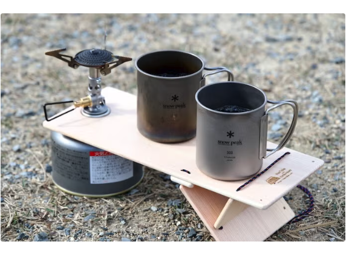

# 生活

- [体力や健康も才能のうち](https://p-shirokuma.hatenadiary.com/entry/20241222/1734849000)  
  何も身につかないままここまで来てしまった。変えるべきとも理解しているつもりだろうけど頭だけだろうな。だから軽んじられても案外平気なんだろう。
- [「45歳独身男性が狂う説」に45歳独身男性のおれもひとこと言いたい](https://blog.tinect.jp/?p=88559)  
  [自分自身を振り返るにはいい機会でした＞45歳うんたら説](https://p-shirokuma.hatenadiary.com/entry/20241219/1734589800)  
  [私たちは本当の孤独を知らない](https://anond.hatelabo.jp/20241220133958)  
  自分も一人で充足できる方の人間だと思う。ここで挙げられているよりもっとコミュニケーションが不得手なんだろうとも感じる。それでも、真に一人でもないし、ライフステージの変化も緩慢だ。心のありようはあまり良くない気もする。今の生活がずっと続くとも思えない。
- [AIのせいで停電の危険が増加中、データセンターからの需要急増が送電網に大きな負担をかけている](https://gigazine.net/news/20241219-electricity-demand-growth-accelerates/)  
  そのうち身近な問題になりそう。自家発電装置の建立が求められる。
- [ワーテルゾーイ！](http://finalvent.cocolog-nifty.com/fareastblog/2024/12/post-305e2d.html)  
  締めの文章がよかった。  
  > 気になる料理名は見つかった。そして、それ以上に私たちは、一つの料理をめぐる豊かな物語を手に入れた。それはきっと、次に口にするワーテルゾーイの味を、より深いものにしてくれる。まずは、作ってみるかな。
- [2023年の｢説明がつかない暑さ｣の理由が明らかに](https://www.gizmodo.jp/2024/12/temperature-surge-record-low-planetary-albedo.html)  
  火山の噴煙とかと同じ理屈で、人類がだす煙が太陽光を遮っていたのだとか。
- [｢余命1年｣治療第2弾がん免疫療法のリアルな効果](https://toyokeizai.net/articles/-/846903)  
  いろいろな治療法があるらしい。実際に自分のみに降りかかったらと思うと、正常性バイアスで無視してしまいそう。ひとりでも戦えるようになりたいな。
- [福岡の｢おひとり様の終活｣に視察が相次ぐ背景](https://toyokeizai.net/articles/-/847799?page=5)  
  社会福祉協議会ってえらいよな。情報を撮りに行きたいと思った時はやっぱり直接相談するっていう形になるのかしら。
- [40歳､年収1000万円の仕事を辞めた人の｢本音｣](https://toyokeizai.net/articles/-/845656?page=3)  
  自分より上の年齢の人が、望む形に人生を軌道修正できた話を読むと元気が出る。もっとよみたい。
- [死者22万人超、インド洋大津波から20年　今も残る深い傷と教訓](https://natgeo.nikkeibp.co.jp/atcl/news/24/121300687/?P=1)  
  身近な災害史は目を通しておきたいな。濃尾で活断層による大きな地震があったとかしか知らないな。
- [林芳正｢なくなって構わない税収など存在しない｣](https://toyokeizai.net/articles/-/848885?page=4)  
  ここでの議論は真っ当なものに見えるけど、どうなんだろう。プライマリバランスが黒字になった時に初めて、歳出・歳入をどう削減できるかみたいな議論ができるのかしら。
- [徐々に衰弱する地球。水害激化の裏で陸地の乾燥化がどんどん広がる](https://www.gizmodo.jp/2024/12/global_desertification_environmental_issues.html)  
  こういうのもこわいな。もう少し何とかならんのか、世の中。日本でも今年は水が少ないという噂を聞く。
- [やさしさが、いつもわたしの身に余る。――「愛がありふれている ＃2」向坂くじら](https://nhkbook-hiraku.com/n/n39320cb78b5a)  
  これはあれだな。誕生日のお祝いが少し重たい、あの気持ちだろうか。申し訳ない反面、「身に余る」。

# 仕事

- [今、リモートワークについて思うこと](https://devblog.thebase.in/entry/2024/12/24/110000)  
  自分は多少なりとも恵まれているのだろうとは思う。また、愛着を持たないという方針はいくらか正しいような気もする。だからどうってこともないんだけど。将来を見据えた合意形成って大事ですね。
- [コンサルから納品されたマクロが重すぎるとの相談があり中身を見たところ狂気のプロシージャが千行に渡って展開されており椅子から転げ落ちた](https://togetter.com/li/2485118)  
  身に覚えが、あるぞ！
# 趣味

- [ソニー、KADOKAWAとの資本業務提携を発表--株式約10%保有し筆頭株主に](https://japan.cnet.com/article/35227503/)  
  これならフロムはプレステに縛られないのかな。
- [鍋から深掘るジンギスカン、世界唯一の「ジン鍋博物館」訪問記](https://dailyportalz.jp/kiji/jin-nabe-museum)  
  北海道が入植地だから、料理やその道具の起こりから発展を追うと、どのように技術や文化が広まったかがわかるという。
    - [https://www2s.biglobe.ne.jp/~kotoni/mokuji.html](https://www2s.biglobe.ne.jp/~kotoni/mokuji.html)  
      北海道のジンギスカンの詳しい話。
- [『聖☆おにいさん』誕生につながったモチベーションとは？作者の中村光氏が駒大で坐禅し、語る](https://www.cinra.net/article/202412-komazawa2_hrtkzmcl)  
  思っていたよりとんでもない人だった。漫画も面白いよ。
## デザイン

- [建築家・谷口吉生さんを悼む　透明感たたえる空間の光明](https://www.nikkei.com/article/DGXZQOUD2310J0T21C24A2000000/)  
  お名前に聞き覚えがあると思ったら豊田市美術館の設計をされた方だった。どこがぽすともだんなんだろ〜とか思っていた気がする。

## 読書

## 制作

- [「イテレータ」～マンガでプログラミング用語解説](https://codezine.jp/article/detail/20264?p=5)  
  > 「イテレータ」（iterator）は、日本語に訳すと反復子です。イテレータは、配列のようなデータを次々に取り出せる構文やオブジェクトのことを指します。イテレータには、内部的にデータを次々に取り出す仕組みがあり、データが終了するまで取り出し続けることができます。こうした仕組みを使うと、要素番号を使うようなデータ構造に依存するコードを書かなくて済みます。

## ガジェット・グッズ

- [室内でも屋外でも周囲360度を暖められる±0「テラスヒーター」](https://www.goodspress.jp/news/648119/2/)  
    

## アウトドア

- [サッと使ってサッと収納！機動力抜群な＜9Kei＞のバーナーサイドテーブル](https://yamahack.com/6463)  
  これは賢い。紐で高さを調整できる構造になっているのか。  
    
- [オシャレすぎる「ゴミ袋」が地味に良すぎるんだが。”収納めんどうくさい問題”もあわせて解決](https://yamahack.com/6471)  
  ちょっといいですね。リュックのエクステンションとしても使えそう。  
   
- [40%キーボードは沼。](https://note.com/lmnpii/n/n49da9139f6a4)  
  自分も、案外いけるぜ派になった。40%くらいからキーボードがかわいくなる、はかなり同意。keyball44は42%らしい。
## 展覧会

## お勉強

## 豆知識

# お金儲け

- [PERだけで｢割高･割安｣を判断するのは危険だ](https://toyokeizai.net/articles/-/842714?utm_source=rss&utm_medium=http&utm_campaign=link_back)  
  下記に加えて、何らかのテーマをもてるとよさそう。
  > PEGレシオ＝PER÷営業利益の成長率
