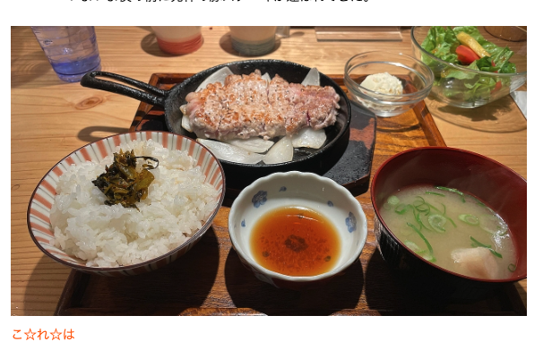
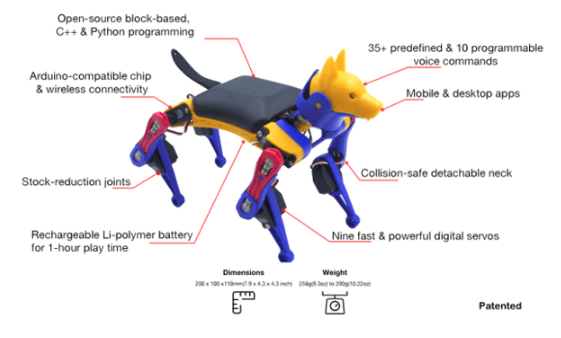

# 生活

- [｢牛丼店にもイクラ｣日本人が知らない資源の実態](https://toyokeizai.net/articles/-/849434)  
  漁獲量制限などの水産資源管理をするべきだ、という話題がよく聞かれるようになったけど、いい傾向であって欲しい。良くなっていって欲しいな。
- [日本型組織は、人材・資源・体制を技術研究に活かせば、余裕で米国・中国 企業を超えるデジタル技術を生み出せる──IPA 登 大遊](https://cybozushiki.cybozu.co.jp/articles/m006223.html)  
  日本の産業は10年以上の遅れをまくってきた、という話題があった。そんな考え方をしたことがなかった。どうなるんだろうな。
- [怒りを御するとはどういうことか](https://blog.tinect.jp/?p=88567)  
  ある程度は怒ってもなにもならないという態度であれるようになった気もするけど、まだ怒ってしまう。頭のいい人たちはわからないけど、自分の場合は加齢だろうな。
- [マステを使った掃除術に落とし穴！まさかの展開に「こんなはずじゃなかった」「本当に後悔」](https://macaro-ni.jp/161797)  
  接着剤が劣化するらしい。そのうちテープ剥がしを買っておこうか。
- [「毎日同じトレーニングをしてはいけない」と専門家が言う理由とは？](https://gigazine.net/news/20241227-same-workout-everyday/)  
  トレーニングは体の恒常性を見出す必要があるけど、同じ運動を続けると負担が恒常化してしまうので、負担を上げるなりの変化を加えようという話題。
- [１円玉廃止への道筋](http://www.world-economic-review.jp/impact/article3681.html)  
  よその国では、金額や会計をまるめるようなことをしているらしい。こういう端数が現金を扱うためのコストを跳ね上げるのだとか。知らなかったのだけど、ここ最近の一円はすでに流通していないらしい。
- [イーロンマスクは何を見ている](https://note.com/tanukiponkich/n/n78fa27288af2)  
  イーロンマスクが手中に収めているのは、宇宙から・街から・インターネットからリアルタイムデータを収集する装置である、という。今後のAIの価値は未来を予測することだとも（いまでもそういう特許があったりするらしい）。
- [それが起こったとしても、誰も第三次世界大戦と呼ばないし、そんな風にも見えない](https://p-shirokuma.hatenadiary.com/entry/20250103/1735865439)  
  戦争とは呼ばれない、呼びたくない。されど軍靴の音は聞こえると。いやだなぁ。深津さんが言っていたけど、対極的には世の中は良くなっているんだけど、ごく個人の視点からすると過酷な時代なのだろうか。
- [もうすぐ消滅するという人間の翻訳について](https://note.com/aki0309/n/n1f05cb496913)  
  精度の向上より、こんなもんでいいか、という要求水準の低下が悪さをするという。たぶん、自分も生成AIより安いし肉体を持ってるしな、という労働力にすぎない。
- [2024年にブックマークしたページでよかったもの集めた](https://toya.hatenablog.com/entry/2024/12/28/232321)  
  インターネットの人の記事まとめをまとめる。かいつまんで読もうと思ったら大変な量になってしまった。黄金頭さん、いいですよね。
  - [妻よ、ケーキ作り卒業してくれ](https://anond.hatelabo.jp/20240113212025)  
    なんかこう、自分がする記憶の反芻とも似ている。しんどいなぁ。
  - [【ミニマリストの実態レビュー】ものを減らして変わったこと、変わらなかったこと](https://www.dekirutabi.tokyo/entry/2024/01/16/203016)  
    自分の考えに近しいな。単身者向けの引越ラック、一つ分ってのは自分も考えた。ちょっと無理そうだったけど、改めて考えてみてもいいかもしれない。
  - [市民、散歩を楽しむ方法を教えます。](https://hasesannzu.hatenablog.com/entry/2024/01/29/092209)  
    単眼鏡、いいな。スマホに取り付けられるタイプのやつ、ずっとほしい。
  - [15年間いた奨励会を退会しました。僕の将棋人生の感想戦です。](https://note.com/nishiyamaharu/n/nfff9429f7b20)  
    現実に、こういう厳しい世界があって、そこで戦える人がいるんだな。
  - [効率厨が、自分を大事にするようになった話](https://note.com/haruru0022/n/n12e5ae11efa4)  
    効率を求めると無味乾燥になっていく、というのは実感として理解できるな。身体はどこまでいってもついてくる。  
    > 時間をケチケチすることで、ほんとうはぜんぜんべつのなにかをケチケチしていることには、だれひとり気がついていないようでした。じぶんたちの生活が日ごとにまずしくなり、日ごとに画一的になり、日ごとに冷たくなっていることを、だれひとり認めようとはしませんでした。jミヒャエル・エンデ「モモ」1976年、岩波書店、95頁
  - [行動をチャンク化して「1日に1ターンしか行動できない」から脱却する](https://piyopanman.dev/memos/chunking-actions/)  
    これも実感として理解できる。一息をつかない。大事。それで思ったんだけど、このチャンクってのが属人化の権化ではないのか？
  - [ライブのセットリストやMCを記憶する方法について](https://www.ongakunojouhou.com/entry/2024/03/06/212416)  
    基礎結合法という記憶術があり、そのアレンジで自分の指にエピソードを結びつけて記憶するらしい
  - [IoT ピザ窯で巨大災害で娘と焼き出してきたこと](https://qiita.com/nanbuwks/items/adf3fea1b13d262047f9)  
    思っていたより、すばらしい記事だった。シミュレーションと実地での訓練、それがそのまま支援になる。よくできていますね。
  - [切符を買う](https://hyoshiok.hatenablog.com/entry/20040616)  
    20年前の記事でギョッとした。いまならより多くの自分のことが明らかにされているんだろうな。考えたことがなくはない。有象無象の一人だ。
  - [正常独身青年、先祖の戸籍を取り寄せる](https://anond.hatelabo.jp/20240521221155)  
    ちょっと面白そう。自分が聞いたことがあるのは母方の曽祖父までだな。
  - [父が亡くなった](https://anond.hatelabo.jp/20240704033106)  
    関係なくはないけど、寝るときにあまり明るくないことばかりを考えてしまう。楽しい予定を立てておこうか。
  - [使ってないモバイルバッテリーや交換したリチウムイオン電池を適切に処分する](https://moognyk.jp/entry/2024/08/16/100000)  
    現状やっぱり難しいんだな。大きなバッテリーを買うときは処分についても調べておこう。
  - [人生イチ旨かったレストランの話をさせてほしい](https://anond.hatelabo.jp/20240914232747)  
    父の還暦祝い、何か考えようか。ううむ。
  - [親子げんかをして絶縁状態になった父が認知症に。介護と看取りを経て、今僕が思うこと](https://kaigo.homes.co.jp/tayorini/column/oyakogenka/)  
    祖父のことでずっとぐるぐる考えていることに近いのかも。若手いるかわかっていないのかも、わからないし、自分から何の言葉もでてこない。安藤さんの記事です。
  - [犬とおばあちゃん助けたら最近かなりいい感じ](https://anond.hatelabo.jp/20241213171049)  
    犬、いいなぁ、散歩したい。
  - [ホテルニューアカオに潜入](https://sakamotwin.hatenablog.com/entry/2024/01/05/175740)  
    こういうホテル行ってみたくはあるな。ラウンジとか楽しめる気がしないけど。
- [2025年に、ブログみたいなごくわずかな共通点の端くれだけ握りしめて](https://fujipon.hatenablog.com/entry/2025/01/06/170225)  
  万人の万人に対する闘争の時代だぁ。よく覚えていたな。日記、もう少しちゃんと書こうか。​
- [少しずつ消滅していく地方都市。](https://blog.tinect.jp/?p=88636)  
  オチが怖かった。怪談じゃないか。
- [福岡で食べた「発祥の」豚ステーキが忘れられない](https://dailyportalz.jp/kiji/umai_pork_steak_in_fukuoka)  
  うまそうじゃないか。腹が減った。  
    
- [愛が、あまって、あまって、しかたないのだ。――「愛がありふれている ＃３」向坂くじら](https://nhkbook-hiraku.com/n/ne32fdbb6fb4f)  
  これもまた、言い当てられたような気がした。熱狂から遠い推し方もあるのかな。
  > 受け取ることは、ときに与えることよりも重たく、居心地が悪い。
- [イーロン・マスクが複数社経営しつつ、なぜこんなに生産性が高いのかに関する面白い話→実はほとんどの業務は権限委譲していて、彼がやるのは毎週1つだけだった](https://togetter.com/li/2493200)  
  ストレスがすごそう。だから狂人みたいにみえる振る舞いもするのか。  
  > CEOは会社で他の誰も解決できない、最も大変で面倒な問題を解決しないといけないので本当に苦しい仕事です。起業するということは、深淵をのぞき込み、ガラスを食べるようなものです。深淵をのぞき込むというのは、自分が目の前にあるこの問題を解決できなければ会社が倒産してしまう現実と常に向き合い続けなければいけないということです。ガラスを食べるというのは、自分が解きたい、もしくは解ける問題ではなく、苦手だろうがなんだろうが会社にとって重要で解かないといけない問題に長期間に渡って取り組み続けないといけない苦しみがあるということです。
- [能登半島地震 生活用水確保に大学や民間企業による支援が効果](https://www3.nhk.or.jp/news/html/20250109/k10014688411000.html)  
  WOTAは動いていたんすね。すごい。この記事で感心したのは上下水道のシステムを小さくしてくという点で、これからのインフラのあり方が示されているような気がする。
- [南海トラフ地震｢臨時情報｣のお粗末な科学的根拠](https://toyokeizai.net/articles/-/849538)  
  どこまで信じていいかわからないけど、昨年の地震のことを思うと、なんともいえないな。東南海トラフ巨大地震もしくは東海大震災の恐怖はずっとすりこまれてきているしなぁ。
- [タイミーとメルカリ ハロで働いてきた　「働く」って難しい](https://www.watch.impress.co.jp/docs/topic/1650874.html)  
  勤務を始めるタイミングでQRコードを読み込むが必須らしい。
- [昭和100年。既に日本は終わっている。](https://blog.tinect.jp/?p=88708)  
  統計から未来を想像すると、絶望できるよ！というやつだな。それでも明日は来る。構造の問題は「自分が」どう対抗していくかを考えなくてはならない。  
- [「太陽光発電で生じた電力を使い切れない」ということの何が問題なのか？](https://gigazine.net/news/20250111-solar-power-cant-use-all/)  
  地域運営を考えたときに問題があるという話題だった。蓄電設備がないから近隣の地域にお金を払ってでも引き取ってもらわないといけない場合があり、つまり設備がある地域の住民が損をする、みたいな。自家発電だとどんなことが起こるんだろう。学習のロードマップを作りたい。

# 仕事

- [生成AIで英語を効率よく勉強するには](https://note.com/fladdict/n/nd760536b5e6d)  
  そもそもとして、自分の能力を高めるモチベーションがないな。それはそれとして。
  - 自分の好きな分野で
  - エッセイか対話形式をインターネットから検索してもらい長文として生成
  - 難易度を調整（たとえば英検2級とか）
  - 理解度を確認する問題を生成して答える
  - 解説をしてもらう
  - 副教材をつくってもらう
    - 重要な慣用句
    - 重要な用法
    - 重要な単語
    - 重要な文化的背景

# 趣味

- [2024年を送る](https://tokinowasuremono.blog.jp/archives/53551510.html)  
  ものすごい方々がこの世を去った年だったのかな。現代にもきっと素晴らしい、才能があるはずだろう。そういうものも見つけられるようになりたい。

## デザイン

## 読書

- [まだ40代の時間があるphaさんへ](https://p-shirokuma.hatenadiary.com/entry/20241230/1735561800)  
  「パーティーが終わって、中年が始まる」、今更ながら読んでみようか。ついぞ自分にはパーティーが訪れなかったか。でも少し昔を振り返ってみると、なんだかパーティーのようにみえる。
- [原 研哉、初のスケッチ・ドローイング集「DRAW」](https://www.axismag.jp/posts/2024/12/633333.html)  
  ほしんご〜とか思っていたら4500円か。高いンゴ。
- [オイルマネーで潤う国々が、なぜ「脱石油依存」を目指すのか？](https://nhkbook-hiraku.com/n/n8d57914ee31b)  
  おもしろそうやな。たしかに中東のことは知らないな。

## 制作

- [browser-use やばいです](https://qiita.com/Syoitu/items/5aa84b5d8c6047c4d41b)  
  これ使ってなんかやったろ、とか思っていたけどトークンの消費が重いらしい。ローカルで動く軽いLLMとかと組み合わせられないのかな。
- [2024年、Web制作者がチェックしておきたいCSSの新機能のまとめ](https://coliss.com/articles/build-websites/operation/css/css-in-2024.html)  
  - コンポーネント: field-sizingプロパティ  
    `field-sizing: content;`でフォームの大きさを自動でいい感じにしてくれるらしい。
  - コンポーネント: interpolate-sizeプロパティ  
    `:root {interpolate-size: allow-keywords;}`でwidthやheightをautoに変化させた場合にもアニメーションが適用できるらしい
  - コンポーネント: details要素  
    - スタイリングできる内容が増えたのだとか
    - > 排他的アコーディオンを実装するには、details要素にname属性を追加します。同じname属性を持つ複数のdetails要素は、セマンティックグループを形成します。グループ内のdetails要素の一つを展開すると、前に展開されていたものは自動的に折りたたまれます。
  - コンポーネント: Anchor positioning  
    アンカー元を設定して相対的にレイアウトができるらしい
  -　インタラクション: スクロールバーのスタイル  
  `  scrollbar-color: hotpink blue;scrollbar-width: 10%;`でスクロールバーのスタイリングができるらしい
  - インタラクション: Scroll-driven animations  
    スクロール量をアニメーションの遷移に適用できるやつ
  - 開発者エクスペリエンス: light-dark()関数  
    `color-scheme: light dark;--primary-color: light-dark(#333, #fafafa);`でダークモードの対応ができるらしい

## ガジェット・グッズ

- [Windowsの調子が……最終手段のクリーンインストールで覚えておきたいテクニック。ローカルアカウントの作り方も紹介](https://pc.watch.impress.co.jp/docs/topic/feature/1651862.html)  
  近く、WIndows11のセットアップが必要になるので覚えておこう。
  - wingetコマンドかUniGetUIというアプリケーション
- [溶岩を湯たんぽがわりに使う](https://dailyportalz.jp/kiji/yogan-yutanpo)  
  天板が暖かくなるタイプの電気ストーブと組み合わせたい。行火（あんか）というらしい。

- [ASUSから初のThunderbolt 5外付けグラフィックスカード「2025 ROG XG Mobile」が登場、あらゆるPCを最上位GPU「GeForce RTX 5090」で強化](https://gigazine.net/news/20250108-asus-thunderbolt-5-xg-mobile-geforce-rtx-5090/)  
  お値段34万円なり。しかし、ちいさいな。最大の弱点はスタイリングかな。
- [#142「ことしの道具　2025年のくらしの手触り」](https://www.jidp.or.jp/ja/2024/12/16/2025products)  
  ダートフリークの電動バイクじゃないか。なんか話をきいたな。乗れはしなかったけど。
- [手のひらサイズのロボット犬「Bittle X」、ChatGPTと統合してより自然なコミュニケーションが可能に](https://fabcross.jp/news/2025/20250119_petoi-bittle-x.html)  
  あまりにもかわいいかも。思ってるよりずっと小さい。45,000円なり。
  

## アウトドア

## 展覧会

- [2025年、注目の展覧会10選。](https://casabrutus.com/categories/art/432590)  
  『リビング・モダニティ　住まいの実験 1920s-1970s』がおもしろそう。国立新美術館にて。2025-03-19〜06-30。  
  [リビング・モダニティ　住まいの実験 1920s-1970s](https://www.nact.jp/exhibition_special/2025/living-modernity/)
- [「パウル・クレー展――創造をめぐる星座」が兵庫県立美術館で2025年3月から開催](https://www.japandesign.ne.jp/news/2025/01/79967/)  
  兵庫県立美術館にて3-29-5-25だ。ちょっと行ってみたいかも。
- [滋賀県立美術館 開館40周年記念展覧会「BUTSUDORI ブツドリ：モノをめぐる写真表現」開催](https://www.axismag.jp/posts/2025/01/626552.html)  
  これはいってみようか。滋賀県立美術館にて1-18-3-23だ。
- [インプレス、DIYの祭典「Maker Faire」事業をオライリーから引き継ぎ](https://pc.watch.impress.co.jp/docs/news/1652633.html)
  
  中部地方でも開催するらしい。行ってみたいので頭の片隅に置いておこう。
## お勉強

## 豆知識

- [いつの間にか「フードテック」が凄いことに--イネから本物の牛乳タンパク質を生成、食用納豆菌も登場](https://japan.cnet.com/article/35227744/)  
  すごい人たちがいるなぁ。稲の植物工場（昨年とかが不作で稲作の持続可能性が怪しい感じが現実味を帯びてきていたな）とか、食べられる納豆菌（細胞が増える効率がものすごくいいらしい、けどまだ適切な菌株を開発できていないらしい）
- [カリフォルニア州は度々大火災に見舞われてるけど最先端技術でどうにかならんの？→住宅開発の事情が関わっていそう](https://togetter.com/li/2493509)  
  いろいろあって、保険会社が手を引いている・山火事防止の野焼きが行われていない・ミミズが問題になっている（元々ミミズがいない地域は落ち葉の分解がゆっくりで、それに適応した生態系が壊れていくらしい）

# お金儲け

- [「金」価格高騰の一因となっている中国の国内事情とは？](https://gigazine.net/news/20241228-gold-china/)  
  中国政府？がたくさん買っているのは知識と知っていたけど、民間もかなり買い込んでいるらしい。ワイも積み立てようかな。