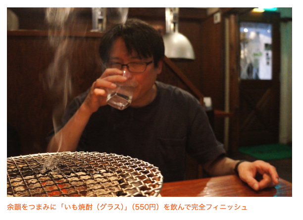
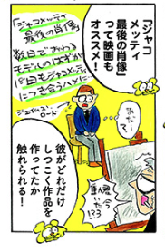
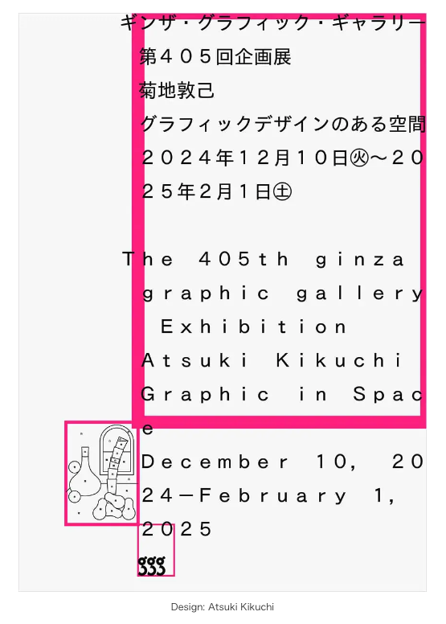
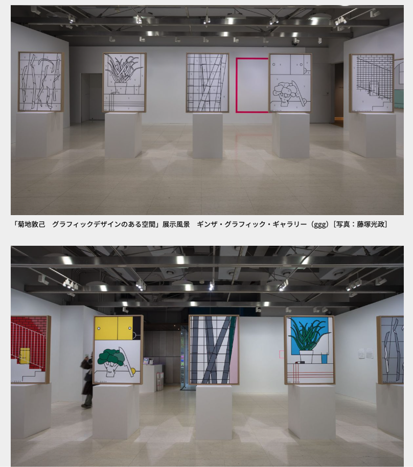
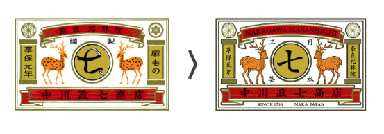

# 生活

- [「このためだけに来た」　交換不要なコイン電池、CESでも話題　SMK](https://dempa-digital.com/article/624807)  
  たとえば、わずかな光や振動など、周囲の環境に存在しているエネルギーを電気に変換する技術をエナジーハーベスティングというらしい。よく使われているサイズのボタン電池で実用的な充電不要電池ができているのだとか。
- [AI翻訳が壊すもの、作り上げるもの](https://blog.tinect.jp/?p=88731)  
  [Sorry voor de vertaling door AI.](https://goldhead.hatenablog.com/entry/2025/01/14/125620)  
  この人のバランス感覚、やはり好きですね。どうも、ハイソサエティな人たちの文章を読んでいると、自分もそうであるかのように錯覚してしまう。もともと、そんなもんでよかったけど、そんなもんを満たすものがあまり使われていなかったのだろう。
- [松屋が｢本気のガチ中華｣で投入した商品の"正体"](https://toyokeizai.net/articles/-/852142)  
  食べてみたいやつ。シュイジューニューローと読むらしい。来週木曜にテイクアウトもええんでないか。
- [「高気圧＝寒い」も「高気圧＝暑い」も正しい～気象予報士増田さんに聞く](https://dailyportalz.jp/kiji/weather_2025_01)  
  どこで高気圧ができるかが問題なのだとか。シベリア気団が雪をもたらすのは珍しいことで、日本海の湿気を運んでくるかららしい。
- [南海トラフ巨大地震 30年以内発生確率「80％程度」に引き上げ](https://www3.nhk.or.jp/news/html/20250115/k10014694011000.html)  
  最後まで読もうね、の大事さがわかる記事。現行の発生確率の計算方法に問題があるかもしれないことは理解しつつも、備えるべきだという。こんなもの↓も世の中にはあったらしい。
  - [岐阜県の地震活動の特徴](https://www.jishin.go.jp/regional_seismicity/rs_chubu/p21_gifu/)  
  地震調査研究推進本部のコンテンツ。
- [「44歳」と「60歳」の2段階で人の老化は一気に加速　米スタンフォード大学などが24年8月に研究報告](https://www.itmedia.co.jp/news/articles/2501/16/news069.html)  
  父が還暦だ。どうか健康でいてほしいな。

# 仕事

- [AIの記事のほうが自分で作った記事よりはるかにPVを稼げてしまった](https://qiita.com/NegishiS/items/146cb26e20774d1333d4)  
  AIの方が自分より優れていると、自分が優れていないとAIを使いこなさないのジレンマ。
- [料理人という仕事](https://www.webchikuma.jp/category/ryourinin)  
  料理人というか仕事全般に関わるいい文章だと思った。料理店は料理を作る能力だけでは成り立たないし、営利団体一般も同様だろう。ハードワークをする機会が得られない、というのもどこかでみた指摘だ。
- [ChatGPTに「日時を指定してタスクを実行させる機能」が追加される](https://gigazine.net/news/20250115-chatgpt-tasks/)  
  だれでも使えるらしい。パソコンの操作とかお願いできるのかしら。
- [アメリカが優れていると感じたのは『ベーコンと乳製品のガチっぷり』食品加工の技術や物流網の違いを感じた「向こうの主食だから」](https://togetter.com/li/2496537?page=4)  
  日本の味噌とか醤油がうまいからとか、食習慣に起因するんじゃないかという。そういえば干し肉を始めてみました。  
  - [日本のベーコンが本場と違うのはわかったから、日本でも買えるガチベーコンが知りたい](https://togetter.com/li/2051278?page=2)  
    ベーコンは手に入ったりするらしい。肉のハナマサ、成城石井。
- [地元にずっとあるけど入ったことのない焼肉屋さんへ行ってみる～大泉学園「炭火焼肉 だい苑」](https://dailyportalz.jp/kiji/yakiniku-daien/page/2)  
  いい写真だな。みんな大好き焼肉。  
   
# 趣味

- [ヘビのキャラクター、大集合　/ 美術のトラちゃん](https://www.cinra.net/article/202501-bijyutsunotorachan73_htrmm)  
  ジャコメッティの話、半分冗談かなと思っていたので、映画が気になる。  
  

## デザイン

- [丹下敏明のエッセイ「ガウディの街バルセロナより」その18 ガウディの日本での研究史にかえて](https://tokinowasuremono.blog.jp/archives/53553655.html)  
  「FLUX STRUCTURE」という概念があるらしく、あのクネクネの元ネタはガウディの逆さ吊り模型にあるのだとか。
- [菊地敦己　グラフィックデザインのある空間](https://www.japandesign.ne.jp/event/kikuchiatsuki-ggg/)  
  元々彫刻をやっていたらしい。はぇ〜。京都に来ないかな。  
  [杉江あこ｜菊地敦己　グラフィックデザインのある空間](https://artscape.jp/article/30103/)  
  ほんとにこんかな。グラフィックやっているのが不思議なくらいの人だな。  
  > これらの絵の“正解”が示されている。「空間上の平面／平面上の空間：線と面」を見ると、先ほど頭のなかで想像した風景は、ある程度、当たっていたものの、想像しきれなかった部分にも気づく。さらに彼が仕掛けたのは、中間色と抜け（白）のスペースだ。もし指定通りに配色しただけであれば、絵は平面的にしかならないだろう。しかし部分的に中間色と抜けを加えることで、絵はわずかに立体的になり、生き生きとしてくる。そうした絵画の基本的な手法を改めて突いてくる。
    
  
- [中川政七商店、初の海外出店を目指して 水野 学がロゴデザインをリニューアル](https://www.axismag.jp/posts/2025/01/635961.html)  
  なんか変わったかいなと思ったけど、違うんですね。明治感があるな、しらんけど。
  
## 読書

- [個人史とパレスチナ史の巧みな融合――『アーベド・サラーマの人生のある一日　パレスチナの物語』書評](https://www.webchikuma.jp/articles/-/3745)  
  以前、なんとなくどっちも悪いという立場で眺めてはダメだぞ、とかって読んだけど、確かになと思わされる。どうしたら解決されるのだろうか。
- [書物の生態系のなかで生き続けるもの 追悼・永田希さん](https://www.webchikuma.jp/articles/-/3759)  
  思っていたよりかなり若い方だった。自分にとって読むべき本・読まれるべき本で情報のビオトープを醸成する、みたいな。このブログ、どこかにいつでも自分で確認できるように置いておきたい。

## 制作

- [Futuraの初期型の字形「Formera」がオープンソースのフリーフォントでダウンロードできます](https://coliss.com/articles/build-websites/operation/design/formera-first-draft-of-futura.html)  
  結構癖がある。せっかくなのでゲットしておいた。ジオメトリック・サンセリフ。
- [環境変数をドキュメント化しておきませんか？という提案](https://zenn.dev/dena/articles/56da0380d7d70d)  
  こういうのはちょっと思う。環境変数というのをいまいちちゃんと理解できてはいないけど。

## ガジェット・グッズ

- [BOOX、13型E Inkを採用したAndroid搭載モノクロ電子ペーパー端末「BOOX NoteMax」](https://www.itmedia.co.jp/pcuser/articles/2501/17/news162.html)  
  最近、電子ペーパーの端末に関心がある。定期的にか。簡易的でもカメラがついてほしい。記録用。 あるにはあるらしい。

## アウトドア

## 展覧会

## お勉強

- [皆が知らない「FeliCa」と「フェリカネットワークス」の最新事情](https://www.watch.impress.co.jp/docs/series/suzukij/1655128.html)  
  フェリカってそのうちなくなるモノのような気がしていたけど、どうもそうだけではないらしい。たしかに、大学の出席確認であまり良くない状況も見たりするし。

## 豆知識

- [「偽のクジラのうんち」を海に散布して気候変動を食い止める試み](https://gigazine.net/news/20250113-fake-whale-poop/)  
  餌が豊富な深海で食事をした鯨が海面付近で糞をすることが、栄養に乏しい海域への栄養供給となりそこから生態系が育まれるという。鯨は増えているのか減っているのか。栄養に乏しい海域にぎじうんちを投入することで二酸化炭素を吸収してもらうことと、海洋資源の回復を狙うらしい。
- [ロサンゼルスの山火事では水が足りず「海水」をまく異例の消火活動が行われている、海水散布が最後の手段である理由とは？](https://gigazine.net/news/20250117-firefighting-planes-dumping-ocean-water/)  
  単純に塩害が〜みたいなことだと思っていたけど、一時的な曝露だったり、あるいは濃度の影響だったりを検証しているらしい。当たり前といけばそうだけど、時間が長いほど影響が顕在化しやすいとか。
- [アルツハイマー病による死亡率が最も低い「2つの意外な職業」とは？](https://gigazine.net/news/20250118-alzheimers-fewest-deaths-taxi-ambulance-drivers/)  
  脳みそに定形外の刺激を与えろよ、みたいな話かな。
# お金儲け