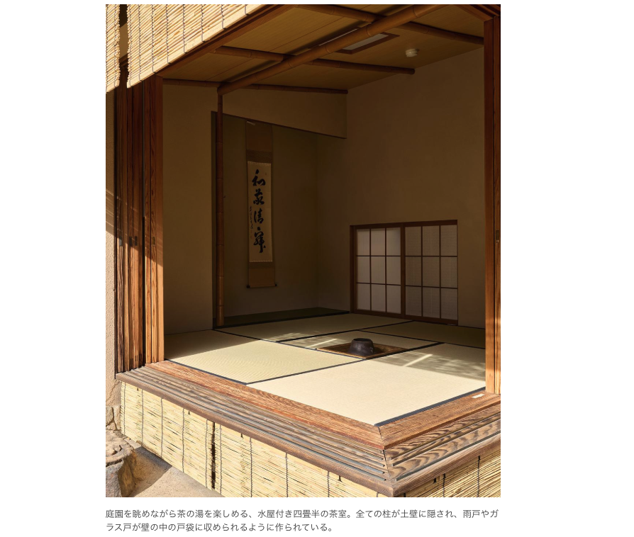

# 生活

- [米中対立の中で日本はどう生きるべきか？](https://drfridge.hatenablog.jp/entry/2025/01/20/042824)  
  中国と関係を深めるべきだ、とか台湾有事に手を出すべきではないとか、たしかに、台湾有事があったとしてその後どうなるんだろうかという見立てを読んだことがない気がする。なんにせよ、なにもないでほしい。
- [追悼・ムラヨシマサユキさん――料理と食を通して日常を考察するエッセイ「とりあえずお湯わかせ」柚木麻子](https://nhkbook-hiraku.com/n/n8bf29b5f2518)  
  覚えておこう。今のうちの設備なら、一品程度の工程がたいへんな料理だって作れるかもしれない。
- [「加工」してない「正直」は食えたものじゃない](https://blog.tinect.jp/?p=88846)  
  自己欺瞞に陥っている（かもしれない）とき、どうしたらいいんだろう。本当は金持ちになりたいのか、モテまくりたいのか。どうなんだろう。
- [飯丸め](https://dailyportalz.jp/kiji/meshimarume)  
  小学生のころやっていた記憶がある、気がするぞ！気のせいかな。
- [令和の日本には「貧乏」がない](https://blog.tinect.jp/?p=88863)  
  自分はビンボーな気がするけど、年齢や属性からすると、いささか無責任でむしろ貧困のほうが正しいのかもしれない。
- [日本の漁業が｢自滅｣に向かっていく根本原因](https://toyokeizai.net/articles/-/853625)  
  こういうのってよくなる兆しはないのかな。小宮さんみたいな活動って身近でないのかしら。小宮さんは少し休んでほしい。
- [商店街の黄金期に商売をしていた人たちは、実は努力をしたことがない。](https://blog.tinect.jp/?p=88884)  
  エライ人だなァ。ずっと同じことで暮らして行きたいってことが甘えなのか。確かにそうだろうな。なんか他のことしようか。持久力と反復練習が取り柄です。

# 仕事

- [表出した事象を叩き潰してはいけない](https://irof.hateblo.jp/entry/2025/01/24/121938)  
  身に覚えがなくもない。防衛だと思ったけど、過剰防衛かも。過剰防衛は罰せられます。

# 趣味

- [【AC6】今後の東和正主催の大会について](https://note.com/azusaki_channel/n/na5443a34d8d6)  
  非常に悲しい出来事だった。大会の存続は難しいんじゃないかとは、確かに考えたけど、実際にそうなると寂しいな。東和正はエライ。次に続く大会出てくるのかなぁ。
  - [コミュニティに属するものとして可愛ゆゆ事件の思うところ](https://note.com/baru0939/n/n91ae04dab259?sub_rt=share_pw)  
    個人的に思っていたことは、たぶんこういう感じ。わけのわからないことを言っている人たちはもう少し想像力を持ってほしい。
  - [お気持ち。](https://note.com/modern_viola238/n/nf620c1d65a9a)  
    これもそうだ。それはそれとして彼らはヒーローだったんだよな。
- [将棋 西山女流三冠 編入試験第5局へ 勝てば初の女性プロ棋士](https://www3.nhk.or.jp/news/html/20250122/k10014699541000.html)  
  奨励会で昇段できなくても、プロになる道があるんですね。これもしらなかった。将棋をわかるようになるとおもしろいだろうな。

## デザイン

- [JR日豊本線 霧島神宮駅 改修](https://www.japan-architects.com/ja/architecture-news/gong-gong-shi-she/takuma-kawaguchi-kirishima-jingu-station)  
  シンボルや耐震構造としてでかい杉材が用いられているけど、大きくなりすぎた杉は商品価値が薄くなっていくらしい。知らなかった。
- [【東京・荻窪】伊東忠太が手がけた和洋折衷の邸宅建築と文化人ゆかりの名庭園へ｜甲斐みのりの建築半日散歩](https://casabrutus.com/categories/architecture/437513)  
  みてどうするんだろうという気持ち半分と、自宅の意匠をかんがえる種になるんじゃないかという気持ち半分。優れた住宅建築で見に行けるものは、身近にもあるかもしれない。  
  

## 読書

- [経済エリートたちの誤解をとく快著、誕生！『日本経済の死角：収奪的システムを解き明かす』ためし読み](https://www.webchikuma.jp/articles/-/3769)  
  ちょっと面白そう。まで書いて思ったんだけど、この本はこっちを向いて気持ち良くさせようとしていないか？それはそれとして、ちゃんとデータは開示されるべきだよな。
- [HTML Living StandardとモダンCSSに完全対応！ 使いやすくて見やすい、期待以上のリファレンス本 -HTML＆CSS全事典改訂4版](https://coliss.com/articles/book-review/isbn-9784295020806.html)  
  よさそう。紙の本の方が便利は確かにそうだ。置く場所がない。
## 制作

- [CSSのみで画面の幅と高さのウィンドウサイズを取得する方法](https://black-flag.net/css/20250121-8237.html)  
  @プロパティには無限の可能性があるぞ、という記事？このサイト、ほかにもいろいろテクニックが載っていそう。

## ガジェット・グッズ

- [一人暮らしだけど洗濯機はドラム式がいい！大丈夫、容量4.5kgの超コンパクトモデルがありますよ](https://www.goodspress.jp/news/654398/)  
  わりかし小さい気がする。洗濯機の何をもって良し悪しなのかを知らないけど。ハイアールのミニドラム「4.5kg ドラム式洗濯機 JW-T45SA」（予想実勢価格：7万8000円前後）、幅516×奥行537×高さ790mm。
- [寒冷地で最も寒い1月を支えた「暖房アイテム」ベスト3](https://tabkul.com/?p=297306&utm_source=rss&utm_medium=rss&utm_campaign=post-297306)  
  自家発電からの電気ストーブにこだわりがある理由は、繰り返し使っても減るものが少ないからなのだと、ようやく自覚できた。備えとして豆炭ストーブってのは悪くないのかも。

## アウトドア

## 展覧会

## お勉強・技術

- [「ジェネレータ」～マンガでプログラミング用語解説](https://codezine.jp/article/detail/20265?p=2)  
  なんかすごく大事なことな気がする。値が返されると、はいれつになっているのかな。
  > ジェネレータ（generator）は、値を生成する特殊な関数などのことです。処理を途中で止めて値を返すyieldといった仕組みを持っており、状態を保持して値を返す処理を、簡潔に書くことができます。ジェネレータは、イテレータの一種でもあります。

## 豆知識

- [米国出生地主義市民権の終了](http://finalvent.cocolog-nifty.com/fareastblog/2025/01/post-d8c6bc.html)  
  出生主義市民権、血統主義市民権、という考え方があるのか。島国で単一言語のコミュニティにいる自分には想像し難い世界だな。
- [AIのブラックボックス内は飛び回る「進行波」で満ちていた](https://nazology.kusuguru.co.jp/archives/168994/2)  
  AIでも何でうまくいっているかわからない部分があるらしい。人の脳ではある刺激を受け取ったとき、周囲のニューロンに興奮が伝播するような働きがみられるとか。そういうような仕組みをAIに組み込んであげると、わからなかった部分がそれによって説明できたり、いまより汎用的な役割を担えたりするらしい。
  - [認知症『LATE』](http://finalvent.cocolog-nifty.com/fareastblog/2025/01/post-a7ab10.html)  
    認知症にもいろいろあるらしい。アルツハイマー病との違いは細胞死を引き起こすタンパク質の種類の差で、これを特定できるバイオマーカーがないので今のところ生前の診断が難しいという。高齢者の7割が認知症に苦しんでいる、という点が驚きだった。

# お金儲け

- [国債の利払い費 2028年度は1.5倍に増える見通し 財務省試算](https://www3.nhk.or.jp/news/html/20250124/k10014701491000.html)  
  こういうの、一次情報を読み解くリテラシーがないと実際のところがわからないよな。税負担は辛いけど、それが適正かどうかは判断できない。辛いけど。