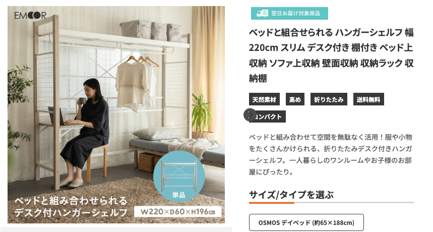
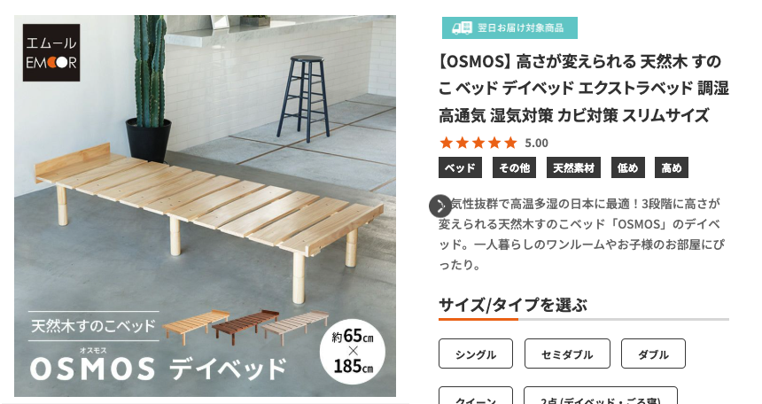

# 生活

- [自宅担保に耐震改修、70歳以上はローン金利ゼロ　国交省](https://www.nikkei.com/article/DGXZQOUA235630T20C25A1000000/)  
  リバースモーゲージという制度らしい。いい仕組みなのかな？いまいちわからないな。
- [｢認知症かも？｣の初動､意外と知られてない正解](https://toyokeizai.net/articles/-/851773?utm_source=rss&utm_medium=http&utm_campaign=link_back)
  各地域には「認知症疾患医療センター」というものがあるらしい。
- [洋上風力発電 建設コスト上昇で次回公募から制度変更へ 経産省](https://www3.nhk.or.jp/news/html/20250128/k10014705321000.html)  
  JERAって発電事業者なんや。知らなんだ。
- [日本社会は若者をダンピングして少子化をきわめた、それは世界も同じではなかったか？](https://p-shirokuma.hatenadiary.com/entry/20250128/1738048116)  
  教育にかかるコストに比べて、就労から得られる報酬が少ない場合が多い、みたいな。就労に供さなくてはならないコストも多過ぎるとか。高卒で働いていたらな、とか思うことはままあるけど、もしそうだとして、高卒で働いていてよかったなとは思わないだろうな。
- [誰も言わないけど、長生きって幸せじゃないよね？](https://blog.tinect.jp/?p=88912)  
   世の中が進歩していい終生を迎えられるようになってほしいな。一人では死ねないんだな。
  > 「オヤジのことは、いい思い出だけのままに見送りたかった」
- [｢認知症予備軍｣早期発見する重要な"8つのサイン"](https://toyokeizai.net/articles/-/854346?page=3)  
  自分の認知や思考の傾向がおかしくなったことにいつまで気づけるだろう。なんか現時点で結構該当してそう。
  1. もの忘れをするようになった
  2. 物事を覚えるのに時間がかかるようになった
  3. 料理の腕が落ちた、味付けが変わった
  4. 掃除や洗濯といった家事がテキパキとこなせない
  5. 時間・場所の把握が苦手になった
  6. 薬の管理ができない
  7. 気分が沈むことが多くなった
  8. 頑固になった、怒りっぽくなった
- [クーリッシュ初のピスタチオフレーバー、北海道産生クリーム入りなめらか“飲むアイス”](https://www.fashion-press.net/news/129632?media=line)  
  ちょっとおいしそう。さむいけど買ってみようかな。見かけたら。
- [33種の栄養素をバランスよく含んでカップ麺なのに完全栄養食な「BASE YAKISOBA ソース焼きそば／旨辛まぜそば」を食べてみた](https://gigazine.net/news/20250129-basefood-base-yakisoba-mazesoba/)  
  ベースブレッドを取り扱っているところで買えるのかな。ちょっと高いけど気になるンゴ。
- [SDGs的ピザの完成！野菜くずを活用した「おせちピザ作り」に挑戦してみた](https://www.bepal.net/archives/506475)  
  将来的にいい感じの庭が使える場所で暮らせたら、鎌を作りたいと思っていたけど、結構簡単そう。レンガを積んで、鉄板を被せる。
  
# 仕事

- [CSSのattr()関数がパワーアップ！ また一つJavaScriptでしかできなかったことがCSSだけでできるになります](https://coliss.com/articles/build-websites/operation/css/css-attr-upgrade-2025.html)  
  contentにしか使えなかったけど、他の用途も行けるようになるらしい。たとえばプロパティの呼び出しとかに使えるのかな。

# 趣味

## デザイン

## 読書

## 制作

## ガジェット・グッズ

- [ローカルLLMを手のひらサイズで動かしてみよう！ M5 Cardputer + ModuleLLM](https://qiita.com/GOROman/items/769bf17589d5661f7a70)  
  Twitter（現X）で見かけたやつだ！ローカルで動かせるLLMに興味がある。WIndowsが届いたらあれこれ試したい。
- [マットレスなのに布団みたいに丸められる！三層構造で寝心地もバッチリ！](https://www.goodspress.jp/news/654884/2/)  
  記事の内容とはあまり関係ないけど、今後（あるかはわからんけど）の自宅のベッド事情のヒントになりそう。  
    
  [エムール](https://www.emoor.jp)
- [来客布団の最適解！ アウトドア寝袋メーカーが作った高機能お布団](https://www.gizmodo.jp/2025/01/bears-rock-nebukuron.html)  
  掛け布団の買い替え先候補かもしれない。色々な製品がありますね。
- [Anker、家庭用蓄電池「Solix XJ」](https://pc.watch.impress.co.jp/docs/news/1658530.html)  
  100万前後。これは手が出ませんな。10,000Whで二日分の電力になるらしい。
## アウトドア

## 展覧会

## お勉強・技術

- [最強のChatGPT活用術『最高の回答を行うために必要な情報があれば回答を生成する前にどんな些細なことでも必ず質問してください。』と付け加える](https://togetter.com/li/2501962j )  
  ショートカットで文頭に加えることができるらしい。やってみたけど結構いいかも。雑に投げても答えてくれるのもいいとこだけど。
- [DeepSeekはなぜこんな大騒ぎになっていて一体何がそんなにスゴいのか](https://gigazine.net/news/20250128-deepseek-r1-impressive/)  
  ローカルで扱えるらしいぞ。学習のさせ方が既存のプロジェクトと異なるらしい。オープンソースというのは魅力的な響きですね。
-  [星街すいせいや宝鐘マリンのライブを彩った照明システム](https://note.cover-corp.com/n/nacc86fff5c36)  
   はえーすごいっすね。普通のライブで使われる技術とゲームエンジン上の技術を同期してライブ演出をするらしい。思っているよりかなり高度な世界だった。

## 豆知識

- [海はナノチューブで相互接続されたバクテリアで満ちあふれていることが明らかになりつつある](https://gigazine.net/news/20250129-network-interconnected-bacteria/)  
  意外と色々な生き物は考えたり、相互にやり取りしているぞ、という話を色々見かけておもしろいですね。過酷な外洋にまばらに存在する単細胞生物もネットワークを形成するらしい。

# お金儲け