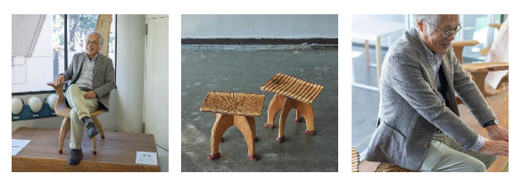
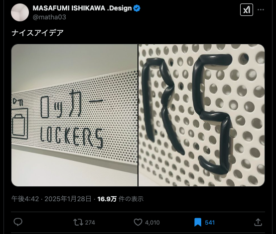
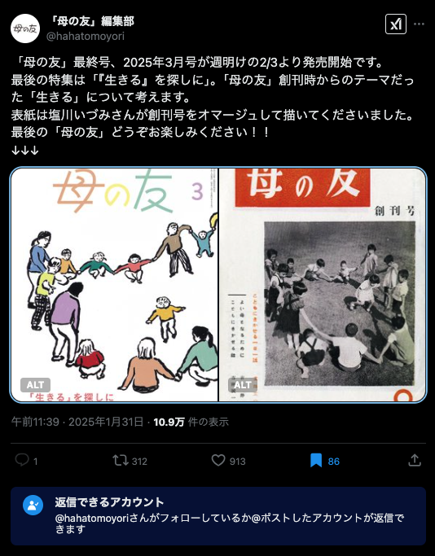
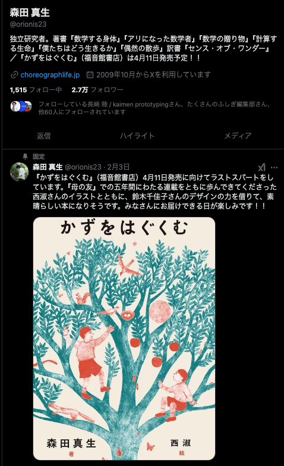
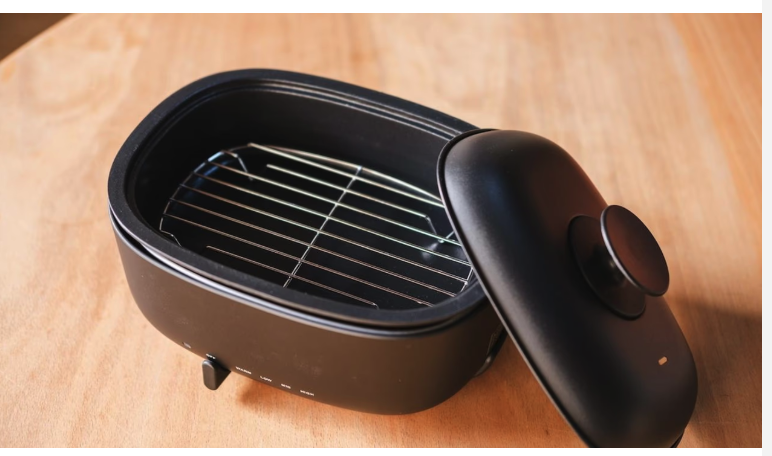
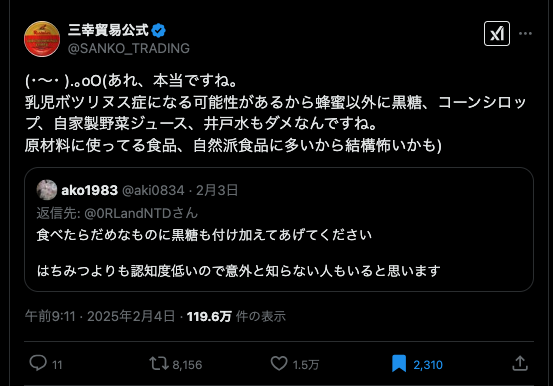

# 生活

- [Amazonが「ゆっくり便」導入。配送日を数日遅らせることで割引が受けられる](https://internet.watch.impress.co.jp/docs/yajiuma/1659639.html)  
  これはいいですね。あとでいいから日時を指定したいという場面はよくある。
    - [Amazonが少し安くなる「無料ゆっくり配達」導入、たった1つの懸念点](https://tabkul.com/?p=297432&utm_source=rss&utm_medium=rss&utm_campaign=post-297432)  
      日時指定はできないらしい？ちゃんとソースを見に行くべきだ。注文と在庫の確保にラグがある場合のトラブルが懸念されるらしい。
- [保険証は体がまともに動かせない人ほど使用頻度があがるのに、すべてマイナンバーカードに変更させて暗証番号を入力させる運用には原理的な無理がある](https://hokke-ookami.hatenablog.com/entry/20250130/1738249149)  
  細々噂に聞くけど、運用に難がありそうだよな。時間が解決するんだろうか。
- [法律の脱レガシーに学ぶフロントエンド刷新](https://speakerdeck.com/oguemon/modernizing-law-and-frontend-app?slide=61)  
  おもしろい話だなぁ。法令は自然言語で書かれたプログラムに近いものだ、みたいな話を聞いたことがあるけど、その保守保全もそれに近いという。憲法が変わらないことはいいことなのだろうか。
- [自分より｢推し｣の成功を望む若者たちのリアル](https://toyokeizai.net/articles/-/854091)  
  そんなこと言われたってどうすりゃいいのさ。自分の実態は寝そべり族に近いのか。「よくなっていく」を知らないし。
- [生産性がゲシュタルト崩壊する](https://blog.tinect.jp/?p=88921)  
   おれの悪口言うなって！！！  
  > 「田舎の中小とか零細企業の経営者や社員に、それが出来る人ってあんまり居らんと思いますけど」
- [東芝や中部電力、岩石を「蓄電池」に　レアメタル不要に](https://www.nikkei.com/article/DGXZQOUC236B10T20C25A1000000/)  
  もちあげるんじゃないくて、蓄熱に優れた材質を利用するらしい。どうやって上手に熱を取り出すかという点に課題があるのだとか。
- [潜在的衝突通知](http://finalvent.cocolog-nifty.com/fareastblog/2025/02/post-23c2c5.html)  
  1.6%とからしいけど、これって結構高いよな。都市にぶつかると壊滅的な被害がもたらされるし、海でも津波が怖い。なんともないといいけど。
- [新しい地熱発電「クローズドループ」商業化めざし世界的に注目](https://www3.nhk.or.jp/news/html/20250205/k10014712731000.html)  
  温度が高い地層に設備を埋め込んで、蒸気を発生させて発電することをいうらしい。建造のコストは高いけど、発電コストは低くなるかも。火山があったりすると国営公園である場合が多いからそれもネックらしい。
- [そういえば五平餅ってなんだっけ？愛知、岐阜で五平餅を食べて理解しました](https://dailyportalz.jp/kiji/goheimochi_in_nagoya_gifu)  
  めっちゃ見覚えある店。五平餅食べたいな。個人的には草鞋形のやつ。
- [『クローズアップ現代』「ロシア “死の経済“の実態」批判](http://finalvent.cocolog-nifty.com/fareastblog/2025/02/post-d89596.html)  
  この見方を知らなかったら、間に受けてしまっていたかも。トランプちゃん、本当に戦争を終わらせることができるのかな。
- [人生は、中年を過ぎていくあたりから](http://finalvent.cocolog-nifty.com/fareastblog/2025/02/post-d6c88c.html)  
  いい文章ですね。今までの人生の中にあって、もう一度味わいたいもの。なんだろう。自分の人生に映画を重ねたとき、何か思うことはあるのかな。リアリズムの宿、漫画を読んでみようか。今死んだら、心残りはある。両親や、mizo、姪っ子が心配だ。それくらいだ。あとのことは暇つぶしか、生活のためか。  
  > あるいは、鏡に映る自分の姿に、フィルムの劣化、色褪せ、ノイズを見た時かもしれない。死んだ父に似た顔や死んだ母に似た顔。つまり、死。その時は、多分誰にでも訪れる。
    - [ぬいぐるみで作る、さっきまで部屋に友達が来てた風インテリア](https://dailyportalz.jp/kiji/tomodachi-ga-kiteta-interior/page/3)  
      > 夕方になるとふと寂しくなる。窓の外が少しずつ暗くなり、今日が終わっていく。すると誰もいない部屋の静寂が気になり始める。いつもなら見つけ次第すぐに追い出すクモも、孤独を紛らわしてくれる存在として、夕方はそのまま放置する。クモよ、お前も寂しいのか……。夕日が完全に沈みきったらこっちのものだ。銭湯に行くも良し、飲みに行くのも良し。今日第2章として夜が始まり、ワイワイ楽しい時間である。クモも外に追い出す。1日の中で、夕方の2時間ぐらいだけ寂しいのだ。今思えば、小学生の頃に放課後2、3時間だけ友達と遊ぶシステムは理にかなっていた。
- [人生でいちばん良かったことは「敗戦」？](https://drfridge.hatenablog.jp/entry/2025/02/07/042832)  
  重い言葉に聞こえる。単純化していいものだなんて言えないな。うまく言葉にできないけど。  
  > 百歳にも近くなった私の人生は、この敗戦を境にその前後で全く切り離されているようなものである。敗戦がいちばん良かったことだったと単純に言うには余りにももそれにつきまとうものが重すぎるのである。
- [せっかちな社会で、熟成に時間のかかるワインとどう向き合うか](https://p-shirokuma.hatenadiary.com/entry/20250206/1738846800)  
  ワイン作りのトレンドが、早熟の作り方に傾いているらしい。ワインのテイスティング、体験とかないんかな。楽しみ方を知ってみたい。初夏に冷やしたワインを飲むのが好き。
    - [「そろそろ中年だし、ワインでもやってみようか」に対してお答えします。](https://blog.tinect.jp/?p=88972)  
      趣味の楽しみ方として、思うところはある。道楽にはお金がかかる。
    - [初心者でも失敗しない好みのワインの選び方](https://toyokeizai.net/articles/-/855792?utm_source=rss&utm_medium=http&utm_campaign=link_back)  
      - アルコールが高いとフルボディ、低いとライトボディ
      - 軽めの白  
         下の品種は酸味が強く爽やか
          - ソーヴィニヨン・ブラン
          - リースリング
      - 重めの白（香り高いアンザス地方のワインはフルート型のボトル？）
          - シャルドネ（オヌヌメ）  
             多くの場合、酸味が穏やか
          - ヴィオニエ
      - 軽めの赤（ワインのボトルがなで肩）
          - ピノ・ノワール
          - ガメイ
      - 重めの赤（ワインのボトルが錨方）
          - カベルネ・ソーヴィニヨン（オヌヌメ）  
             渋みが強く、力強い味わい
          - シラー
          - メルロ
          
- [批評を書くための哲学的ガイド──「目的・理由・推論」から考える](https://lichtung.hatenablog.com/entry/2025/02/07/110243)  
  感想を書くときに気を付けてみよう。最近、美術館を見に行くと、なんとなく展示の意図を汲み取れるようになっている気がする。  
  > 目的：作品の価値づけ／選択ガイド／解釈・説明／鑑賞の仕方の伝達／社会批判の一手段…… 理由：作品自体の特性に根ざす認識的理由／聞き手や読者の行為を導く実践的理由／批評理論（マルクス主義・フェミニズムなど）に基づく理由…… 推論：ある結論（信念）をめざす「理論的推論」／鑑賞や行為を促す「実践的推論」
- [意味分からなくはないだろ](https://anond.hatelabo.jp/20250207100144)  
  気をつけよ。違う内容をAであるならBであるべし！みたいに主張するのは違うよな。適当に考えたけど、全ての人で一斉に記録とって、レギュレーションで受賞を決めるとか。これはダメそう。高いヒエラルキーの大会にでられない、みたいな問題が起こりそう。
- [トランプ・石破初会談](http://finalvent.cocolog-nifty.com/fareastblog/2025/02/post-681f0d.html)  
  肯定的な意見と、否定的な意見、両方あったけど、こういう感じかぁ。増税はやめちくり〜。
# 仕事

- [はてなCMS](https://www.hatena.ne.jp/cms/)  
  たしかに、WordPressがあるなら、なんで今までなかったんだろう感まである。資料ダウンロードのハードルが高い。どっちかというと競合なのか。

# 趣味

- [初心者が25鍵盤MIDIキーボードを使ってはいけない理由](https://note.com/ozashin/n/nccab91d69d3d)  
  はえーって感じですね。音を作るための鍵が足りなくて、テクニカルなことをしなくてはならなくなるのだとか。
- [〈簡単！〉ローカル環境で動画生成AIを動かす方法](https://rootport.hateblo.jp/entry/2025/02/04/161457)  
  なんかローカルで動かせるやつ試してみたいよな。
- [映画『セッション』4Kデジタルリマスター版で再上映、狂気のドラムレッスンを迫力音響で](https://www.fashion-press.net/news/129953?media=line)  
  ちょっとみたいかも。おもしろかったよな。

## デザイン

- [【インタビュー】建築家・藤森照信が、アートピースになりうる椅子を発表！](https://casabrutus.com/categories/design/438696)  
  いい椅子。それを一つだけ買う、と考えると何がええんだろう。お勉強したい。  
    
- [旧式の軍用機に「3Dプリンターで作った板」を接着剤で貼り付けるだけで年間22億円の燃料代が節約できることが判明](https://gigazine.net/news/20250203-microvanes-big-savings-us-air-force/)  
  これは3Dプリンタの美点だよな。既存のものに合わせたパーツを少量生産できる。
-  [スタッフMJの「12月20日 倉俣史朗展ギャラリートーク／関康子×大澤勝彦」レポート](https://tokinowasuremono.blog.jp/archives/53552476.html)  
   最近思うことだけど、といか多分漫画が元ネタだけど、人ひとりが持っている情報ってとんでもなく多いよな。死んでしまったらかなりの部分が失われてしまう。
-   
  覚えておこう。サイン、作りたくなることあるかな。
## 読書

- [山本理顕『新編住居論』再刊！](https://tokinowasuremono.blog.jp/archives/53555597.html)  
  山本理顕はどうなん、っていう思いがなくはないけど、興味がある。集合住宅の設計がええよなと感じました。
-   
  最終号のイラストは塩川いづみ、本のデザインはSTUDIOという会社らしい。買いに行ってこようか。
-   
  キーボードを叩いていると、読んでみたい本がたくさんあるけど、図書館に行くと忘れてしまう。

## 制作

- [img要素のalt属性に何を記述すればよいか、WAIによるチュートリアルにその答えがありました](https://coliss.com/articles/build-websites/operation/work/how-to-use-the-alt-of-the-img-element-in-various-situations.html)  
  大体、直感に反さない。意味がなければ空で、行動を求めるならその行動を、意味があるなら意味を、含めよう。
- [絵本研究にはどのようなトピックがあるのか](https://lichtung.hatenablog.com/entry/2025/02/05/134355)  
  絵本っていい世界だよな、と言うことを教えてくれた。ちょっと作ってみたいかも。
## ガジェット・グッズ

- [「右利き・左利き」どちらもOK！ ALPAKAの多機能ボディバッグは11インチPC対応の実力派！](https://www.goodspress.jp/news/655727/2/)  
  いい感じのカバンが欲しくなってきている。大事なガジェットが増えてきたからセミハードかつ防水がいい。なんかあるか。
- [無印良品の｢一台5役のホットプレート｣。蒸し料理・鍋料理で大活躍してくれます](https://www.gizmodo.jp/2025/02/muji_plate.html)  
  いいかんじでつね。あんまりシチュエーションが思いつかないか。  
    
- [鳥見歴50年のプロが東京郊外で特別レッスン！初心者も始めやすいバードウォッチングの楽しみ方](https://www.bepal.net/archives/506856)  
  あまり安いものではないな。いいセンサーといいレンズが着いたスマホと、単眼鏡、ちょっと欲しい。
- [未発表の「Xiaomi 15 Ultra」は2025年の「最強カメラスマホ」となるか--噂まとめ](https://japan.cnet.com/article/35228792/)  
  気になる君。14は20万くらいらしいけど、作例が大変いい。ううむ。
- [不要になったPCのモニター、どう処分する？方法と注意点をまとめてみた](https://pc.watch.impress.co.jp/docs/topic/feature/1658344.html)  
  PCリサイクルマークという概念があるらしい。それがついていると、あるいは改めて発行してもらうと、タダで引き取ってもらえるらしい。
- [ついに発表！5ドアの｢ジムニー｣265万1000円](https://toyokeizai.net/articles/-/854912?page=3)  
  ジムニーだと思って眺めてると、サイドビューが長い。かわいいですね。
- [ミニPCのライセンスがボリュームライセンスだった場合の対処方法](https://komameblog.jp/review/minipc-license/)  
  新しいパソコンきたら確認しよう。いつ来るんだろう。
- [「スターリンクミニ」が届いた！　さっそく導入したお寺に聞いた“第一印象”と活用法](https://www.itmedia.co.jp/news/articles/2501/30/news066_2.html)  
  思ったより早いんですね。そのうちスマホで衛星通信使えるようにならないかしら。
- [ソニー製ミラーレスカメラのリモート撮影が可能な「Remote Camera Tool」の使い方を「α1 II」で試してみた](https://gigazine.net/news/20250130-sony-alpha1-ii-remote-camera-tool/)  
  動画とかの用途なんかな。USBとかでテザー撮影できないのかしら。
- [マイクロソフト、「システム要件を満たさないPCへのWindows 11導入方法」をウェブサイトから削除](https://gadget.phileweb.com/post-95933/)  
  パソコンきたら早急に対応したい。proライセンスを保護するのだ。

## アウトドア

- [3人のクライマーがパンドラ北東壁登頂！ 亡き友の魂に導かれて](https://www.bepal.net/archives/506496)  
  壮絶だなぁ。なぜ、これを目指すのかがわからない。読みながら金玉が縮み上がる。

## 展覧会

## お勉強・技術

- [フロントエンド開発者が知っておくべきバックエンドの知識10選](https://qiita.com/K3n_to_n17/items/be59c202f4dc0ba68cb8)  
  データベースのAPIを使えるくらいにはなりたい。なんのためか知らんけど。

## 豆知識

- [ボノボは人間が「知らないことを知っている」と助けてくれる (2/2)](https://nazology.kusuguru.co.jp/archives/170067/2)  
  相手が知らないことがわかる、というのは上等なことらしい。みんな大好きボノボ。
- [ナナフシのオスはもはや不要⁈ 交尾しても「オスの遺伝子が受け継がれない」と判明 (2/2)](https://nazology.kusuguru.co.jp/archives/170166/2)  
  オスメスって、遺伝的多様性を担保するための仕組みみたいに思っていたけど、退化する場合も（オス絶滅はよく言われるけど）あるんですね。ナナフシモドキは単性生殖でかなり長い間繁栄していたらしいので、なんでうまく行っていたのかはさらに調査されるらしい。
-   
  画像へのリンク、できるんですね（mdについて）。はちみつ以外は知らなかった。
-   
  偽中国語からの派生かな。我理解了！理解了！
- [コロナウイルスの「隠密作戦」と急速な老化の仕組み：新レポートの一部をご紹介](https://x.com/Angama_Market/status/1867515841304310239)  
  コロナウィルスの特徴として、構造的に宿主の細胞の中で長期的な炎症を起こしやすいらしい。さらに新型コロナウィルスの特徴として、ヌクレオチドをたくさん消費する点が、細胞の負担となる。くわえて、新型コロナウィルスのミトコンドリアへの攻撃性が、さらに細胞の負担を重くする。ので、加速的に細胞の老化が進み、慢性的な痛みなどの長期的な症状を引き起こすのだとか。難しい話だった。
# お金儲け