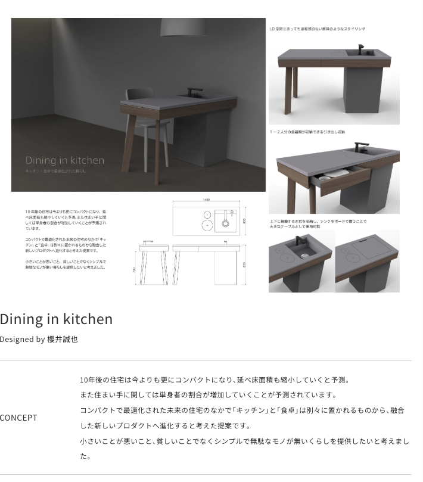
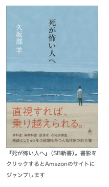
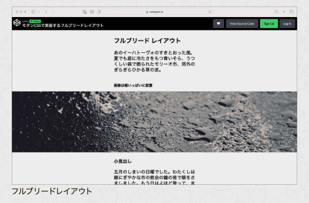
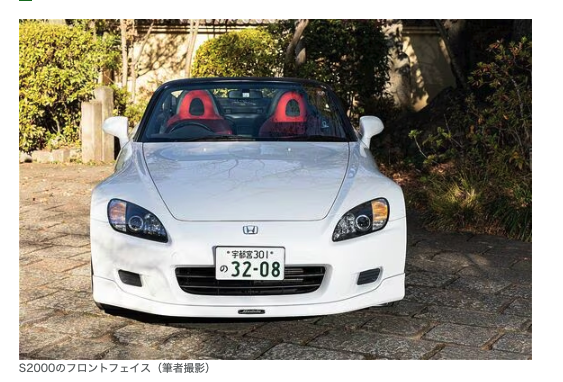
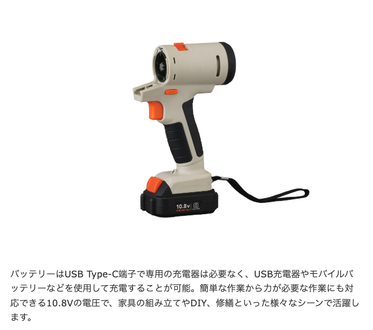
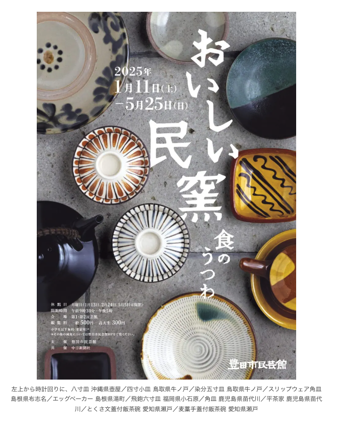

# 生活

- [雪国まいたけ、きのこで作った代替肉「キノコのお肉」](https://www.watch.impress.co.jp/docs/news/1660810.html)  
  ちょっと食べてみたい。300円くらい。  
  
- [日本人の"足の悩み"の｢元凶=扁平足｣9つのサイン](https://toyokeizai.net/articles/-/856528?page=4)  
  めちゃめちゃ雑だけど、ふくらはぎをほぐしたりするのがいいらしい。扁平足対策を考えるといいのだとか。
- [雪かきという、法のソト・世間のウチ](https://p-shirokuma.hatenadiary.com/entry/20250209/1739061921)  
  タイトルがいいですね。自分の場合、とくに何もないのか。子供のころにはそういうものもあった気がする。
- [雪のない冬](https://drfridge.hatenablog.jp/entry/2025/02/12/043227)  
  たしかに、子供のころは数日遊べる雪が降ることも、年に1〜2回あったように思う。凍った雪の上を歩いた通学路。なくなってしまったものも多いな。
- [村上総務相 “人口減「県庁いらない」は長期スパンの話”](https://www3.nhk.or.jp/news/html/20250214/k10014722391000.html)  
  見出しがアレな感じだけど、ものすごく現実的な意見に思える。wikiかなんか読んでみても、何をしている人なのあまりわからない。悪口をかかれる向きは多いように感じられる。  
  > 「個人的な見解で長期スパンの話だ。次の世代が生き残るために今から考えていかないと間に合わない」
  - [鳥インフルエンザ カラスで感染拡大し養鶏場に持ち込んだか](https://www3.nhk.or.jp/news/html/20250215/k10014723091000.html)  
      H5N1型は着々と進歩しているらしい。これ怖いんだよなぁ。
- [楽天モバイル、スマホと直接通信する衛星ブロードバンドサービスを春ごろ実験、26年中に提供へ　](https://www.itmedia.co.jp/news/articles/2502/14/news190.html)  
      ワイくんの携帯でも通じるようになるのかな。ロマンがありますね。
- [｢台所で料理も｣寝たきりの70代女性に起きた変化](https://toyokeizai.net/articles/-/858335?page=4)  
  薬の効能とデメリットは、きちんと知っておくべきだよな。痛みは軽視するべきじゃない。これは肝に銘じておこう。余計な口出しをしがちだから。
- [君が代は歌わない](https://drfridge.hatenablog.jp/entry/2025/02/14/044934)  
  ううむ。知らないことばかりだ。右にも左にもなれないけど、戦争のことは知っておくべきだろうし、想像力は持つべきだ。こういう事実を受け取って何らかの行動を起こせる人は尊敬する。  
  > ただ皮肉に思うのは、音痴の私が弾けるピアノ曲が戦前に覚えた「レドレミソミレ　ミソラソ・・・」の君が代しかないと言うのがあまりにも情けない。
- [岐阜には名物「冷やしたぬきそば」がある](https://dailyportalz.jp/kiji/hiyashitanukisoba_in_gifu)  
  たぬきそば、食いたいぜ。更科のやつは卵乗ってないもんな。大福屋、行ってみようか。
- [鉛製給水管、知らぬ間に血中の鉛濃度が平均の１００倍に…中毒に苦しむ男性「まさかと思った」](https://news.yahoo.co.jp/articles/c3bc2e5b6991d4dcfb8317b92643a116bd9052e9?page=1)  
  これはびっくりした。現代で、水道管由来の鉛中毒なんて起こるんですね。しかも三十代と若い方に。予後が良くなることを祈りたい。岐阜県でもコンマ数%の水道管に現存するらしい。
# 仕事

- [緊急時の規律](https://irof.hateblo.jp/entry/2025/02/11/110918)  
  たぶん、似ていることだけど、同じような対応は、やり方をわけない、同じにしていく、ということを個人的には実践している。細かくパターン分けをしても、運用が困難になるだけだと感じられるからだった。緊急時に通せるやり方、たとえば承認を省略化したり、は普段でも適用されて然るべきじゃないか？というお話。
- [能力はカバーできるけど、人間性はカバーできない](https://blog.tinect.jp/?p=88999)  
  わいの悪口がいっぱい書かれている。気をつけよう。こういうふうに考えるのはやめようね。
    - 「別に悪口言ってるわけじゃないよ？ 事実でしょ？」
    - 「今日のプレゼン、内容が薄いよね～」
    - 「君にはまだ早いかな。もう少し勉強してから提案したら？」
    - 「今回はタイミングが良かっただけでしょ」
    - 「まぐれで上手くいっただけで、大したことないよ」
    - 「才能ないよね。」
    - 「そんな理想ばっかり言っててもね～」
    - 「私はこの程度なんです」
    - 「そこまでやるように言われてませんでしたけど？」
    - 「勉強したくありません」

# 趣味

## デザイン

- [ミラタッププロダクトデザインコンテスト2024](https://info.miratap.co.jp/designaward/product/result/2024/)  
  ミラタップ賞、いいですね。都市部への一極集中はこれからも進んでいくのだろうか。  
  

## 読書

- [｢脳死は否定するのに移植を望む｣はおかしい？](https://toyokeizai.net/articles/-/853851)  
  脳死となってしまった人は、思っているよりずっと生きている感じがするらしい。もしかしたらという思いを抱えながら、臓器移植の判断をしなくてはならないとも。もっとちゃんと知った方がいいのだろうか。 下記の本の抜粋らしいけど、自分の死は怖いかな。痛みや苦しみは怖い。身近な人の死の方が怖い。
  
- [プログラマー高橋征義が選ぶ、開発者として“生きる”と向き合うための「お守り本」6冊](https://levtech.jp/media/article/column/detail_616/) 
- 『ひとめあなたに…』新井素子 著、東京創元社
     地球が破滅するタイプのSF
 - 「Die Energie 5.2☆11.8」『三原順傑作選’80s』所収、三原順 著、白泉社
      三原順という面白い漫画を描く人がいるらしい。  
      > 消費者は送られてくる電気を憎みはしないが　いかなる種類の発電所でもそれを憎む人々は必ずいるそれは食卓に並んだ料理は好んでも　屠殺場は好まない人々が多いのにどこか似ているそして…けれど現在　発電所は自然を破壊し人々に害をなすことにゆるしを与えてくれる宗教を持っていない
      - 『故郷から10000光年』ジェイムズ・ティプトリー・ジュニア 著、伊藤典夫 訳、早川書房
      - 私的所有論［第2版］』立岩真也著、生活書院  
         これが気になる。物を所有するということについて。
      - 増補新版 人間の条件　そんなものない

## 制作

- [これは覚えておきたい！ モダンCSSで実装する、記事は中央に画像は幅いっぱいにフルブリードレイアウトを実装するテクニック](https://coliss.com/articles/build-websites/operation/css/full-bleed-layout-with-modern-css.html)  
  むかしあったテクニックをナウでヤングにした感じだな。  
  
  
  ```css
  html{
  container-type: inline-size;
  }
  main {
  --w: 600px; /* the max-width */
  --m: 1em;   /* margin on small screen */
   margin-inline: max(   var(--m),50cqw - var(--w)/2);
   }
   .full-bleed {
  margin-inline: min(-1*var(--m),var(--w)/2 - 50cqw);
  /* same as
  margin-inline: calc(-1*max(var(--m),50cqw - var(--w)/2))  
  */
  }  
```
- [負債になりにくいCSSをデザイナとつくるには？](https://speakerdeck.com/fsubal/fu-zhai-ninarinikuicsswodezainatotukuruniha?slide=24)  
  これは個人的には実践していることに近い気がする。あらかじめコンポーネント？変数？を定義して、それをベースにレイアウトを作っていくかんじ。テイルウィンド（って読むんだ）をカスタマイズして使えるのは知らなかった。あと、校正ルールでないべき物を炙り出すみたいなことも有効なんだろうな。
- [え？本買ってるの？？もっと良い方法あります。](https://qiita.com/itsuki_m/items/3fe9b1154e6e98b182e4)  
  ライブラリやフレームワークで、公式ドキュメントが公開されている場合に有効な方法らしい。AIに食わせて、ハンズオンを作ってもらう。
    1. ドキュメントのURLをChatGPTに要約させる  
   ``` プロンプト
       URLのドキュメントを要約してください: [ドキュメントのURL]
       //必要であればGithubのREADMEのURL
       GithubのREADMEを要約してください : [GithubのURL]
    ```
    1.  ハンズオンを作成させる
   ```プロンプト
       このライブラリの基本的な使い方を学ぶために、初心者向けのハンズオンを作成してください。
       - 必要なセットアップ手順
       - 簡単なサンプルコード
       - よくあるエラーとその対処法
    ```
    1. 実際に手を動かして学ぶ
       難易度の調節もできる（あらかじめ自分の水準を教えておいてもいいかも）
## ガジェット・グッズ

- [｢聞こえるメガネ｣にチタンモデル登場。脳がバグる](https://www.gizmodo.jp/2025/02/huawei-eyewear-2-release.html)  
  定期的に欲しくなるけど、個人的にはオーバルタイプのメガネがいい。つけている写真を見ると、そんなに悪くなさそうだけど。
  
- [今が買い時!?ホンダ｢S2000｣FRオープンの刺激](https://toyokeizai.net/articles/-/855829?page=4)  
  意外と安い。NAロードスターよりも安い説、あるんじゃないか。こんな難しそうな車運転できないだろうけど。このお顔、今のホンダのスタイリングに通じるものがある気がする。  
  
- [バイク用スマートモニターにドラレコ、レーダー、空気圧センサーまでも付けられるって！](https://www.goodspress.jp/news/657841/)  
  バイクの状態をセンシングするの、ちょっと興味あるかも。まぁまぁ年寄りになってきてるし。
- [こんなDIYギアが欲しかった。ヘッド交換式で収納にも困らないアイリスのマルチギアが気になる！](https://www.goodspress.jp/news/658973/2/)  
  この手の工具、ちょっと欲しい。でもできればバッテリーより有線がいい気がしている。実際のところはどうなんだろう。  
  
## アウトドア

## 展覧会

- [おいしい民窯　―食のうつわ―](https://www.japandesign.ne.jp/event/oishiiminyo-mingeikan/)  
  ちょっと行ってみたい。行くならバイクだろうな。〜2025-05-25。  
  

## お勉強・技術

## 豆知識

- [アホみたいに穴を掘り続ける、マントル到達チャレンジ](https://nazology.kusuguru.co.jp/archives/169617)  
  知らなかった。マントルはカンラン石でできていて、固体らしい。そのうえ、対流を起こしているのだとか。はぇ〜。
- [量子コンピューター「黎明」とスパコン「富岳」の連携がスタート、世界初のハイブリッド量子スーパーコンピューター](https://gigazine.net/news/20250212-hybrid-quantum-supercomputer/)  
  量子コンピューターってもうあれこれ動き始めてるんですね。種類もいろいろあるのだとか。
- [天才発明家ニコラ・テスラが生み出した「水を制御するテスラバルブ」に新機能が見つかる (2/2)](https://nazology.kusuguru.co.jp/archives/89285/2)  
  液体を交流電流のように扱えるらしい。なんか疫隊の振動からポンプのように機能する仕組みが作れるとか。直流交流のメリットデメリットを理解していないので、どういう意味を持つかがあんまりわかっていないけど。
- [【神の薬アヘン】いかに人類を破滅させる「悪魔の実」となったのか？](https://nazology.kusuguru.co.jp/archives/170616)  
  覚醒剤と似たような話だなぁ。ヘロインは薬局で買えたらしい。人類が化学物質を扱うようになってから、意外とその歴史は浅いように思う。

# お金儲け

- [｢不動産価値が下がらない街｣には大きな特徴がある](https://toyokeizai.net/articles/-/856888?page=3)  
  儲けるつもりは、できるはずもなく、ないけど。そのうち土地を買うかもしれないときに考慮したい。
    - 人口の出入りがある
    - 幹線道路に近い
    - 生鮮食品スーパーがある
    - 地盤が強固