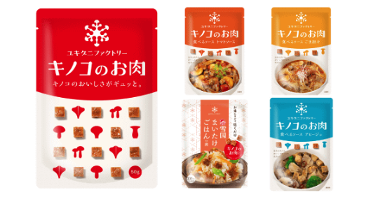

# 生活

- [雪国まいたけ、きのこで作った代替肉「キノコのお肉」](https://www.watch.impress.co.jp/docs/news/1660810.html)  
  ちょっと食べてみたい。300円くらい。  
  
- [日本人の"足の悩み"の｢元凶=扁平足｣9つのサイン](https://toyokeizai.net/articles/-/856528?page=4)  
  めちゃめちゃ雑だけど、ふくらはぎをほぐしたりするのがいいらしい。扁平足対策を考えるといいのだとか。
- [雪かきという、法のソト・世間のウチ](https://p-shirokuma.hatenadiary.com/entry/20250209/1739061921)  
  タイトルがいいですね。自分の場合、とくに何もないのか。子供のころにはそういうものもあった気がする。
# 仕事

# 趣味

## デザイン

## 読書

## 制作

## ガジェット・グッズ

- [｢聞こえるメガネ｣にチタンモデル登場。脳がバグる](https://www.gizmodo.jp/2025/02/huawei-eyewear-2-release.html)  
  定期的に欲しくなるけど、個人的にはオーバルタイプのメガネがいい。つけている写真を見ると、そんなに悪くなさそうだけど。
  
- [今が買い時!?ホンダ｢S2000｣FRオープンの刺激](https://toyokeizai.net/articles/-/855829?page=4)  
  意外と安い。NAロードスターよりも安い説、あるんじゃないか。こんな難しそうな車運転できないだろうけど。このお顔、今のホンダのスタイリングに通じるものがある気がする。  
  
## アウトドア

## 展覧会

- [おいしい民窯　―食のうつわ―](https://www.japandesign.ne.jp/event/oishiiminyo-mingeikan/)  
  ちょっと行ってみたい。行くならバイクだろうな。〜2025-05-25。  
  

## お勉強・技術

## 豆知識

- [アホみたいに穴を掘り続ける、マントル到達チャレンジ](https://nazology.kusuguru.co.jp/archives/169617)  
  知らなかった。マントルはカンラン石でできていて、固体らしい。そのうえ、対流を起こしているのだとか。はぇ〜。

# お金儲け