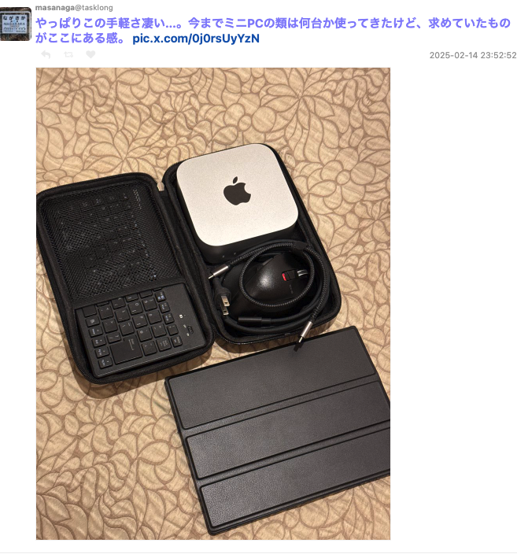
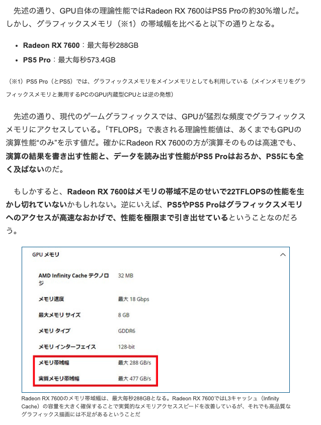
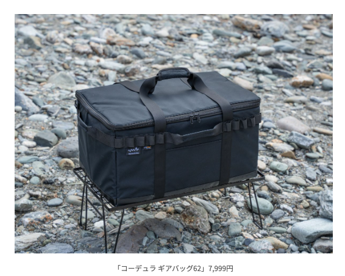

# 生活

- [けれど大切にしてこなかったのだ。――「愛がありふれている ＃５」向坂くじら](https://nhkbook-hiraku.com/n/ndc6e4c13ee42)  
  心当たりがある文章だ。大事だと思っていたものはいつのまにか、自分の扱いで、少し壊れている。そうすると、より大事にしようと考えなおす。それでいいのか。
- [「自治体の消滅をリアルタイムで見ている」北海道北見市で「都市開発の現状」を見た地元医師が悲痛な声…「公的機関の撤退戦」が始まり勝ち筋が見えない](https://togetter.com/li/2511454)  
  人ごとではないように思う。どんな議論していても、届くべき人に届かないというのは最近よく考えることだ。どれだけ情報が開かれていても、自分には聞こえていないし、理解し得ない、ということが多いのではないかと。でもなんでもかんでも考えろよってのも難しいよなぁ。岐阜市の人口は400,000人ほどらしい。
    - [おれは雪国で生きていけない](https://blog.tinect.jp/?p=89034)  
      [弱者の東京と強者の田舎](https://goldhead.hatenablog.com/entry/2025/02/20/125705
      生きるだけなら自分にはできるが。そういう話題ではない。おそらく自分も再生産しない人間の一人になるだろうし、社会を縮小再生産している会社に勤めている人間で、敵側だろうなとは思う。じゃあ死ねるかと言われると、モゴモゴしちゃう。
- [子ども目線で昔のガンダムを思い出す──ある石川県民の場合](https://p-shirokuma.hatenadiary.com/entry/20250217/1739798322)  
  子供の頃見たガンダムは、よくわからなかった。絵も古いし。確か劇場版三部作プラス逆襲のシャアだったと思う。今もわからんか。何を見ても。小学生の頃はNARUTOが流行っていたけど、よくわかっていいなかった。いつやるアニメなのかも、ジャンプなんてものも知らなかった。忍者走りの真似だけしていた。よく友達がいてくれていましたね。
- [梅宮アンナ｢胸はもういらない｣病を得て感じた事](https://toyokeizai.net/articles/-/858845)  
  かわった人のイメージがあるけど、かなり堅実な内容に思えた。専門の人の言うことや、標準なことは、大事なことだよな。
- [中国｢砂漠に太陽光パネルの海を作れば、緑化もできて一石二鳥じゃん｣](https://www.gizmodo.jp/2025/02/desert-called-sea-of-death-becomes-sea-of-solar-panels.html)  
  砂漠に太陽光パネルを設置すると、風防になって砂漠化の進行を抑えたり、地面の水分の保持に役立ったりするらしい。中国の太陽光発電はすごいとも。たしかに、大陸のど真ん中って、いい場所だよな。ワイ家にもなんらかの発電設備を導入したい。
- [同性愛者の脳に電気刺激→異性と性行為できるか？　24歳の男性で人体実験　1972年の研究報告](https://www.itmedia.co.jp/news/articles/2502/19/news071.html)  
  そもそものところで、家庭環境に原因がある、後天的な（？）同性愛というよりかは異性嫌悪だったものらしい。
- [佐藤圭多のエッセイ「大西洋のファサード　－ポルトガルで思うこと－」第18回](https://tokinowasuremono.blog.jp/archives/53556273.html)  
  格差というか、バラバラさというか、遊びのなさというか、難しいんだけど。一人は優しいけど、集団は...みたいな話題でもあるのか。わからんけど。それはそれとして、ポルトガルでは冬に雨季が来るんですね。長い冬に雨が降りしきると、心情的にもどんよりしてきそう。
- [商店街マダムショップは増殖しているのか？――料理と食を通して日常を考察するエッセイ「とりあえずお湯わかせ」柚木麻子](https://nhkbook-hiraku.com/n/n7281a5d92159)  
  かわいい服を買って嬉しいとか、ほめられて嬉しいとか、そういう素朴な気持ちを大事にしたい。自分の主義は、それはそれとして。
- [福島第一原発で試験的に採取 核燃料デブリ 茨城の施設で初公開](https://www3.nhk.or.jp/news/html/20250221/k10014728641000.html)  
  批判的な意見があるのも知っているけど、実際どういうふうに考えたらいいんだろう。思っていたよりもっとずっと、進捗は緩やかだ。
# 趣味

## デザイン

## 読書

## 制作

- [プロンプトエンジニアリング再入門](https://zenn.dev/acntechjp/articles/ad24cd00af552d)  
  覚えておきたい。言語化できることはパソコンにお願いできるのだ。
    - 目的・ゴールの明確化
    - ステップを分けた思考の指示
    - 一方通行での思考を促す  
      前のステップを考慮しないでいいこと、現状の材料だけで思考していいことを伝える
    - プロンプト自体を複数回に分けて実行する（分割実行）
    - SystemメッセージとUserメッセージの役割分担
    - JSONやYAMLなど構造化出力の指示
    - Few Shotの使い方  
      想定される問答を先に教えて、それに倣った回答を出力するようにお願いする
    - Temperatureなどパラメータの調整  
      サービスによって設定できるパラメーターが異なるらしい
    - 可読性・簡潔性の確保
    -  タスク特化型 vs. 汎用型のバランス
    - 継続的な検証と改善  
      バージョンが変わると、受け答えの内容が変わることもあるらしい
- [LLMを活用するためのデータのテキストへの変換方法](https://zenn.dev/karaage0703/articles/617c6c4225335a)  
  プルリクエストの差分をくわせたり、pdfをテキストにしたり、音声をテキストにしたりする方法が示されている。

## ガジェット・グッズ

- [Mac miniが小さくなってきたのでモバイル系のガジェットと組み合わせれば持ち運び運用も可能に「MacBook Proよりバカ安高スペ」](https://togetter.com/li/2512391)  
  次のMac端末はMacMiniにしようと思っているんだけど、ダイソーのケースに入るんですね。小さめのモバイルモニター欲しいかも。  
  
- [「こんなハズでは……」　理論性能は良いのにベンチマークスコアが奮わない？　「モンスターハンターワイルズ」にピッタリなGPUの選び方](https://www.itmedia.co.jp/pcuser/articles/2502/18/news143_4.html)  
  思ってるよりスペック伸びないなとか、調べてもいないのに考えていたけど、ここに答えがありそう。ちょっと調べてみよう。  
    

## アウトドア

- [1999円から7999円とお手頃！Alpen Outdoorsから機能性抜群の「コーデュラ ギアバッグ」４種登場](https://www.bepal.net/archives/513646)  
  バイクの箱の上にくくるボックスにいいかも。どうだろう。  
  
## 展覧会

## お勉強・技術

## 豆知識

# お金儲け