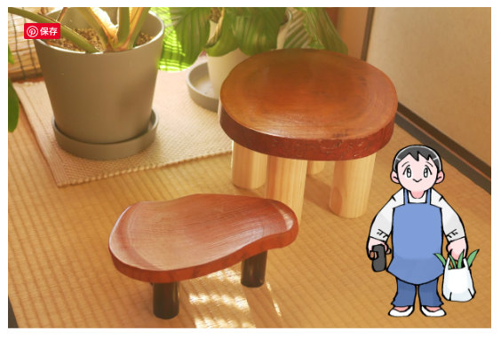
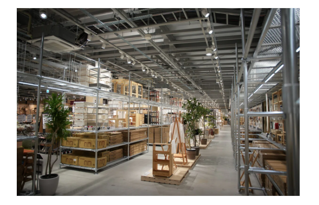

# 生活

- [恐怖の｢50-50｣。50年後、温暖化で経済が50％減少する現実味](https://www.gizmodo.jp/2025/02/may_lose_50percent_of_gdp_due_to_global_warming.html)  
  これもリソースの問題らしい。ちょっと思ったんだけど、どっかのタイミングで人類全体の活動規模の成長が止まるんだろうけど（フィクションの世界ではよくあるけど）、そういうことって偉い人は考えたりするのかな。
- [頑丈な人間・頑丈に見えて命を削っている人間、どちらも恐ろしい](https://p-shirokuma.hatenadiary.com/entry/20250224/1740393369)  
  自分は、ダメだった。モチベーションがない。ランニングみたいな仕事の仕方なら、少しだけ長く続けられたりするくらい。クレーの絵を見ても落ち込まない。
- [脚をつけるとかわいい](https://magazine.cainz.com/article/213027)  
  たまにりんご箱に足をつけたくなる（台に乗せた方がいい）。  
  
- [クレアチンは脳にもいい、研究続々、筋トレに大人気のサプリ](https://natgeo.nikkeibp.co.jp/atcl/news/25/022100101/)  
  主に筋肉に作用して、脳にもいい効果があるのだとか。あと、体質の改善にも役立つのだとか。タンパク質から作られるもので、サプリで撮るならプロテイン（タンパク質じゃないか）より楽かも。
- [ワクチン接種後症候群](http://finalvent.cocolog-nifty.com/fareastblog/2025/02/post-3f30b4.html)  
  免疫を獲得するために擬似的に発生させたスパイクタンパク質が、長期的な炎症を引き起こして、なんらかの病理の原因になっているかも、ということらしい。それも新コロちゃんの後遺症に似ているのだとか。リスクはあると思っていたけど、結構深刻ですね。研究がうまく進んでいくことを祈りたい。
- [【煩雑すぎる介護申請】腰痛で歩けない中、自分で申請しなければならなかった純子さん(仮名)の場合　『じょうずに頼る介護』より](https://ohtabookstand.com/2025/02/kaigo-02/)  
  「お父さん！　ハンマーは置いていけ!!」は、本当に冗談でないように思う。介護、人への頼り方。課題ですね。
- [脳汁出なくても「や　る　ん　だ　よ　！」](https://blog.tinect.jp/?p=89052)  
  ドーパミンの寵愛を、ゲームに使い切ってしまったのか。大学生の頃、バイトと卒業制作を並行して進められたのって、これなのかな。いまはあまり成功体験がないですね。
- [米国とウクライナの決裂](http://finalvent.cocolog-nifty.com/fareastblog/2025/03/post-56c4a8.html)  
  世の中から、ウクライナの負けを口に出さずとも望んでいる雰囲気がでてきてるのか。西側世界と、東側世界が、当事者を傍に置いてこれで手打ちにしましょうか、という話をしているように見えるんだけどな。わからない。  
  > 私の意見は、率直に言えば、今回の事態を肯定的に捉えたい。トランプ米大統領が、ウクライナ戦争のエスカレーションには第三次世界大戦の懸念があると明瞭に認識した点でである。私は、ウクライナ政権は破れかぶれになって、核戦争を含めた世界を第三次世界大戦に巻き込もうとする動きが生じるのではないかと疑っている。しかし、トランプ米大統領は少なくともそれに加担しない意思を今回の騒動で明確にした。
- [Xに頼らずAI関連情報をキャッチアップする](https://zenn.dev/discus0434/articles/6e5add61970786)　　
   暇つぶしに眺めているけど、確かにそうなんだよな。だるいんだ。みんな一斉にどこか一つプラットフォームに引っ越してくれればいいのに。

# 仕事

- [伝わる説明を書くスキル](https://qiita.com/bread_ha/items/934ba71671f5369f84c2)  
  自分の仕事の言い方で、書き直したい内容。前提を省かない、略語をなるべく使わない、など。未来の自分や新参者に不親切だから。
- [不要コード削除のススメ](https://www.docswell.com/s/naopusyu/KYD7W3-unused-code-cleanup#p32)  
  取るに足らないものでも、放っておくと、本当にめんどくさくなる。助けて欲しい。
- [生成AIについて考えていること](https://blog.smasato.net/entry/2025/02/27/190743)  
  なんか、デカテック企業が儲かってる理由に、（製造業とちがって）ひとりあたりの生産性が、コンピューターを頼ることで、何倍にもなりやすい見たなことを読んだことがある気がする。生成AIはそうした傾向を加速させるのだろうか。
- [コードレビュー時に"しないこと"３選](https://qiita.com/taka_xin/items/cef8cd6d284eb8034890)  
  確認して欲しいときに、やるべきことリストとしても便利そうだ。
    - ローカルで動作確認しない  
      デザイン変更はスクリーンショットかスクリーンレコーディングを活用する
    - 「動いているからいいか」をしない
      コードを確認して、命名法則やロジックを確認しよう
    - 「動いているからいいか」をしない  
      ちゃんと教えよう

# 趣味

- [創作のための健康管理法＆ドーパミン維持について──私の場合](https://p-shirokuma.hatenadiary.com/entry/20250228/1740747600)  
  体と精神は不可分だよな、というのはよく思う。LGBT的なものを外野から眺めている時も、そんな気持ち。自分にどこまでもついてくる。  
  > 道具としての身体は、壊れやすく傷みやすい。メンタルや精神だって身体に根ざしている。休息や回復、メンテナンスをしなければ壊れてしまうし、だから大事に扱わなければならない。

## デザイン

- [奈良にできた「世界最大の無印良品」を堪能してきたので紹介します](https://note.com/tyari/n/n864e7b898201)  
  田中一光の出身地だからだとか。ほんと〜？それはそれとして、ちょっと楽しそう。あと、下の画像のような金属パイプと継手、どうやって買うんだろう。調べてみると普通にあった。
  

## 読書

## 制作

## ガジェット・グッズ

- [【2025年版】Mac 使いのエンジニアの最初にやること / 初期設定](https://zenn.dev/gahuto/articles/tkt-mac-preferences-2025)  
  windowsのセットアップ進めなきゃ。ゲームばっかりしているぞ。

## アウトドア

## 展覧会

## お勉強・技術

## 豆知識

- [15年前の「H-IIAロケット」に15mまで接近　商用デブリ除去で複数の世界初](https://www.watch.impress.co.jp/docs/news/1665966.html)  
  SFの世界ダァ。あまりにもゴミに見えない。

# お金儲け