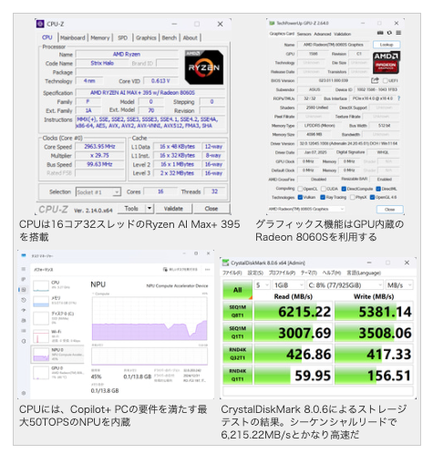
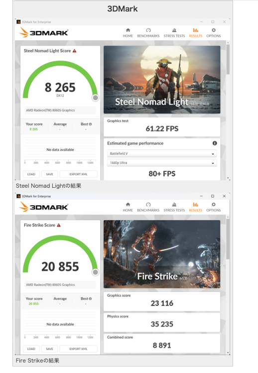

# 生活

- [筋肉維持に必要｢プロテイン｣いつ摂れば効果的か](https://toyokeizai.net/articles/-/861269?page=5)  
  プロテイン、高いんだよな。何かいい手はないか。プロテインの種類、作られ方？によって特性が変わるらしい。  
  チャッピーくんに聞いたら炒り大豆が安くていい感じらしい。
- [トランプのゼレンスキー不信の背景](http://finalvent.cocolog-nifty.com/fareastblog/2025/03/post-d46fc8.html)  
  ここに書いてあることを、鵜呑みにしてはいけないとは思うけど、やはり背景は大事ですよね。そもそもウクライナは汚職の国だと聞いたこともある。無論、現状を肯定するようなことはないけど。
- [知っている街の知らない道を歩く](https://dailyportalz.jp/kiji/unfamiliar-streets-in-familiar-town)  
  ちょっと楽しそう。TrailRouterというアプリが自動で普段は使わないルートを作成してくれるらしい。
- [時速30キロ規制](http://finalvent.cocolog-nifty.com/fareastblog/2025/03/post-711f12.html)  
  中央線がない道路は一律そうなるらしい。2026年9月から。うちの周り取り締まりが増えそうですね。理由の一つとして、標識の置き換えコストの削減が挙げられていた。
- [トイレのドア](https://drfridge.hatenablog.jp/entry/2025/03/04/105913)  
  開けておくと、空いてるというメッセージになる。むかしは汲み取りだからできなかったけど。確かにな。コンポストトイレとかどうなんやろ。
- [運転免許証120年の歴史とマイナ免許証が誕生するまで](https://www.watch.impress.co.jp/docs/topic/1661908.html)  
  マイナンバーカード、便利に使えるシチュエーションが増えていくのだろうな。見た目をもう少しなんとかして欲しい。
- [自販機に革命を起こした「ど冷えもん」、次々と新たなニーズを生み1万台超のヒット--サンデンRS大木哲秀氏【後編】](https://japan.cnet.com/article/35226876/)  
  DVDのレンタルサービスの自販機化をストリーミングサービスが始まるからやめよ、ってのがすごいな。2008年の話。
- [AIが登場して『やさしい仕事』がなくなるという話があるが「AIマインスイーパー』をやるとそれがよくわかる「人間に残るのは運試しと結果責任」](https://togetter.com/li/2521123)  
  自動運転車がトロッコ問題にあたったとき、最後に制御が人間に戻される、みたいなことはないか。お前が死ぬか、あいつを殺すか、あいつらを殺すか、みたいな択だけが残るみたいな。
# 仕事

# 趣味

- [古今東西 かしゆか商店【岐阜提灯】](https://casabrutus.com/categories/design/439675)  
  そういえば、かつての実家にあった気がする。なぜかはわからないけど、印象に残っている。今も残っているのだろうか。

## デザイン

## 読書

## 制作

## ガジェット・グッズ

- [ノートパソコン、充電つなぎっぱなしにしてる？ 今すぐ抜いて](https://www.gizmodo.jp/2025/03/unplug-your-laptop-now-it-will-stay-plugged-in-forever-1.html)  
  今使っている端末はバッテリー保護機能を有効にしているぞ。GPD Pocket4はBIOSから、[intel Macはアルデンテというソフトを入れた](https://www.gizmodo.jp/2025/03/unplug-your-laptop-now-it-will-stay-plugged-in-forever-1.html)けど、appleSiliconだと持っていいやつが使えるらしい。
-  [モンハンワイルズが内蔵GPUで余裕だって!? Ryzen Al Max+ 395のタブレットPC「ROG Flow Z13 GZ302EA」現る](https://pc.watch.impress.co.jp/docs/column/short-review/1667160.html)  
   ちょっと比較してみよ。負けはするだろうけど。 ほんの少しだけ勝ってた。 
     
   

## アウトドア

- [このギミックは痺れる……！驚きとワクワクが詰まったブランド「FIELD RECORD」の革新性](https://yamahack.com/6575)  
  ちょっといいなと思ったけど、オーバースペックかな。1.5万円ほどで、納期は遥か彼方。  
  

## 展覧会

## お勉強・技術

- [日本の技術者はSakana AIのことを、よく見たほうがいい。](https://forest.watch.impress.co.jp/docs/serial/aistream/1667515.html)  
  いままで何もわからなかったけど、これはものすごいよくわからないものなのだというふうに理解が進んだ。
- [自分が書いたことが正しいかどうかを AI に判断してもらう](https://cocolog-nifty.hatenablog.com/entry/2025/03/06/172400)  
    > AI に作業させるのは楽なので、作業させるんだけど、そもそもこの作業は無駄だから時間の無駄だ馬鹿かお前はみたいな指摘も AI がするようになると良いと思われる。

## 豆知識

- [人間の脳細胞を使った「世界初の商用バイオコンピューター」が登場](https://gigazine.net/news/20250305-cortical-labs-cl1/)  
  神経細胞を使って、AI でいうところのモデルをつくるみたいなイメージかな。こういうものが意思っぽいものを持っているかのような振る舞いをし始めたらどうするんだろう。そういう特性は持たないらしい。

# お金儲け