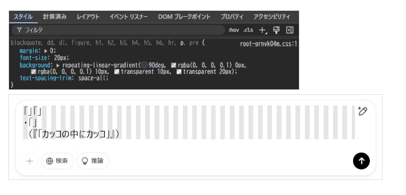

# 生活

- [猫ミームの美学](https://lichtung.hatenablog.com/entry/2025/03/08/234046)  
  ちょっと面白かった。「ミームの反対側の極に詩がある』とか。なにが面白かったんだろう。  
  > 詩は私たちの日常的な言葉遣いすらも振りほどいて、自分が表現したい経験や感情や感触や雰囲気を言葉を破壊させながら新しく作り出して伝えようとする。
- [「認知症になる運命」を回避した男性の研究で「高温」がアルツハイマー病から脳を保護する可能性があるとの仮説が浮上](https://gigazine.net/news/20250309-early-alzheimer-disease-protected-dementia/)  
  熱でダメージを受けたタンパク質を修復する仕組みが人体にはあるらしいけど、それが認知症の原因物質の除去とか抑制に役立っているかも、らしい。
- [｢高額療養費｣負担引き上げ回避どれだけ助かる？](https://toyokeizai.net/articles/-/863390)  
  思っていたより、額が小さい話でびっくりした。今どうなっているか知らないけど基礎控除の話だったり、これに関しても、おそらく変数になっているもの（相対的な円の価値）だったりかが変わるとその金額が変わる仕組みとかにできないのだろうか。しかし、これは手厚い制度ですね。
- [「令和のコメ騒動」を考える](http://finalvent.cocolog-nifty.com/fareastblog/2025/03/post-ed31f6.html)  
  生産量や需要の変動ではなくて、JAを中心とした制度設計に問題があったんじゃないかという考察。昨今のインフレによる生産原価（？）の高騰を買取価格に転嫁できなかった結果、民間卸への販路が拡大して、そこから連鎖的に小売価格上昇につながるような諸問題に発展したかもだとか。その昔のインフレ時代はお米が生産過剰だったらしい（チャッピーくんにきいた）。
- [それぞれの五十年](https://ohtabookstand.com/2025/03/oshimai16/)  
  くだらないと思った自分がいたら、それはじっと眺めてみよう。みていられないと感じることも同じだろうか。  
  > かつて「くだらない」と切り捨てていたものたちを「偏見ってよくなかったねえ」と言いながら拾い集めている。七十代になっても人の心はまだ変化するのだ。
- [香川県の隠れた名物「かしわバター丼」を食べたい](https://dailyportalz.jp/kiji/the-best-chicken-dishes-in-kagawa)  
  スーパーで普通に親鳥が売っているんですね、香川。しかしうまそう。[調べてみると、長良のサンマートに売っていることがあるらしい。](https://detail.chiebukuro.yahoo.co.jp/qa/question_detail/q13294642683)
- [芋と豚の共闘！スロバキアの芋ソーセージを作ってみた](https://dailyportalz.jp/kiji/slovakia-imo-sausage)  
  おいしそうだけど、飽きるらしい。下ごしらえのスパイスかなぁ。
- [冷凍の野菜と果物、実は栄養たっぷり、生よりよい場合も](https://natgeo.nikkeibp.co.jp/atcl/news/25/031200137/?P=2)  
  冷凍に加工するタイミングは栄養価が高かったり、優れた保存技術であるからが理由らしい。美味しいのは生野菜。
- [激甚災害｢車からの人命救出｣難しさのリアル](https://toyokeizai.net/articles/-/863809?page=5)  
  今時の軽くて強い車は、当然解体が大変らしい。経験がいるから、その経験を積む訓練の場が催されていたのだとか。
- [桑名を紹介させてください～駅のトリックアート、取り壊し直前の駅ビル～](https://dailyportalz.jp/kiji/kuwana-syokai)  
  桑名って蛤が有名なんですね。遊びに行くのにいいかも。
- [20年以上住んでいる月島・勝どき界隈の見どころ、そして諸行無常を紹介したい](https://dailyportalz.jp/kiji/tsukishima-kachidoki-midokoro)  
  書こうとして思いついたけど、身近な場所の10年と、そうでない場所の10年はスケールが違いますね。どこも均質になっていくのか。
- [「薬物」を知り、上手につきあう――『身近な薬物のはなし』著者、松本俊彦氏インタビュー](https://tanemaki.iwanami.co.jp/posts/8681)   
  市販薬の乱用や過度のカフェイン摂取が問題になっているってのはよく聞くけど、その背景がちょっと嫌な感じがしますね。とくに、報道のあり方はいろいろな分野で考え直すべきだと思う。特にワイドショーなんてほとんど利がない存在だと感じてしまっている。 
- [股火鉢（またひばち）](https://drfridge.hatenablog.jp/entry/2025/03/14/043529)  
  火鉢を使おうとは思わないけど、光景が目に浮かぶようですね。我が部屋は寒い。朝は起きれない。昼も眠たい。
- [デザイナーズドッグ（ミックス犬）が抱える残酷な遺伝の問題 (2/2)](https://nazology.kusuguru.co.jp/archives/172141/2)  
  雑種の犬は強いものだと思っていたけど、実際そうではなく、遺伝性の疾患は両親のものを発症するリスクがあるのだとか。
- [異国の「ふつう」がいかにユニークで代え難いか。「ペルーの山奥で暮らすおばあちゃんの食卓」――料理に心が動いたあの瞬間の記録《自炊の風景》山口祐加](https://nhkbook-hiraku.com/n/nc311f1f50aa7)  
  贅沢な体験だなぁ。野菜のスープにサルサソース、うまそうですね。
- [消費カロリー40％増　後ろ歩きは早歩きよりも健康に良い](https://natgeo.nikkeibp.co.jp/atcl/news/25/031400142/?rss)  
  今度からプールの半分は後ろ歩きにしよ。いつもの動きを後ろ歩きでやるとややこし〜とかって思っていたけど、ややこしさが大事なんですね。
# 仕事

- [エンジニアと営業仲悪い問題について](https://note.com/mizkun/n/n54094e97ec95)  
  元の記事は初見で、たしかにな〜とか思ったし、反論の記事（納期がない奴らの考えだよ）ってのにもそうだよな〜とか思った。結果として自分はどっちも並行して進めることを選んだのだけど。もしかしたらデザイナーとコーダー・エンジニアの仲介役に転職の光明があるのかもしれない。家から出ないといけないのか。

# 趣味

- [重さ332g！普段から持ち歩く｢防災ポーチ｣の中身](https://toyokeizai.net/articles/-/862336?page=2)  
  いい加減やりたい。とはいえお金がない。自宅に備える防災用品・バイクに積んでおくセット・持ち歩くセット、みたいな感じでやるといいのか。
    - 凝固剤のいらない携帯トイレ（トイレONEシリーズ／LA・PITA）
    - 静音アルミブランケット／エピオス
    - アルコールウェットシート／スコッティ
    - 防臭袋／BOS
    - ミニライト／ジェントス
    - ホイッスル／コクヨ
    - 小銭（千円札、百円玉、十円玉）
    - 大切な人の連絡先一覧表
    - 絆創膏・常備薬
- [編集雑記……25──ともに読む](https://artscape.jp/article/33624/)  
  これが楽しめるといいんだろうな。自分は得意ではない。  
  > ほぼ初対面の者同士が偶然に居合わせている。そんな半公共的な空間に、自分の声が反響しているということが、何よりもまず単純に動物的な楽しさがあるのだという驚き。それは戯曲の冒頭の「ALL」と振られた台詞を、周りの声のトーンを探りながら恐る恐る読み上げ始めた瞬間に即座にわかり、口角がつい上がってしまうものでした
- [「だから"糖質オフ"は美味しくないのか…」｢砂糖→太る→ダメ･悪者｣と安易に考える人の深刻すぎる盲点](https://toyokeizai.net/articles/-/854706?page=2)  
  タイトルが良くない気がする。砂糖を少量加えることで、味が染みやすくなったり、泡立てに役立ったり、いろいろ優れた物性があるのだとか。
    - 【1】甘味  
      適量を使用することで、ほかの調味料の味と調和させる。それぞれの味を際立たせる効果も
    - 【2】親水性 例）スポンジケーキ、カステラ、和菓子
        - 乳成分、カカオ成分の味を安定させる
        - 食品の保水性、しっとり感を保つ。乾燥を防止する
        - でんぷんの老化（パサパサ感）を遅らせる
    - 【3】安定性 例）ビスケット、クッキー、チョコレート
        - 食品中の水分を結合水に変え、酸化を遅らせることで、油脂成分の風味を安定させる
    - 【4】造形性
        - パン、カステラなどのふっくらした状態を保つ
    - 【5】着色と香味 例）パン、クッキー
        - メイラード（糖とアミノ酸）反応により、おいしそうな色（茶色）、いい香りをつける
    - 【6】たんぱく質の安定
        - カスタードプリンなど、たんぱく質の凝固温度を高め、口当たりをよくする
    - 【7】冷凍変性防止 例）クリーム、スポンジ類、冷凍すり身など
        - 冷凍による劣化を防ぐ

## デザイン

## 読書

- [『宮﨑駿イメージボード全集』製作の舞台裏](https://tanemaki.iwanami.co.jp/posts/8678)  
  ちょっとほしいかも。5,000円くらい。ううむ。しかも複数刊行される。

## 制作

- [なぜ「」「」や（「」）で文字が重なってしまうのか。](https://qiita.com/haihaikazuma/items/e5519854ccd0919064c0)  
  `text-spacing-trim`というプロパティで約物のツメを調整できるらしい。文字組みをチェックするときに使っているプロパティがかしこい。  
  
- [Web制作者はダウンロードしておきたい！ CSS関連の最新版チートシートのまとめ](https://coliss.com/articles/build-websites/operation/css/css-cheatsheets-2025.html)  
  みたい時に思い出せるといい。思い出せない。
- [これは簡単で便利！ CSSのclamp()関数を使ったレスポンシブ対応のフォントサイズの定義ができるツール -Type Scale Generator](https://coliss.com/articles/build-websites/operation/css/type-scale-generator.html)  
  `clamp()`を覚えたくはあるが、特に用事がないんだよな。

## ガジェット・グッズ

- [もしアイロボットが倒産したら、あなたの「ルンバ」はどうなる？--「事業継続難しい」と同社表明](https://japan.cnet.com/article/35230432/)  
  全然知らなかった。お気に入りのガジェットがこういう形で使えなくなったりするとつらいな。ルンバという名前だけ残りそう。
- [エレコムが「ナトリウムイオン電池」搭載モバイルバッテリー発売　発火リスクが低く10倍長持ち](https://www.itmedia.co.jp/mobile/articles/2503/13/news014.html)  
  [5000回繰り返して使えるというエレコムの「ナトリウムイオンモバイルバッテリー」を試して分かったこと](https://www.itmedia.co.jp/pcuser/articles/2503/13/news074.html)  
  これちょっとすごいですね。自分が知ってからすぐに商用化されているので驚いた。無駄に欲しい。いまのところまだ、エネルギー密度が低いらしい。不安要素が少ない電源は増えれば増えるほどいい。

## アウトドア・お出かけ

- [JR西日本、3Dプリンターで駅舎建設へ--「世界初の事例」](https://japan.cnet.com/article/35230343/)  
  できたらみにいってみようかな。電車とか下道（高速でもいいのか）でどれくらいかかるだろう。
- [琵琶湖の固有種・イワトコナマズの料理を食べた！蒲焼きも旨いが最高なのは…](https://www.bepal.net/archives/520766)  
  滋賀県立博物館、結構近いぞ。楽しそうですね。

## 展覧会

## お勉強・技術

## 豆知識

- [太らせて食べる？コトドリは森を耕し、獲物となる虫たちを育てる農耕鳥だった！](https://karapaia.com/archives/493877.html)  
  環境を作り変える生き物って、意外とたくさんいるんだろうな。人間のそれが極端なだけで。

# お金儲け