日記を格好と思っていて、ずっと忘れていた。永井一正のポスターって生で見るとすごいっすね。ポスターの時代はいい時代だったのだろう。「一般の人」という言い方をされるのも理解できる。
***
美味しいうどんを食べる。また食べたい。
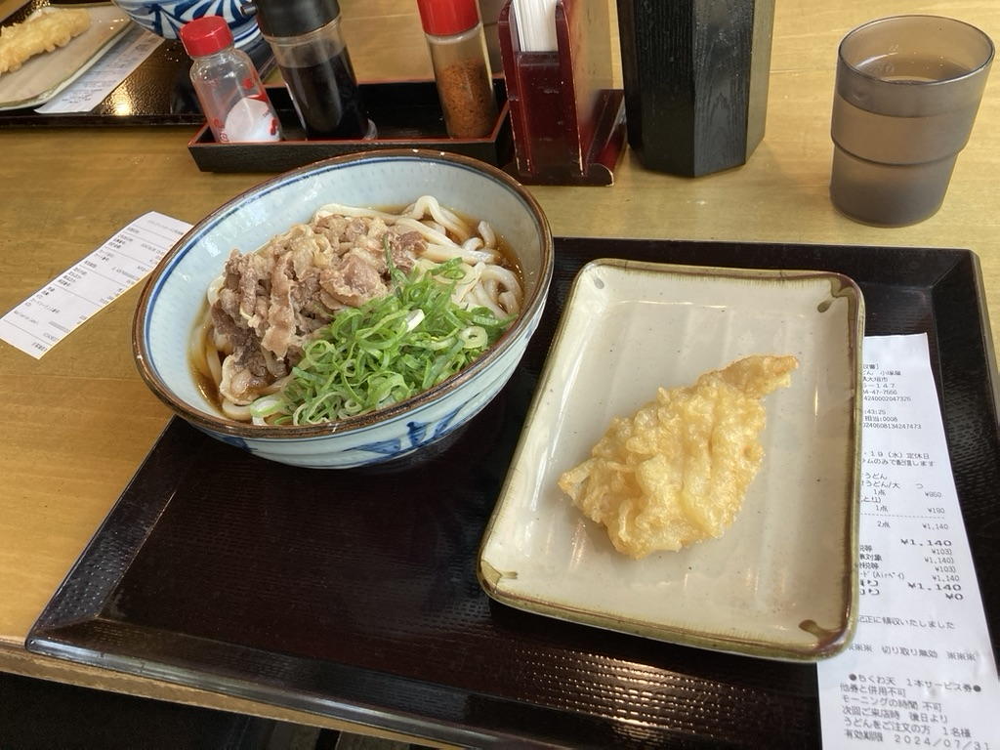
ポスターを見る。みんなすごい。名前を覚えていない。

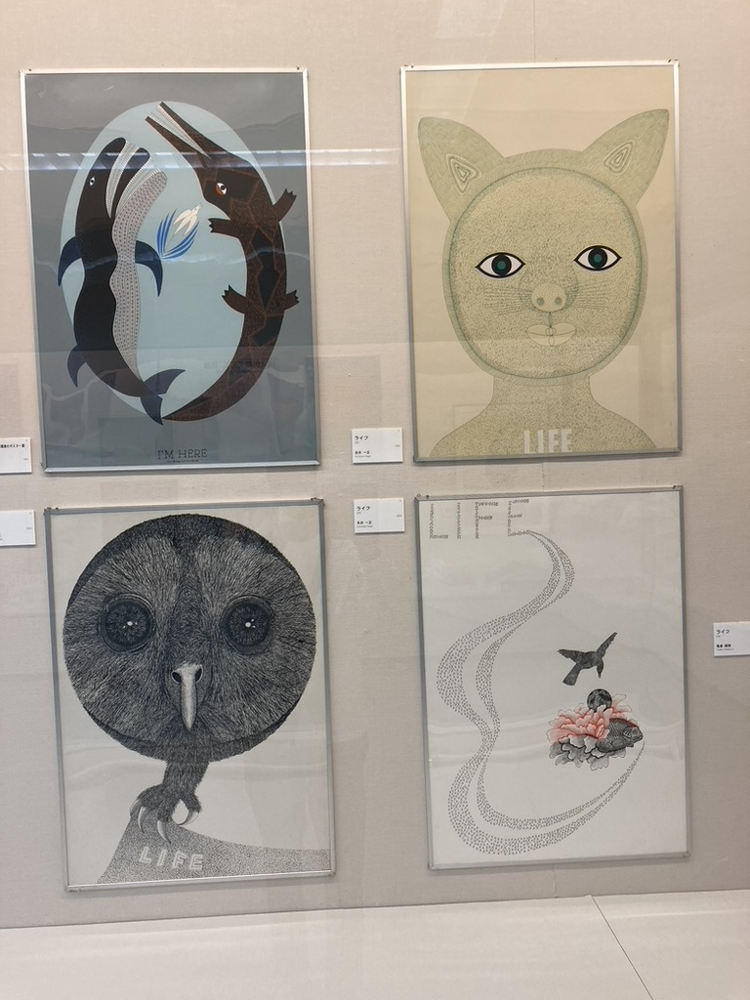
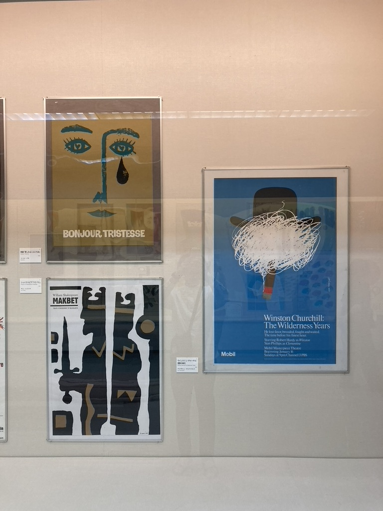
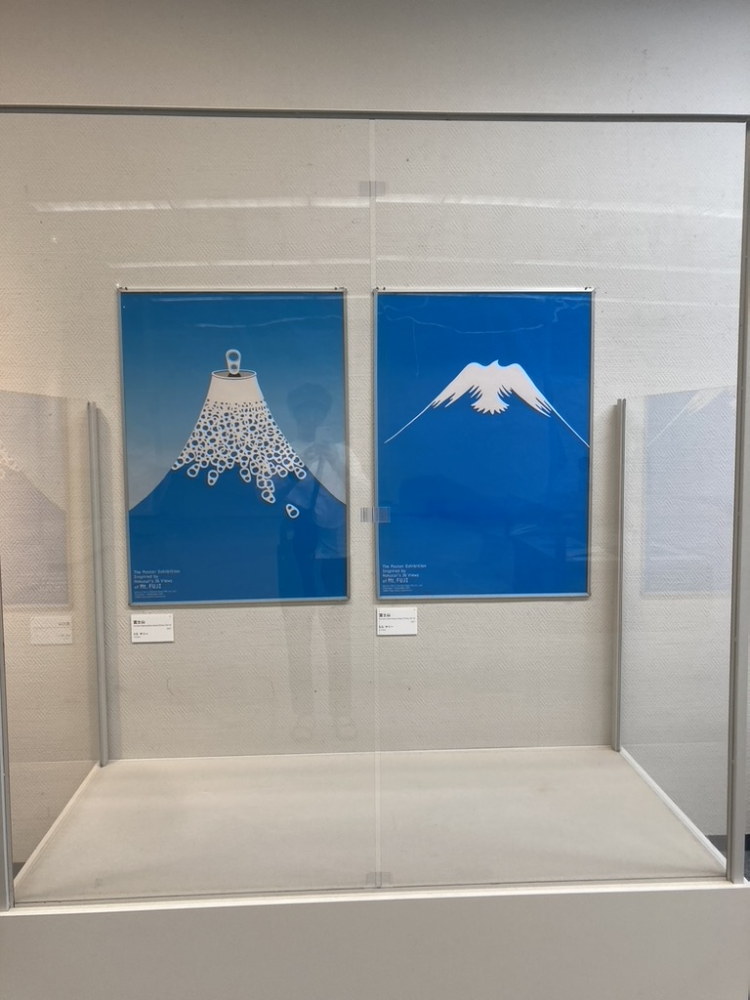
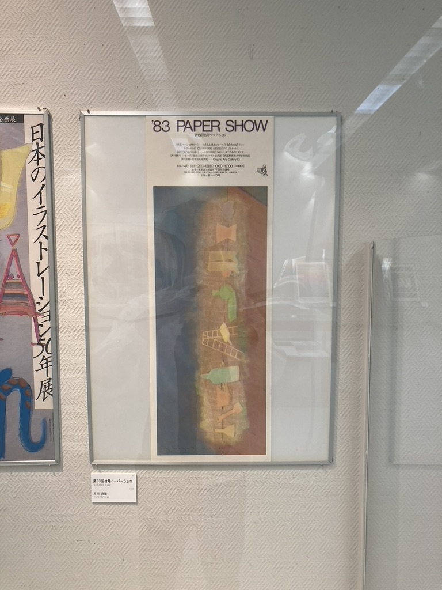
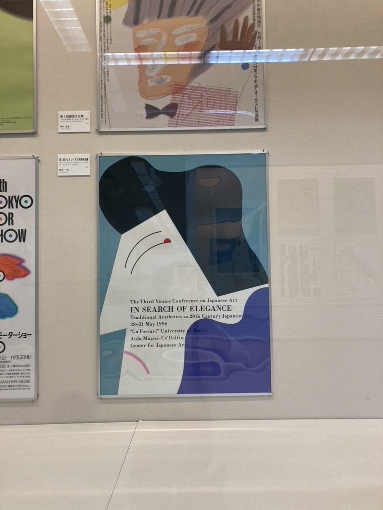
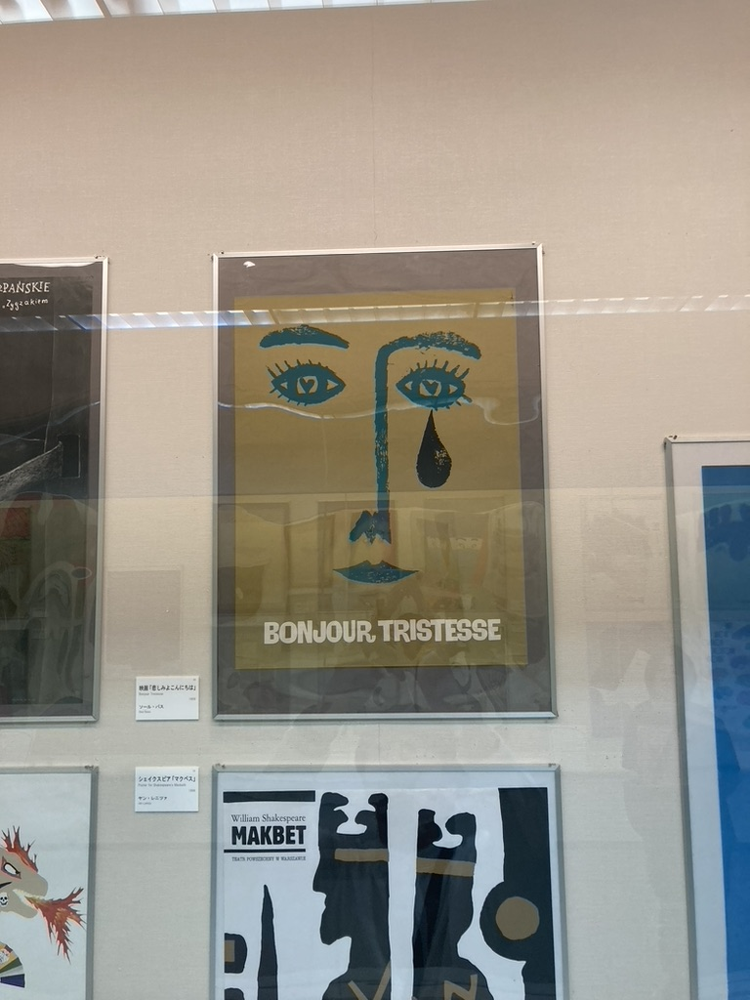
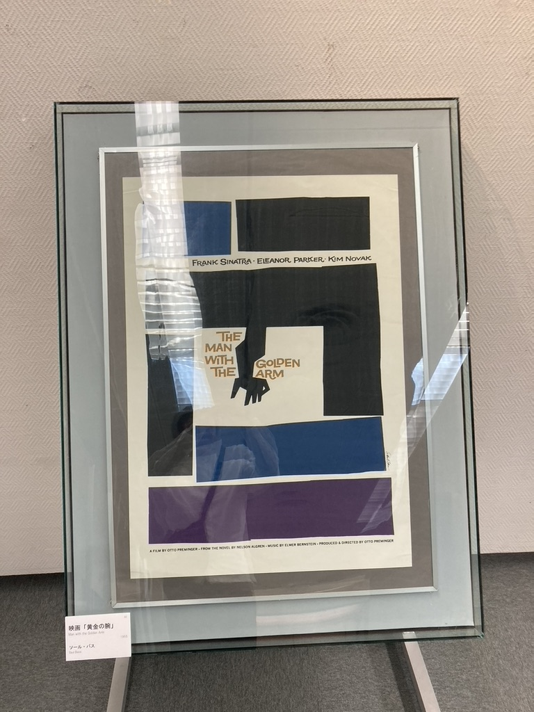
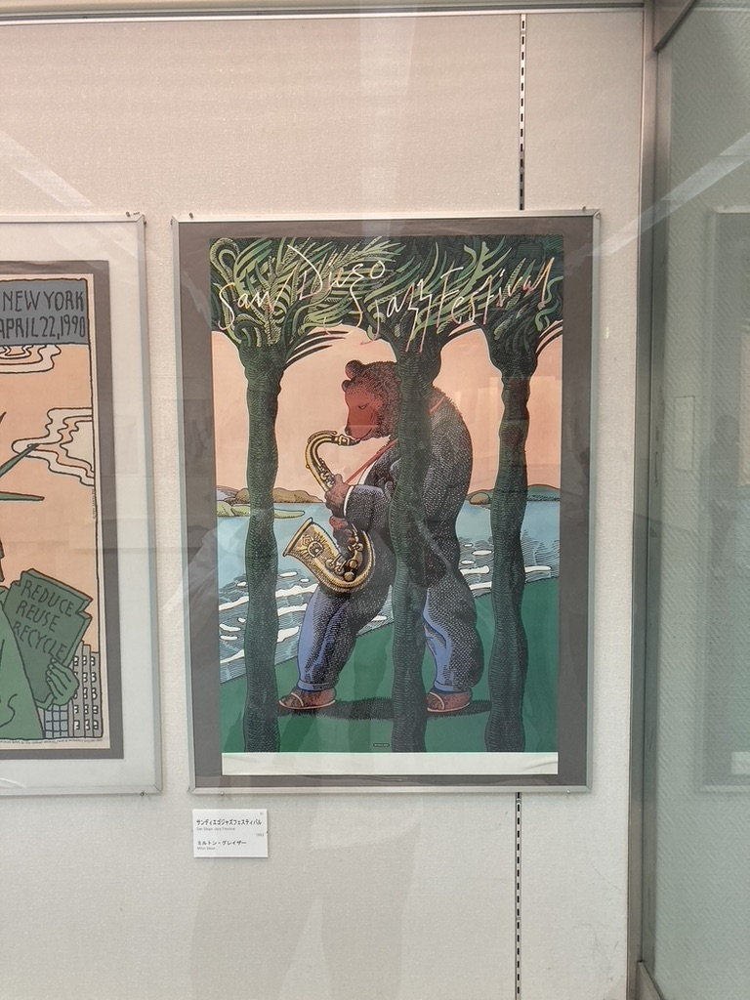
***
スイトピア大垣はいい感じの施設ですね。
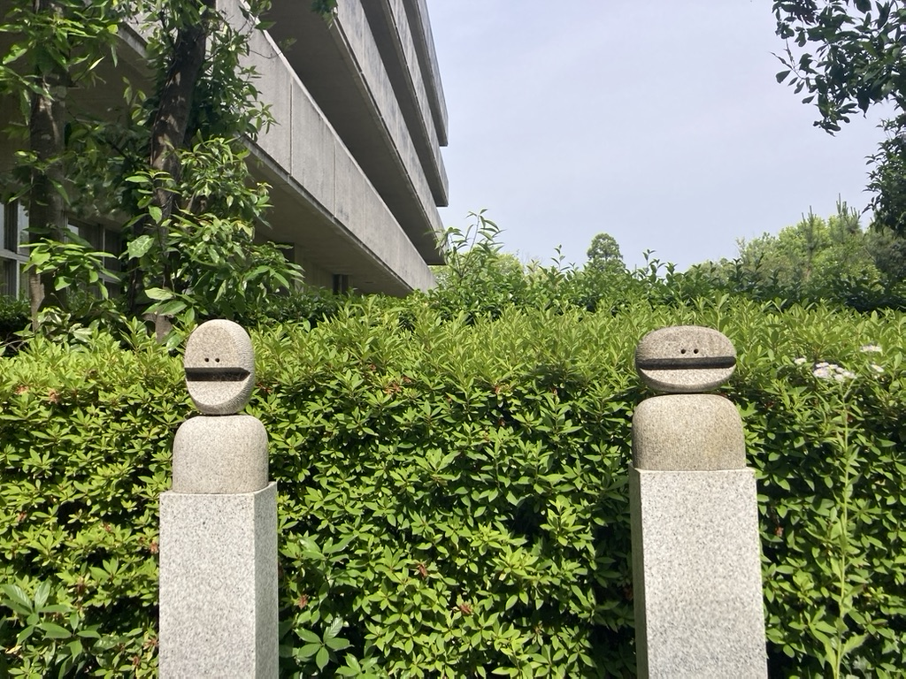
***
会社の先輩と合流して、硬い煎餅を食べたり、海鮮を食べたりする。
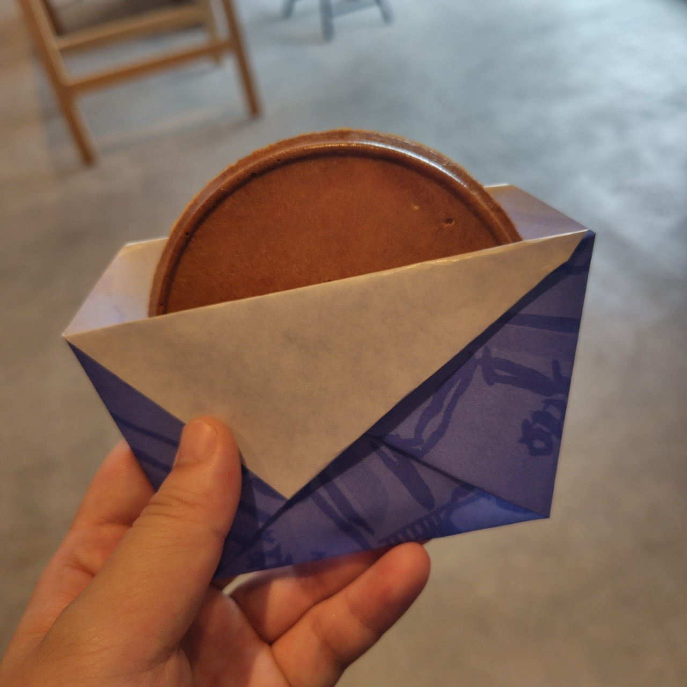
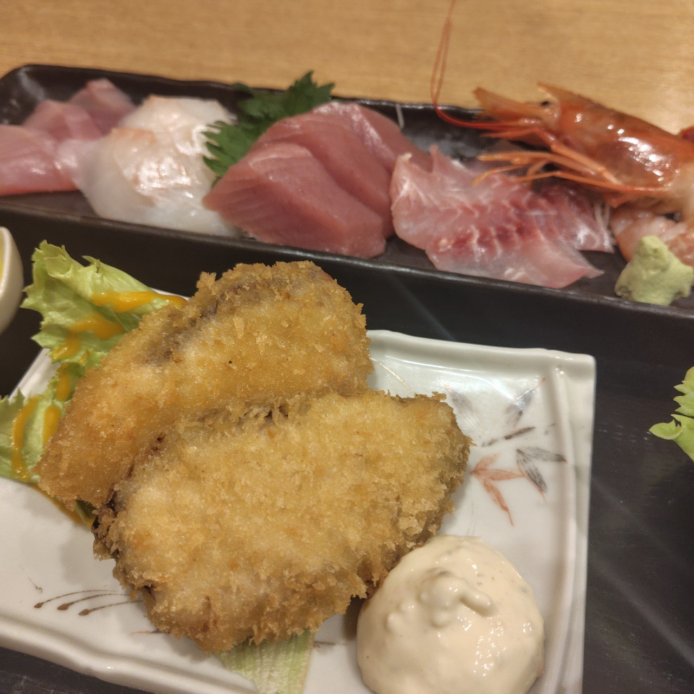