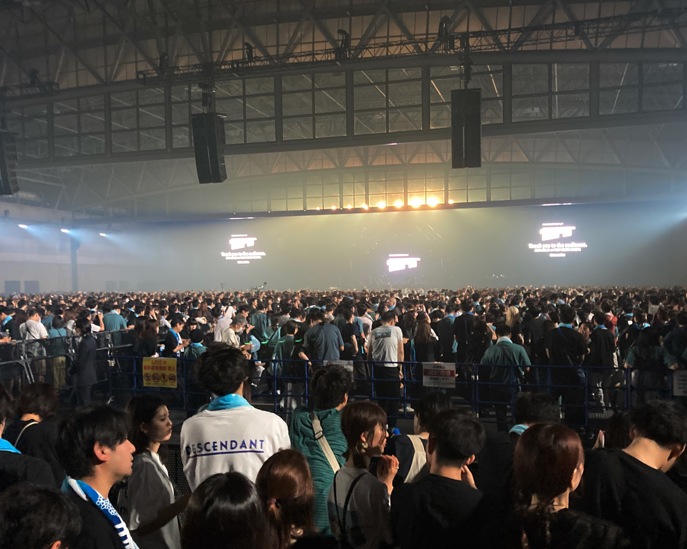

自分はほとんどライブには行かない。盛り上がるやつ、あんまり得意じゃないしね。以前、サカナクションのライブに出かけたのは10年近く前なんじゃないか。  
友人に誘われたので、行くことになったのは2024年の完全復ツアーだった。岐阜市から２時間かからないくらいでポートメッセなごやに到着した。運転してくれた友人に感謝。ポートメッセなごやのまわりは道がややこしくて大変ですね。以前、閉場後にグッズが欲しくなったので、ステッカーとカラビナを買うなどした。日常遣いができてうれしいですね。  
席は10年前と左右違いでほとんど同じ位置だった。記憶でしかないから実際のところはわからないけど、音質ははるかによくなっていたように感じた。後ろの席なのにスピーカーが目の前にあったのは驚いた。サニーさんが作ってくれたシステムらしい。

# セットリスト
1. Ame(B)
2. 陽炎
3. アイデンティティ
4. ルーキー
5. Aoi
6. プラトー
7. ユリイカ
8. 流線
9. ナイロンの糸
10. ネプトゥーヌス
11. さよならはエモーション
12. 『バッハの旋律を夜に聴いたせいです。』
13. ネイティブダンサー
14. ミュージック
15. ショック！
16. モス
17. 新宝島
18. 忘れられないの
19. 夜の踊り子
20. 三日月サンセット
21. シャンディガフ

陽炎はちょっと涙が出た。「はしゃぎすぎて無くした　赤い空を僕は待った」というフレーズがあまりにも良い。んだけど、一郎さんの現状を思うにこういう言葉をどうやって味わえばいいんだろうかという思いも浮かんだ。サカナクションの魅力って音ももちろんだけど、一郎さんの歌だからいいんだよな。本人が言っていたからきっとそうだろうけど、音楽の歌だからだよな。  
プラトーも「この夜は目を閉じて見た幻」とか「僕はまだ多分まだ目を閉じてるだから今笑えるのか」あたりがキラーワードなんだけど、目の前で歌われるとグッときますね。  
それでユリイカ・「流線」・ナイロンの糸の流れにはかなり驚いた。好きな曲が多いライブだったけど、これ以後はここばかりに気を取られてしまった。なんで流線いれたんだろうな〜。アルバムだとユリイカ・ナイロンの糸なんだよな。ここに流線が入ると、ナイロンの糸が聞こえた印象がかなり変わって感じられた。なんでだろう。ものすごくポジティブに聞こえたんだよな。「この海に居たい　この海に居たい　この海に帰った二人は幼気に　この海に居たい　この海に帰った振りしてもいいだろう」があまりにも違って聞こえた。トップクラスに好きな曲だけに大変驚いた。  
あとはまぁ、あれだ全部いい曲。忘れられないののもっちの生ギターアウトロとか、愛美ちゃんのベースソロとか、やっぱりいいっすね（小並感）。  
アンコール後に一郎さんがいろいろ話していたけど（ドラゴンズの話とか）、一番安心したというか、本人から聞けて良かった言葉は「これまで通りに戻ることはない」だった。心を病むまで思い詰めてしまう人だからこそ（実際にそうかはわからないけど）、いい歌が書けるし歌えるのだろうとも思う。ただ、それを消費してしまってもいいのだろうかという思いがこの度のライブで浮かんだ。とくに陽炎なんかは苦悩の歌だと思っていた。それがライブのほぼトップバッターの曲で、そこからのセットリスト全体を通して山口一郎の再生がテーマのように感じられたのも、そういう思いが浮かんだからだった。最初の盛り上げたいコーナー曲の最後がプラトーなのもね。  
そういう意味でも山口一郎の、ひいてはサカナクションの再生のシンボルとして、最後に演奏された曲がシャンディガフなのも大変良かった。これもまた、アダプトを聞いていた時とは違った聞こえ方がした。英美ちゃんのキーボードも最高。s  

--

ライブが終われば、2時間かけて駐車場を出庫し、もう一人の友人をひろい、風呂に出かけ、飯を食い、岐阜に帰って寝た。翌日はあらためて一人暮らしをはじめた友人の買い物を茶化し、パチンコの大当たりの棚ぼたをもらった。楽しかった週末である。
