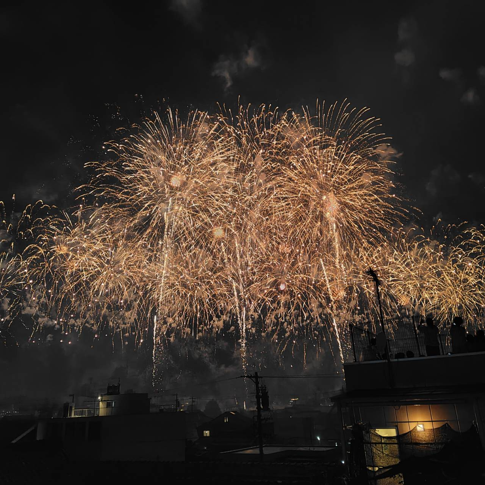
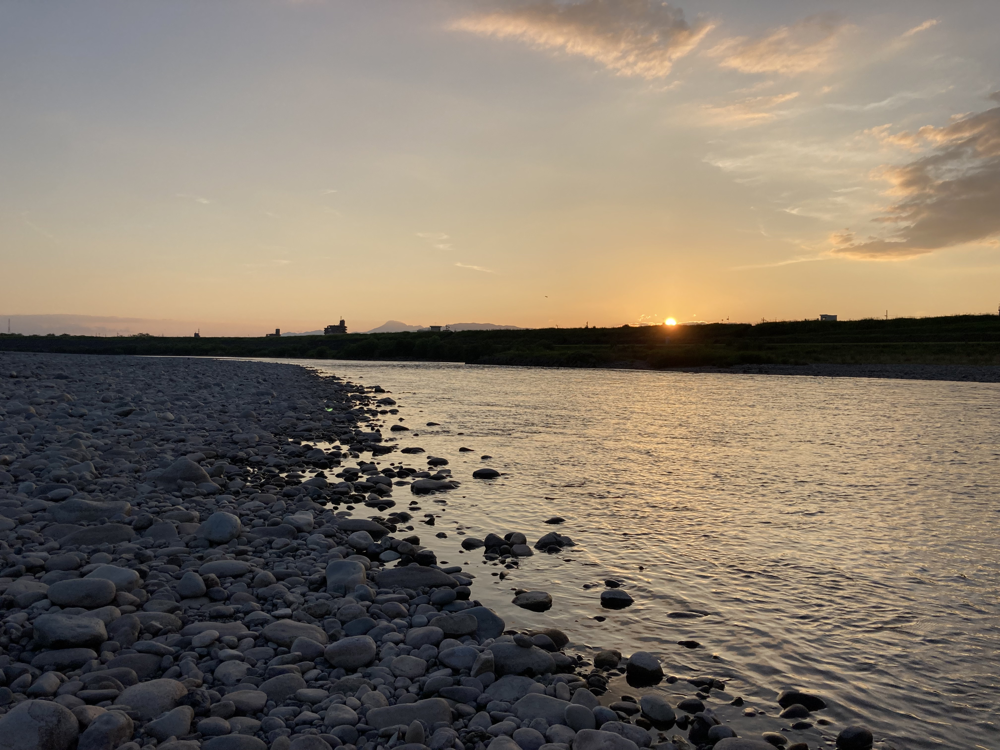
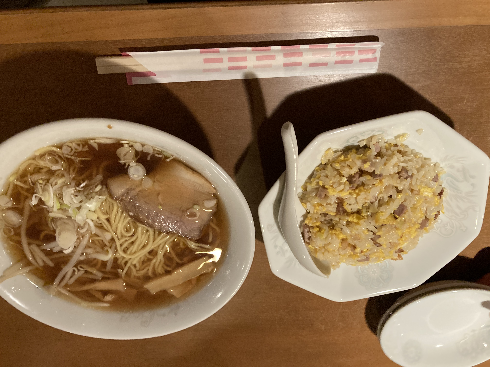
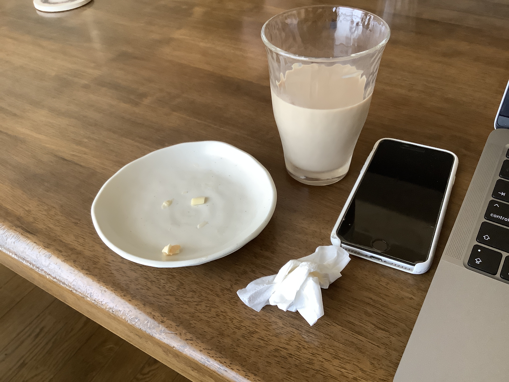

2024年のお盆休みの思い出。  
お盆休み前に、きっともう会わないと思っていた人から遊びに誘われて、あわてり。週初からバタバタしてたし、相場はうまくいかなかったしも不安に拍車をかける。これを書いている時にはだいぶ落ち着けた。おつかれじぶん。

# 2024-08-10

夜に花火を眺める、エビフライをあげてもらう、が予定だった。  
ついでになんか朝マックを買ってきてもらえた。しかしながら、翌日の予定が心配で心ここに在らず。でもでも久しぶりの朝マックはおいしい。mizoはそのうち帰宅する。  
手持ち無沙汰でゲームをする。まぁ負ける。こういう時はパフォーマンスでないよな。とはいえ時間を忘れられるのはありがたい。  
夕方、夜のお酒を買ったりするために出かける。なんだか道が混んでいるぞ。旧アピタのドン・キホーテで買い物をして、mizoの家に向かう。裏道で向かうも、大変に渋滞している。面倒なのでバイクを押していく。  
シャワーをあびてエビフライとポテトフライをいただく。うまい。程なくして花火が始まる。開演で結構満足。遠目に根尾川の花火大会も見える。家で涼んだり花火を眺めたりエビフライを食べたりしていると、やがてフィナーレ。最後の花火には驚いてしまったけど、やっぱり火花の色の花火が一番きれいですね。

# 2024-08-11

例の東京の友人と遊びに誘われ、予定に提案した蕎麦屋がおやすみで焦る。なんとか良さげなお店を見つけて、連絡しことをなきを得る。  
予定が固まった道中は心が安らか。道もいいかんじ。残念ながら、お店の受付の直前に満席となりあえなく退散。お店のばあちゃんはいい人そうでまた行きたいな。近場のお蕎麦屋でヒレカツ丼とざるそばをいただく。友人はあいかわらずだった。お互いの近況なりたわいない話をする。暑いのでどこかに移ろうか、ということで自分が好きな珈琲屋に行く（珈琲得意じゃないのにもうしわけない）。  
30分くらいの道のりで、流れのある道で気持ちよかった。バイクの気持ち良さよ。珈琲屋のそばで、ルートをミスして、またまた申し訳ない。何とか到着してアイスコーヒーをいただく。お盆休みの話とか（奴の休みが長くてうらやましい）、仕事の話とか、住居の話、お金の話、思い出話をする。長野に行く予定が天候が悪くなりそうで中止になったのはお気の毒。一度は結婚してみたいらしい。がんばってくれよ。俺はモテない。知っているよ。変な生き物だと思われている。君もね。同棲したけど、結果別れることになったらしいとか。やるなぁ、自分には人と暮らすのが難しいような気がしているよ。高校の三年間と、それ以外にも少しあっていると、案外話は尽きない。それは救いなのかもしれないな。思い出せる会話は断片的だけど。やがて夕方なり、長良川をみに出かける。  
自宅に車をとめ、歩くと「歩くの早いね」怒られる。そうそう、自分は車道側を歩くようにして、人間らしいことをしなければならないね。夕方の河辺は涼しい。川に来たら石を投げたくなる。夕日は綺麗。やはりどことなく秋の雰囲気が滲んできている。気温は高いのだけれど。川縁を歩いているとたぶん、ドジョウが跳ねるようににげていく。これにはしゃぐ。夏の素晴らしさや（このところの夏は暑すぎるので手加減してほしいも）、秋の暮れの寂しさを話す。冬の辛さも。町の景色は少しずつちがう。川にはたまに出かけたいな。コウモリが飛んでいる。お腹が空いたので、夕飯を食べに歩く。中華が食べたいと言われ、近所のお店を思い出せる。がんばった。  
また、少しだけ歩く。お店の犬がかわいい。やがて犬は散歩に出掛けていく。閉店間際だったのかも。ラーメンチャーハン定食と唐揚げを頼む。おいしかった。麺はしゃっきり、チャーハンとからあげの味もいい。お互いの連れ人の話をすこしする。話せてよかった。でも、ことさら話せる内容もない。テレビはオリンピック。また少し話をして帰路につく。  
帰り道、道でふざける。一つ思い出深いこと。それに、いくつかの思い出深かったことがうかぶ。近所の公園にプールの準備がしてあった。一度だけかな。むかし、祖母に連れてきてもらったことがある気がする。誰もいない自分だけのプールで遊ぶ。それを桜の木の下のベンチで眺める祖母。忘れていたなぁ。この日記はこれを書くためでもあった。思い出したことを話す。あとで日記につけようとも。そして友人は帰っていった。また遊べるといいのかな。  
そういえば、人を見下しているって指摘されたので、気をつけたい。

# 2024-08-12

ひるまはいつも通りに過ごす。夕方から実家に帰る。すこし遅くなり怒られる。ビールを買っていくと、みんながみんなそれぞれビールをお土産にしていた。自分はハイネケン。祖父は寝ている。また少し痩せたような気がする。  
妹に結婚祝いと、出産祝いを渡す。つつがなく終えられてよかった。  
夕飯はいつもの焼肉。おうちの焼き肉は楽しいものですね。同級生がホストでうまくやってるだの（整形しただのはしらんがな）、冠山にのぼっただの（冠山に行ったらしい）、いろいろ話をしながら、肉をつつく。自分の話はしただろうか？思い出せないな。  
妹の苗字は少し珍しいものに変わった。妹の夫にはしばらく会えないだろう。出産した後とかに会うのかな。緊張するなぁ。  
焼肉の後、風呂に入る。実家は綺麗にしてあるけど、すこし年寄りの気配がする。両親もいい歳だ。あるいは、自宅が神経質すぎるのかもしれない。あんまりよその家のことはわからなくなってきている。  
パソコンをいじりながら話をした。何の話をしただろう。覚えていないような話をしているのって大事な気がするよね。ちゃんと話をしよう。父の方が先に寝る。寝室の扉から寝相の悪い足が見え隠れ。ちょっとおもしろい。そのうち自分も寝る。  

# 2024-08-13-14-15

朝起きて、何らかのパン（何とかって名前だった）食べた。妹はいつの間にか帰って、また帰ってきてむぎをもらった。母は仕事に出かける。父もそのうちに、笠松競馬場への納品に出かけた。休みのうちも現場が動いていて大変そう。そのうち誰もいなくなって、ビールをもらって帰る。祖父にも少し声をかける。あとは家でいつも通り。翌日も。翌々日も多分そうだ。ゲームは程々にしたい。それで一日だけ仕事。

# 2024-08-16

土曜日は、mizoとカーペットと寝袋をクリーニングに出して、買い物をして、「しのえもん」という美味しいお店でお昼を食べる。そうしてらクリーニングが終わり、受け取り、自宅に戻る。なんかダラダラしていたな。ちょっと作業と夕飯の準備をして寝た。あまりにも眠かった記憶があるな。夕飯にはゴーヤチャンプルとお酒。あとなんか甘いものをたくさん食べた。予定があったのでmizoは帰宅する。

# 2024-08-17

友人たちとバイクで福井方面に出かける。正直なところ、少し気が重い。色々あるけど、年齢に見合わない収入と生活水準にあることは事実として重たい。それだけではないけど。でもまぁそれはそれとして楽しめたかな。あさ、芥見のローソンに集合して、福井に向かう。夏は街中でなければどんなところを走っていても景色がいい。自然が綺麗だ。それでも、やっぱり終わりが近い雰囲気はあるけど。まずは郡上大和の道の駅に向かう。そういえば川の方を通った印象がないな。鯉の頭を押したり、アイスコーヒーを飲んだりする。そして、福井九頭竜湖の方へ向かう。九頭竜湖は綺麗ですね。ただし、水量が少なかった。例年に比べても少ないと、友人は言っていた。そのまま、湖畔を走り、道の駅九頭竜につく。一休み。水と日本酒味のパウンドケーキを買う。いい香りがして美味しい。木の可愛いキーホルダーも在庫復活していた。本命の越前おおの荒島の郷に向かう。新しくできた大きくて綺麗な道の駅だった。この日の目当てはここで食べられるハンバーガーだ。「Bunny Supertte」というお店だ。パティが牛の脛肉をミンチにしたハンバーグで、それがウリだという。確かに噛みごたえがあって、ジューシーでうまかった。ちょっと塩気が強すぎたのが好みでなかったのが惜しい。でも夏にはぴったり。お土産に日本酒と、豆と、揚げ出し豆腐をお土産にする。福井県大野の名物らしい。楽しみである。また、モンベルと、モンベルのカフェが併設されていた。なかみは普通。モンベルのカフェは初めて見た。親子連れでも楽しめそうな道の駅だった。クラウンロード経由の帰路につく。道のオアシスフォーシーズンなんとかに立ち寄る。川のに併設されていて、泳いだりして遊べる施設だった。川も浅く整備されていたのかな。登山靴でちょっと入れた気持ちがいい気がした。可愛い犬もいた。クラウンロードは夜に走ると、湖面を滑っているような印象があったけど、思ったより湖面から高さがあった。徳山ダムにもたちよる。徳山ダムって、結構すごいんですね。集落と引き換えにとんでもない水量のバッファが得られたのか。感謝だなぁ。施設のメンテナンスも大変そうだし、そもそもとんでもない構造物だ。ちょっと勉強してみたい気持ちになった。ファンがいるのもわかる。上から湖を覗くと怖かった。あと、吊り構造の橋ってどうやって作るんだろう。道の駅星の故郷ふじはしにも寄る。美味しいソーセージと、ノンアルコールビールを飲む。これは必殺技かもしれない。甘くない、炭酸の、うまい飲み物。いいことに気づけた。そうして岐阜市について解散した。