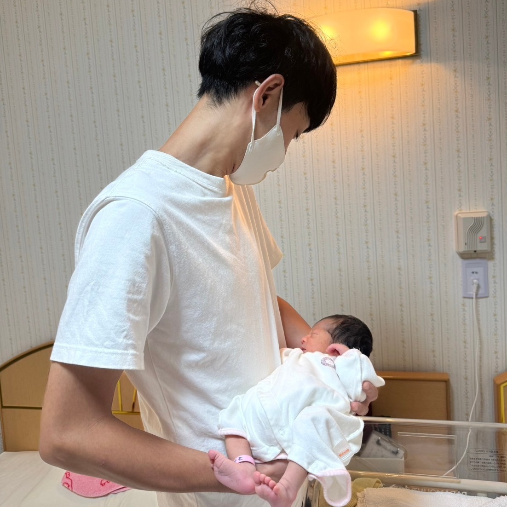
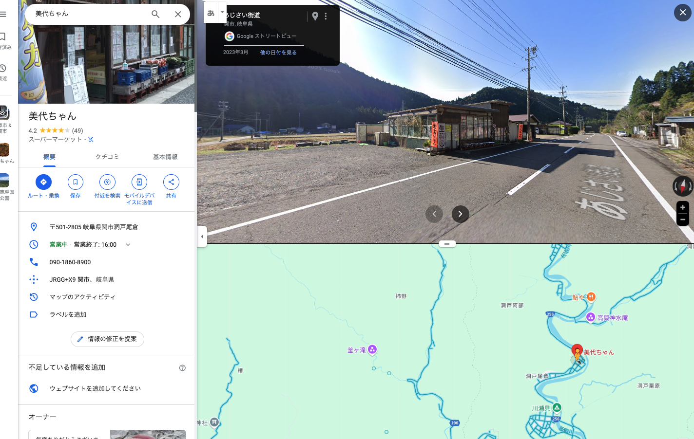

# 妹が子供を産んだ

それと、その少し前に妹の夫にあう。いい人だろう。このご時世に、子供ができたから結婚しようという人だから。感じもいい。一応義兄だからか。これからの生活、苦労もするだろうけどなんとかがんばってほしい。  
それで、子供が生まれた。びっくりですね。妊娠を知らされてからあっという間だった。  
なんとまぁ愛らしい。意外にも力強い。赤子を抱くのは怖い。なんで泣いているのかわからない。これからどんなことを経験していくのだろう。すこしだけなにかをしてあげたい気持ちがある。  
妹がなじみの居酒屋に行くのは最後かもなといっていた。それがなんとなく腹落ちしつつある。変わらないものってないんだなぁ。  
今度、家族が揃うことがあったら記念写真を撮りたい。

# 会社の先輩の家へ遊びに行った

mizoともう一人の先輩と遊びに行った。たこやきをやくなど。もう一人の先輩はよく喋る、ちょっと近い。  
先輩の家はコンパクトで、いい感じの生活感があるように見えた。多分、結婚当初に買った家電をずっと使いながら、すこしずつ買い足しているんじゃないかな（当たり前だけど）。ものって時間軸が加わると、思いもよらずにいいものが揃っていったりするような感じがする。それが感じられたような気がした。二人で暮らすコンパクトな空間で、ところどころお互いの好きなこと、趣味のものがある。もちろん、来客のために片付けてもいるんだろうけど、そういう生活があい見えるのはいいですね。誰かの生活っていいものだな。この印象が良くて、そればかり思い出されるけど、ちゃんと言葉にならない。本を読もう。なのか。  
本のコレクションをみたり、ロボアニメの美味しいところだけを齧ったり、ゲームをしたりした。たこ焼きも食べた。おいしいですね。お手製のグリーンカレーもうまい。鶏胸肉は水につけておくといいらしい。鍋だきの米もうまい。終始食べて遊ぶ係だった。
ちゃんと楽しめたのでよかった。帰り道、猫とそれを構う家族を見かけた。とても愛らしい光景だけど、考えなければならないこともある。
# 思うこと

## 友人について

少し前に友人の振る舞いに、腹が立ったのと、ついていけないなと感じたので、少しのあいだ距離を置きたいと思っている。  
そういうのってやはり伝わるんですね。なんだか頻繁に連絡が来る。というのと、交際が成立する属性のレンジみたいなものを実感せざるを得ない。  
たしかに、昔は条件が近かったから同じような思いがあったのかもしれない。でも、ずっとそうであるわけではないんだな。人の考えは変わっていくものだろうし。仕方がない。  
また、自分はわりと、気持ちが怒りになるまで我慢してしまうタイプだったりするけど、その前に気持ちを片付けておくべきなんだろうな。  
自分の気持ちが落ち着くまではそっとしておいて欲しい。仲良くしたいとは思っているよ。もちろん。

## mizoについて

自分としては少なからず、恩があると思っている。なのに、それに相応しくない振る舞いをしてしまう。申し訳ない。なるべくやさしくありたい。べつに怒ること、ないじゃないか。

## 仕事について

ひどい状態だと思う。主観的には。とはいえ、やられていることを指摘しても、何か意味があるように思えない。その振る舞いを通せると思っている人たちだから。しかし、ひどく不快だ。どういう状況かまとめておく、作業を済ませておく、退職の準備を進めておくだろうな。心の平穏のために。共犯関係でもあるか。  
仕事で認められるみたいなことは望んでいないけど、近視眼的で、業績もわるく、そのうえに道理の通らない振る舞いを繰り返すでは、色々と厳しいものがあるように思う。

## 音楽について

ある人が、音楽を、自分の歌だと思い込んでいた、みたいな話をしていた。だれだっけ。  
それと、30代あたりから流行りの歌にピンとこなくなる、話題を見て思いついた。  
自分もまぁ、最近は歌ものを聴くことが少ない。昔から歌詞の選り好みがあった。  
その人の情景を歌った詩は今も好きだ。ただ、メッセージだと思うと、途端になにも感じなくなる。それは自分が何もしていないからだ。自分の歌だと思えないんだろうな。

# 思い出したこと

## 美代ちゃん

むかし、祖母（ばあば）がしきりに美代ちゃんに行きたいといっていた。なんのことか分からなかった。バイクを買ったばかりで、ぷらぷらと出かけていた頃、そのままのお店を見つけてびっくりした。寄り道して、小玉のスイカを買った記憶がある。  
写真を整理していたら、そのことを思い出したけど、お店の名前が思い出せなくて頑張って調べた。見つけられてうれしい。  
そのうち遊びに行ってみようか。
