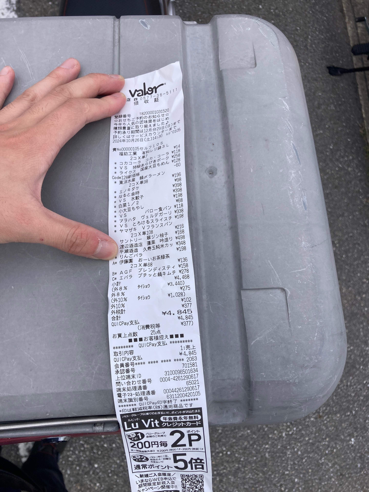
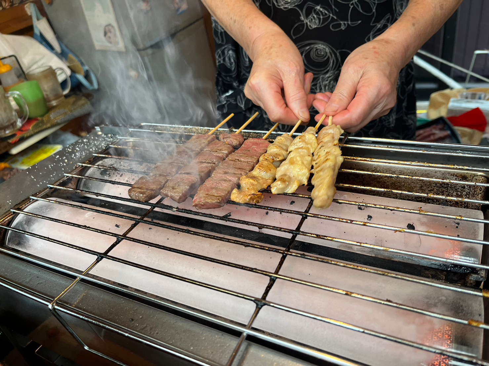

# 美味しいものを食べる

mizoと自分の誕生日が近いので、10月の半ばにお祝いで美味しいものを食べに行くことが多い。今年は食堂こよりのコース。美味しいんですよね。しかしながら、来年の初夏には高山に移るとこのと。新装開店はさらに先なのだとか。わりかし残念。高山にも遊びに行きたい。  
それで、食べに行った日の献立はこんな感じ。

どれもおいしい。当たり前か。ちゃんと素材の味がするという、大変凡庸な感想であたまがいっぱい。お刺身などに乗っている、菊の花が食べられることは知っていたけど、花の香りがして美味しかった。さわらうまい。もっと食べたい。骨までしばいたつみれ。だしがうまい。四角いササゲ。グリルされた里芋がうまい。あんもだしが効いていて、かにでうまい。子持ち鮎と茄子の冷菜。思いもよらぬうまさ。目鯛などのグリル。落花生のソースがうまい。甘くてまだ小さな渋柿のグリルもうまい。舞茸ご飯。白米うまい。舞茸最高。デザートにはコーヒが欲しかった。また、いくらか酒を飲んだ。竹雀は岐阜の酒で、ものすごく辛口。うたしろ（？）は多分新潟の酒で、飲みやすい。みんながたのしめる美味しい酒らしい。また、ひやおろしという、春に寝かせて、秋から楽しめるお酒があるのだとか。

となりのご婦人方が、むやみに他者を非難しない、みたいなことを話していた。自分も気をつけたい。いろいろなことを楽しまれているようで、勝手に話を楽しませてもらっていた。mizoとは何を話したっけ。おいちいねくらいのことしか話していない気がする。能作のとっくりは、使うのが難しい。勢いよくやってねと店員さんに教えてもらった。  
お会計の時、バタバタしててすみませんね、みたいなことを話されていた。まぁ移転するって言ったらみんなきたがるよな。おいしいもん。そのあとはまっすぐ帰った気がする。コンビニに寄ったかも。
# キャンプ・ツーリングの準備をする

キャンプツーリングの準備で、バイクのメンテナンスをしようと思ったので有給をとったところ、雨予報になってしまった。有休の少し前の日、キャンプの打ち合わせがあったのでそのことを話したら、友人宅のガレージをつかってもいいとのこと。ありがたく甘えることにした。  
やはりその日は雨。前日にあまりよくないことがあって、落ち込んではいたけど、なんとか頑張れた。朝に友人から連絡があったのもありがたい。それで、ちょこちょこ準備をして出かけた。  
まぁまぁ久しぶりに会う。自分としても普通に話せてよかった。聞きたかったこともいくつか聞けてよかった。よくないことが続くと、会いたくなくなるけど、なるべく早く気持ちを整理して、話をした方がいいのだろうな。  
整備は滞りなく終わり、友人と別れる。助かりました。  
それは小雨。岐阜市役所に出かけ、投票をすませる。食堂が混んでいたので展望台まであがる。暇つぶしに階段で登ったけど、これは大変だ。運動しよう。展望台から岐阜市を眺めてみると、気持ちの上での方向と実際の地理がずれているように感じた。方向音痴たるゆえ。13時をすぎたところで、辛いうどん（ちゃんと辛くて人気がなさそうなうまさ）を食べて帰宅した。あとは特にどうこうもない。翌日に洗車・チェーンの清掃などを済ませる。  

# 平湯に出かける

朝、いつもの芥見のマクドナルドに集合する。そういえば、作戦会議の通話の時に、ごとちゃんのバイクが新しくなったと言っていた。NEWバイクで登場する。ハンターカブ、いいですね。昔のハンターカブに似せた、ヒートガードをつけていたけど、あまりにも自然でわからなかった。いいカスタム。ほどなくしてまっちゃんが現れる。ゆうたは遅刻してやってくる。荷物の積載に苦労したらしい。  
朝食にダブルチーズマフィン、前も食べてイマイチだと思った記憶が蘇る。忘れないようにしてください。ダブルが好きじゃないのかも。一つ目の目的地を設定してバイクを走らせる。  

一度コンビニで休憩を挟み、道の駅の到着する。名前、なんだっけ。綺麗な川がそばにあるところ。きのこ汁が売っていたりする。道の駅、明宝だ。少しだけ、お土産などを物色して、昼食を摂る。どうも、以前に大きな災害に遭っていたらしく、なんとか今の営業できる形に再興したのだとか。いい場所なので、うまくいってよかったと思う。まっちゃん談。それで、トマト豚丼を食べた。思っていたより甘く、意外な美味しさ。そのあと、散歩がてら川ではしゃぐ。かなり透明度が高くて、イワナか何かが泳いでいるのが見えた。川釣り、やってみたい。ゆうたの方にバッタを乗せる。カメムシも乗っていた。  

いつものバローで買い出し。バケットが食べたい、バケットおじさんになる。夕飯は鍋。日本酒も買った。蓬莱の何かだった気がする。いや違うか。写真撮っておきなさい。蓬莱だった。そういえば、駐車場内で出会う車の運転が大変ユニークだった。気をつけようね。  

程なくして、平湯に着いた。それまでに、いくつかトンネルを抜けるのだけど、トンネルを通るごとに景色がかわる、そのきれいなこと。いつも忘れまいとして忘れてしまう。例年より少し、季節の歩みが遅い。肝心のキャンプ場はいつもより混んでいた。あまりいい場所が空いていなくて、嫌な顔をしてしまった。反省したい。それでもいい場所をたまたま見つけられたのがよかった。設営していると、お隣さんがやってきて、少しだけ話す。挨拶をしてくれる、いい人。挨拶大事。自分もがんばれ。紅葉は程々（例年に比べると落ち葉が少ない気もする）だけど、いい景色だ。軽く食事をとり（ごとちゃんが美味しい紅茶を持ってきてくれた）、温泉に向かう。その頃にはもう真っ暗だった。  
道中、星がきれい。夜に晴れていることがあまりないのでうれしかった。パッとみた時に有名な星座はなんとなく結べる。温泉で色々話をした。まっちゃんが海外に転勤になるかもらしかった。本人は行きたそうで、聞いている限り、いくべきなんだろうなと思った。ので、いいんじゃないのとは言っていた。マレーシアだとか。以前にも似たようは話があって、その時は都合も悪く、心無いアドバイスもあったようで、話ができてよかったと。ゆうたとは遊びに出かけるかと言いながらも、我々は、「どうする？」といって顔を突き合わせるしかないよなとか話していた。そのうち自分は痒みが限界で、お風呂を後にする（温熱発疹）。さきに17アイスクリームのチョコミントを食べて待っていた。良し悪しあれど、自分がやってもいいなと思っていることは、うまくいってほしいね。自分も、何を望むのかを知っていきたい。そのうち、ごとちゃん、まっちゃんがやってくる。ゆうたは遅れてくる。  
夕飯の用意をする。最初に嫌だと言って、構ってもらおうとするのをやめましょう。ただの嫌なやつだぞ。自分。キムチ鍋を一通り美味しく食べて、バケットも美味しい。ガーリックの塗るやつ、初めて買ったけどいいですね。日本酒も美味しかった。最初は甘口かな？と思うんだけど、後味がすっきりで辛口のような気もする。自分にはよくわからないけど、これも美味しかった。そのうちに寝る。  
夜に、テントの周りに何かがいるような夢を見た。ほんといたのかも。翌朝、早めに目が醒める。すでに、ゆうたとごとちゃんは活動していた。紅茶とマシュマロをいただく。マシュマロは胸いっぱいの胸焼け。おいしいけれども。その後まっちゃんが起きてくる。水を火にかけ、散歩に出かける。ここ数年は本当に混んでいるな。どこもかしこも人だらけ。良いだの悪いだの。少しだけ写真を撮る。朝食を摂る。ドリップポッドを忘れていたので端でコーヒーを淹れる。しばらくして、片付けを始めた。お隣さんはそのうちに挨拶をしていなくなる。片付けの時間は思っているより多めに想定しよう。  

ちっちゃいカメラ、暗所と逆光に弱い。キャンプ場を後にして下呂に向かう。  

41号も景色がいい。それでも、やっぱり今年は季節がゆっくりだな。定番も定番の、大安についた。今年はマトンちゃんを食べたぞ。まぁおいしいよな。ゆうたが持ってきた茄子とだし巻き卵もおいしかった。ありがとう。ちゃんと伝えよう。  

それから道の駅を二つ経由するルートで帰路についた。その昔、出川さんが電動の原付に乗る番組のロケとすれ違ったことがあるけど、その時に訪れた串焼き屋さんで牛と鳥の串を食べた。うまい。店主のおばあちゃん曰く、ビールと合わせると最高らしい。そりゃそうだろう。お土産もいくらか買う。  

ピアチェーレ白川だっけ。ここでもお土産を買った。草餅と甘いコーヒーもいただく。ここで買ったお土産のハムが美味しかった。それから少しして、関のコンビニで解散となる。家が近くのまっちゃんとは話をしながら帰る。俺も悪かったと思っているよ。  

頑張ってカネスエに買い物に出かけて、キャンプの後片付けをして、ビールと肉で、楽しい週末終わり。そういえば、買い物の帰り、キャンプの割り勘の計算を間違えていると勘違いして慌てたのは、大変間抜け。イキって迷惑をかけたかと思った。  

## そろそろ買い替えたい・買い足したい

思い出したらメモしておいて。

- カッパ→サンダーパスかなんか
- ペグとペグをしまうやつ

# 最近のこと

かれこれ、2週間前のことを1週間かけて書いていた。なので、それからもちょこちょこいろんなことがある。妹に内祝（どういう概念か知らない）にビールをもらう。うまい。りんご箱が無料で手に入る。美味しいカツを食べる。そんなもんかな。  
嫌なことで言えば、ずっと使っていたUSBハブが壊れる。電源が悪いのか、ハブがわるいのか。  
あと、お土産に悪口を言われて凹む。これはまぁ、やめてほしいよな。好みはあるだろうけど。
# 思っていること

ここまでの文章は嫌なことをなるべく省いて書いた。嫌なことは仕事の、ある取引先の担当者の振る舞いに起因するものだと思う。もちろん、当社の担当営業にも問題はあるとも思う。ここまでの横暴を許しているのは、もう問題にしないとして、どう収拾を図るのだろう？ここで生まれるストレスは、自分が対処しなくてはならないのだろうか？自分が黙ってこなしている仕事を、たまたま誰かの対応になった時、そこで生まれるストレスにまで巻き込まれるのは耐え難く不快だ。  
こういう形で、自分の楽しかった気持ちを台無しにされるのは本当に悲しい。いま、自分の性格もかなり歪んでいるんだろうな。