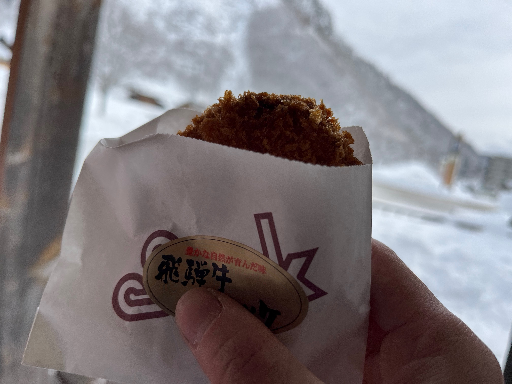

# クリスマスと忘年会

プレゼントは随分前に交換しあった。ちょっと高級なリップクリームをあげて、 電気湯たんぽをもらった。コイツァいいものだ。この冬はあまり寒くて辛い思いをしていない気がする。  
母から恒例となっているクリスマスケーキをいただく。ついでにチキンも。ローソンの商品だけど、全然侮れませんね。フルーツタルトが好き。これはクリスマスイブの話。クリスマスの食事のその前の休日。  

## 忘年会

その土曜の午前中に買い物を済ませ、ばたばたで忘年会に向かった記憶がある。ちょっといい寿司がリーズナブルに食べられるお店なのかな。一番遅刻しそうなやつと自分以外が遅刻だった。  
  
ラインで注文するミニアプリはすこし使いづらい。飲み放題が飲み放題なのか心配だった。お酒は色々飲んだ。食事は美味しかったと思う。普通に美味しいウニを始めた食べたけど、美味しいですね。でもまだよくわかっていないので今度ちょっといいウニの瓶詰めを取り寄せてみようか。だしスープが頼めたのもよかったし、美味しかった。じゃがいものグリルも美味しかったな。友達の一人が大暴れしていたので出禁だろう。知らんけど。  
二軒目は焼肉屋みたいなところに行く。メガハイボールを頼む。ホルモンを焼くのが下手くそだ。水をこぼして恥ずかしい思いをする。  
三軒目は会員制っぽい、バーっぽいところに行く。フルーツのカクテルがうまい。友達が水をこぼす。仲間だな。  
  
何を話したかはあんまり思い出せない。いつものことだけれど。自分のボーナスがあまりにも少ないとか。子供の頃の思い出とか。プールの更衣室からふりちんで飛び出したことがあった。昔の悪事すべてと向き合えるほど強くないンゴ。一軒目はちょっと横着しすぎかと思ったけど、楽しい飲み会だった。

## クリスマス

昼くらいにゆっくり起きて、シャワーを浴びて、スプラトゥーンのガチキング決定戦のアーカイブを見ながら夕飯の準備を始めた。ほぼはじめて作るものだった。美味しくできたのはパスタくらいか。まぁ来年やる気があったらがんばろう。コンベクションオーブンの火加減を上手になろう。  
写真をまとめていて、思い出した。今年は二部編成でしたね。クリスマスイブにお母ちゃんからのクリスマスケーキと黄金チキンをいただき、ラザニアを作るときに多めに用意しておいたミートソースでパスタをした。
  

# 飛騨荘川へ寒中キャンプへ行く

誘われたとき、たぶん計画ありきの合意形成みたいな話し方をされて、腹を立ててしまったことはここに懺悔しておきたい。しょうもないことにあまり目くじらを立てないようにしたい。  

朝、自宅まで迎えに来ていただく。どうもこの前後の数日、たくさん雪が降るらしい。ちょいと不安である。下道でまず、道の駅美並についた。いつものところ。ここでお昼を食べた。ここで食事をするのは二回目とかじゃないか。覚えがないけれど。この辺りではまだ向こうの山の上に少し雪が見えるくらい。秋冬の山の色、しみじみ眺めるといい色ですね。  
  
それから走り出すと少しずつ雪景色に変わっていく。高山のいつものバローの小さい方に着く頃には真っ白。寒いのはそこまで堪えない、運転は少し怖い。もちろん下手くそだからではない。
 Macの画像編集は結構便利ですね。それであれこれ食材を買い込む。寒い朝にどん兵衛が食べたかった。ポトフの材料やお酒をなど買った。ここからさらに一時間ほどでキャンプ場に着くとのこと。なんだったっけ、一色の森キャンプ場か。この辺のお金を払っていないので、次回会うときに精算すること。

国道の果てのキャンプ場にたどり着く。初体験の真っ白さ。これだけ雪があるけど、やはり空気は乾燥していた。手で雪を溶かしても、瞬く間に乾く。山盛りの雪がつもったサイトの雪かきから始まる。これは重労働だった。雪国に住みたい気持ちも十分理解できたけど、雪かきの負担も身に染みて理解できた。腰にきますね。重労働とはいえ、たまにのことなので、はしゃいでしまった。たまにの雪は楽しい。自分の住む街で、今年は降るのだろうか。そのうちにテントが立ち上がる。自分はコットの上で過ごすことにした。  

少しだけ休んで、お風呂へ行く。タオルも借りられてちょっとびっくりな安さ。値段は忘れたけれども。しかし雪がすごい。お風呂に浸かり（ぬるっとした温泉だった）、そのうちかゆくなりだした自分は早めに退散した。雪の中の露天風呂はいいものですな。かゆくならなければずっと浸かれる。休憩所でアイスを食べるなど。お土産コーナーにブルーベリージャムがあったので買った。ホットワインにでもしようと思った。  
  
それからは料理をするなど。友人がもらってきた（自治体のチケットで交換したらしい）いい肉を食べる。たしかにうまい。脂でマスキングされるからワサビをつけても何も感じない。あとはほとんどポトフ。バケットはきった側からつまみ喰いまくってた。アヒージョは面倒になったので、材料をポトフにぶちこむ。そういえば食べ損なってたファミチキも一緒にいれた。なんでもポトフ。ブルーベリージャムはバケットに塗るのみ。l歯磨きをしにいく、ついでに散歩も。星がすごかった。メガネがなくてあまり見えていなくてもわかるくらい。メガネは持ち歩こう。雪の夜は明るい。

  
そして、とこに着く。自宅で愛用している寝袋、案外暖かくないな？もしかしたら。コットで寝るときはもう少し工夫したいか。朝、すこし暖かくなってきてからの方がゆっくり寝られる気がする。寝袋、ほしいかなぁ。翌朝、フレンチトーストを作ってもらったり、コーヒーを飲んだりした。どん兵衛は食べず。無念。ぼちぼち撤収を始めた。大体一時間ちょいかな。撤収を甘くみがちである。昼前にはキャンプ場を発つことになった。

  
帰りの道の駅で、お土産を買い（そば餅と、明宝ハムの安いやつ、鶏のパストラミ←大当たり）、コロッケを食べ、行きに見かけた風見鶏で昼食を摂る。かつて近所にあったチキンレストランとは無関係なのだろうか。こちらはカレーが有名らしい。昨日の夕飯のおかげか、コロッケを食べたせいか、胸がいっぱいだったので、スープカレーをいただいた。個人的にこれが大当たりだった。また食べに行きたいお店である。お店に暖炉があって、店員さんがその世話をしながら、上で温めていた鍋を確認していた。なんだろうと眺めていたら、それはおでんで、暖炉を使って沸かさない程度に火を入れると、濁らない出汁の美味しいおでんができると教えてくれた。うまいだろうなぁ。マスターも気さくな面白い方だった。

それからもうひとつ、道の駅に寄りお土産をゲットした（カチョカバロと日本酒）。その頃にはだいぶ雪も見えなくなっていた。池の鯉はおとなしい。冬季はエサやりができいないのだとか。
  
そのうち岐阜市について、解散となった。不安も多かったけど、なんだかんだ楽しく過ごせてよかった。

# 大晦日

事前に約束があり、mizoの部屋を片付ける。ワイは結構がんばった。ベランダの片付け、お風呂の大掃除（変わったタイプの浴槽で、浴槽の下全てが排水になっているのでゴミが溜まるなど）、キッチン磨き、床掃除。まぁこれくらいのことしか役に立たないし。そしてたこ焼きだ。生地にしっかり味がついていておいしかった。牛すじの煮込みも作ってくれた。mizoは白い塊が苦手だと言っていたけど、うまい。たしかに、よく知る牛すじではない。お土産のカチョカバロや鶏のパストラミも食べた。おいしいぜ。紅白歌合戦の星野源は怖かった。いい曲だけれども。歌詞をすこし変えていたらしい。たこ焼きでお腹いっぱいだったので、年越しそばは用意だけして、年を越して網羅うことにした。年越しまで起きていたっけ。  
年越したそばを食べて、しばらくゆっくりしたら、それぞれ実家に帰ることになった。

# 大掃除の覚書

## 中華鍋をしばく

焦げをヤスリで落として、地金を出してから焼きを入れる。そんなにいい感じじゃないのでまたやり直したいかな。  
[うまく空焼きできた中華鍋](https://www.aoi-syarin.com/blog/e3040.html)  
家庭用のコンロで参考の記事程度の焼きを入れるには一時間とかかかるらしい。

## エスプレッソメーカーをしばく

上部のパッキンが簡単に外れることを知ったので、外してきれいにした。ついでに水で炊いた。磨くのはやめておいた。  
[ビアレッティのマキネッタ(直火式エスプレッソメーカー)モカエクスプレスを徹底解剖！【お手入れ・メンテナンス・洗い方編】](https://coffeeblues1.blogspot.com/2018/06/blog-post_24.html)

## 電子レンジ・ノンフライヤーをしばく

耐熱容器にカップ一杯の水、大さじ一杯の重曹を加えてとき、5分加熱する。20分ほど扉を開けずに放置してから拭き掃除をする。同じことをノンフライヤーでしたら、無印の耐熱ボウルが割れてしまった。間抜け。  
[電子レンジのお掃除方法を解説　頑固な汚れ・ニオイをスッキリ落とそう！](https://www.duskin.jp/servicemaster/column/detail/00031/)  
庫内に残った重曹が水分を含むのか、加熱することがあるので、よく洗おう。
[電子レンジを徹底お手入れ（3）：回転網編](https://okomotot.com/%E6%8E%83%E9%99%A4-%E9%9B%BB%E5%AD%90%E3%83%AC%E3%83%B3%E3%82%B8%E3%82%92%E5%BE%B9%E5%BA%95%E3%81%8A%E6%89%8B%E5%85%A5%E3%82%8C%EF%BC%9A%E5%9B%9E%E8%BB%A2%E7%B6%B2%E7%B7%A8/)

## バイクもしばいていた

唯一ひまそうなタイミングで洗車をしておいた。この子とはもう随分と長い付き合いになってしまった。激安バッテリーに交換してみたけど、今のところ問題はないな？この後に書くことではないが、なるべく長く大事に乗りたいですね。
  

