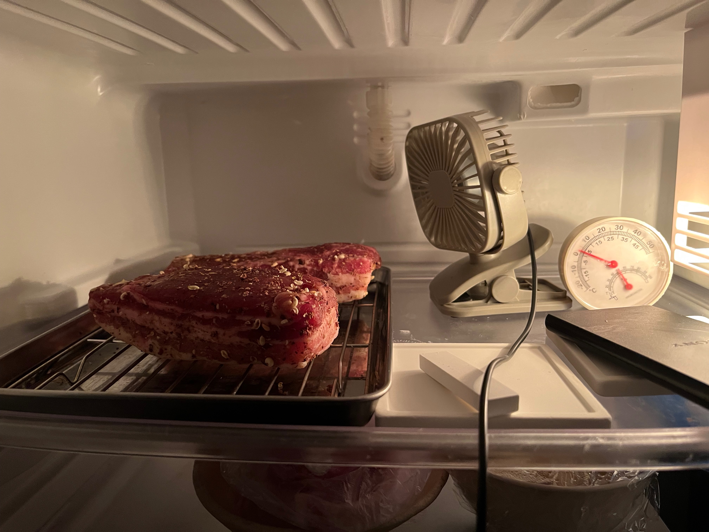

# 材料

## 咸肉の場合

- 豚バラ肉ブロック
- 塩 肉重量の2.5%前後
- 花椒（なぜか変換できない） 塩重量の20%ほど

# 手順

## 咸肉の場合

1. 塩と花椒を空炒りし、冷ましておく
2. 花椒塩を豚バラ肉に満遍なく刷り込む
3. キッチンペーパーやピチッとシートを巻いて3日程度寝かす
  1. 肉から出る水分はきちんと取り除く・こまめにキッチンペーパーなどを取り替える
4. 豚肉を日陰で風通しの良い場所で20日程度干す
   体感2週間ほどでも問題なさそう
5. 臭いと表面の状態（ぬるつき・べたつきがないか）をチェックする

# そのほか

## 冷蔵庫で干してみた

調理の仕方を調べてみると、冷蔵庫のなかで作業を完結させている人がちらほらいた。自宅冷蔵庫の温湿度を測ってみたところ、干し肉を作る条件を満たしている気がしていたので、それやってみることにした。
1.   
  温度は2度前後で湿度は低いと30%かそれ以下になる。また上図のように空気を滞留させると湿度が上がるので、外で干している環境に近いんじゃないかな。
2.  
   一週間ほどはバッテリーが切れるまでファンを回すようにして、さらにもう一週間放置した。それをスライスしてみると上図の感じ。見てくれは中央まで乾燥して透けた牡丹色できれい。焼いて食べたらおいしい。

# 出典

- [おうちで中華 - 鹹肉（豚三枚肉の塩漬け干し）](https://note.com/chijintianxia/n/n788f8908834a)  
- [“自家製干し肉”を作ってみよう！料理人の私がおいしい作り方を教えます](https://www.homes.co.jp/life/cl-hobby/cm-cooking/37445/)  
  咸肉以外も作ってみたい。注意事項がよくまとまっている。
- [手作りの干し肉について質問です。](https://detail.chiebukuro.yahoo.co.jp/qa/question_detail/q12137578622)  
  牛肉においては気温ではなく湿度が肝要である、と言及されている。そうなのか。他の動物の肉はやっぱり秋冬らしい。
- [咸肉（中国式塩漬け肉）の構造](https://note.com/ahmad_z/n/n893690c0ca2d)  
  基本的なレシピと作業方法がまとまっている。
  > 咸肉と青菜の炊き込みご飯（上海咸肉菜飯）などは大層美味しいという。i