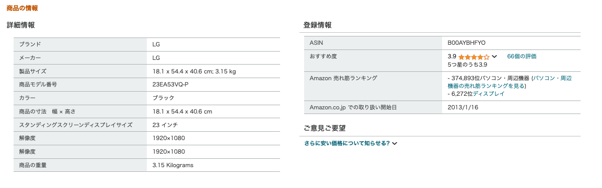

# 少し大きなモニターに買い替える

値段もお手頃、たまに試してみているけど、ソファで作業したりゲームしたりの体験は悪くない。

## [現在使っているモニターの詳細](https://www.amazon.co.jp/gp/product/B00AYBHFYO/ref=ppx_yo_dt_b_search_asin_title?ie=UTF8&psc=1)

- [LGのページ 23EA53VQ](https://www.lg.com/jp/monitors/fhd-qhd/23ea53vq-p/)

# ヘッドマウントディスプレイとしてのARデバイス

デスク以外で作業したり、動画などを視聴したりする用途に便利かなと思っていた。たぶんなんだけど、自宅においてデスクのセットアップ以外で作業するのは効率悪い上にめんどくさくなりそうだし、動画見るだけでちょっと準備するみたいなことを自分はしなさそう。  
「ヘッドマウントディスプレイとしてのARデバイス」ってのは今のところボツ気味。

- [XREAL Air 2 Pro購入して使用してみた感想](https://note.com/oka_yuji/n/n9b0b9c65f24c)  
  ディスプレイの固定など、AR的な拡張機能を使用するためにはBEAMが必要。この辺はそのほかのARグラスと同じ感じ。絵は綺麗だけど、ちょっと疲れる。
- [XREAL Air2 Pro体験記](https://note.com/play_tech/n/n9854ca6f61eb)  
  視力調整用のインナーグラスが必要みたい。ロッキードだっけ、必要のない機種もある。
