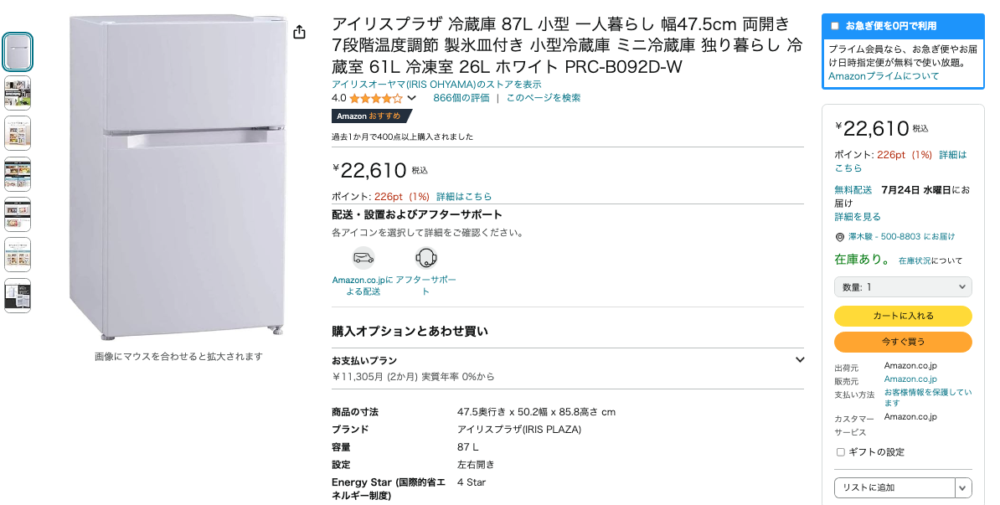
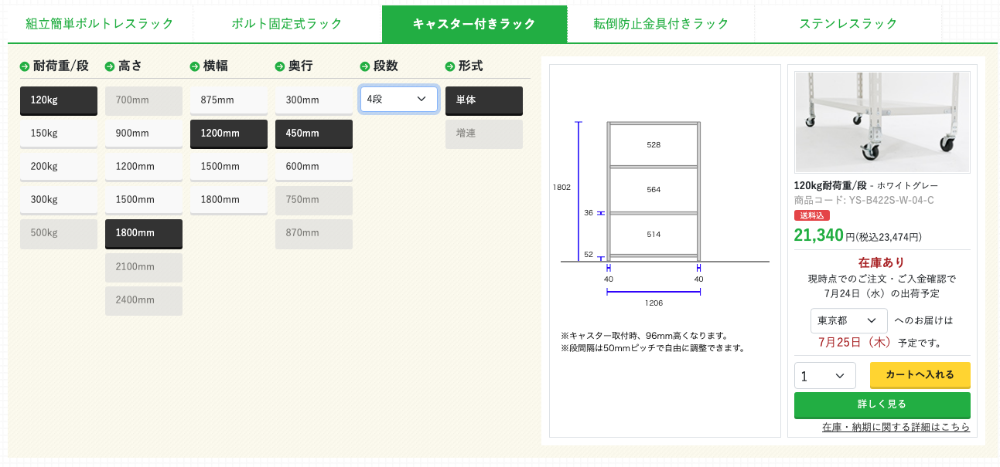

# とりあえず箇条書き

- ~~ドロウアラインを買う~~
- ~~本などを除き、クローゼットに収められるようにする~~
- ベッドにワイヤーネットをはる
- 本の収納を考える
- 家電を小型化する／可動式・壁掛けにする
  - 冷蔵庫（現冷蔵庫120＊50→新86＊50）  
    
  - 洗濯機
  - ~~扇風機~~
- 稼働ラックのサイズを決めておく  
    
    [シーエスラックキャスター付きラック](https://cs-rack.com/carry-rack#rack_search)  
    [スチールラックキャスターセット（4個入り・耐荷重120kgタイプ専用）YS/SOシリーズ兼用](https://cs-rack.com/products/detail/26102)
- バイオトイレがきになる
  - [スターエンジニアリング株式会社バイオトイレ　ビオレット](https://premium.ipros.jp/stareng/catalog/detail/276678/?hub=164+1074093)