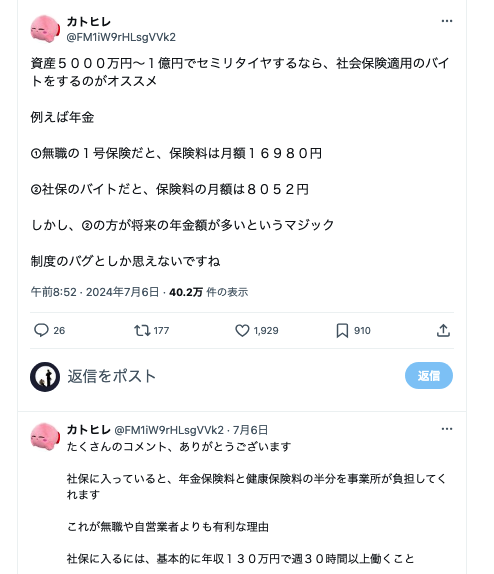
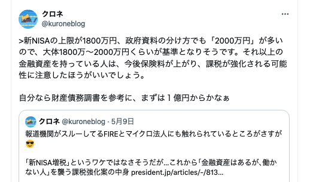

# [社会保障](https://www.mof.go.jp/about_mof/councils/fiscal_system_council/sub-of_fiscal_system/proceedings/material/zaiseia20231101/01.pdf)

叩かれがちな財務省だけど、この資料でやろうしていることは筋が通っているように思う。  
とはいえ、合理性だけでうまく進んでいけるとは思えない。医師の分散とかそういうやつ。

- 子作り・子育てを支援するための財源確保  
  社会の維持には人口が必要なので、社会で負担をするということに大きな異論はない
- 社会保障・医療の人材確保のための賃上げや財政面での支援  
  これは難しい問題、現状の社会において必要なリソースを適切に配分するのは難しそう
- 医療費の合理化  
  これは必要なことだと思う。リソースの使い方を上手になりたい。
- DX化・生産性の向上  
  必要なことだと思いつつも、社会がより難しくなっていくよなぁという懸念もある。

政治とか公の仕事の世界は遅いとか言われるけど、企業活動とは比較にならないほど考慮しなくてはならない影響範囲があるのではないかと思う。それでいてミスが許されづらい。

## セミリタイアしたい時に使えそうなテクニック（24/08現在）

# 金融資産課税について

導入されるとの噂があるもの。死ぬまでに必要な金とモノは分けて考えるといいのかなぁ。