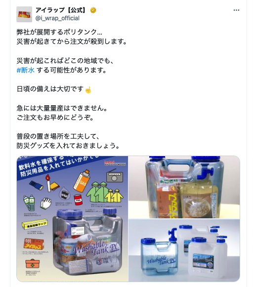

# ずっと検討している
## 備品の候補

- 安全靴（ソフトなタイプのものがあるらしい）
- 折りたたみヘルメット
- 防刃手袋（ワークマンに売ってるらしい）
- 手回し発電付きのバッテリー
- アイマスク・耳栓
- エマージェンシーメモ（家族の連絡先とか）
- 登山用の速乾タオル
- 上記を濡らさないようにするジップロック
- キャリーケース
- 防災食
  - ドライフード
  - 青汁（ビタミン摂取に役立つ）
  - 甘いもの
# メモ
## ポリタンクに非常用品を詰めておくといいらしい

- 防水になる
- 容量がある
- 容器が水の保管にも使える
- 二次持ち出しによさそう