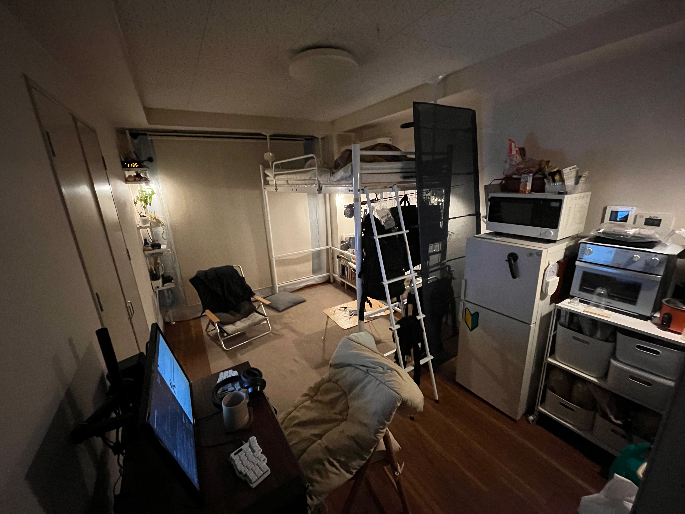

# 総評

2024年の初めは本当に驚いた。じいちゃんの体調も含めて、変わらないことはないんだなと、痛感させられた。そのせいか、そのせいでもないか。身の回りの人たちの変化が大きく感じられる一年だったように思う。妹が結婚したり、姪っ子を産んだり。また、友人たちとの生活水準の差にたじろいだり。30代が鬼門だと思っていたけど、その予感はあまりはずれていなかった。  
たぶんこれらの思いから、少しずつ物の整理をしたり（これは住宅騒動を引きずっているのもある）、あるいはこまめに記録をつけるようにしているのだろう。  
そんなには悪くなかったけど、自分の中に希望が持てなかった気もする。相変わらず仕事も適当だしな。部屋は前よりもう少しだけ片付いた。貯金も増えた。体重も増えたが、髪の毛は減った。  
2025年は自分の関心ごとに取り組むようにしたい。たとえばなんだろう。パンを焼いたり、豚の塩漬けを作ったり。  
あと、ものがたくさん壊れたな！壊したともいう！  

## お金について

月の予算を作ってみたけど、どうも週次の予算としないと意図した形で記録が取れなさそう。ついでに2024年から予算の一部を現金で消化していくことにした。  
見直してみると、突発的な支出が多い。ネットワーク環境やデスク周りの改善やトラブル解消、バイクのメンテナンスなど数年に一度の更新が2024年にまとまっているのかな。

- 食費+雑費：予算480,000円に対し、-79,50円0のマイナス。  
  2025年から予算を530,000円として、210,000円を現金で管理する。  
  バイクのメンテナンス・タイヤ交換が支出としては大きかったと思う。
- そのほかの支出：338,850円  
  賃貸の更新・自動車税・妹の結婚出産祝い・ふるさと納税
- 趣味など：予算200,000円に対し、-133,000円のマイナス。  
  すでにパソコンを買ってしまっているので2025年の予算は150,00円0とする
- 資産：3,196,252円（2,317,687円に対して38%増）  
  現金が結構あるので、積立を一括に変更した
- 負債：-6,488,389円（-6,885,621円から6%減）

## 住まいについて

2023年に比べると進捗はゆっくりだったけど、作業は進行できたように思う。とはいえ、部屋のみてくれは結構変わった。頼りになるキッチン家電も増えたし、日用品を見直すことで、管理しなくてはならない物の点数も少なくなった。書いて並べてみるといい傾向だな。  
2025年は押入れのワークベンチ化を進める・賃貸の収納に依存しない部屋のレイアウトをつくるを中心に取り組んでいきたい。  
関係なくはないけど、洗濯が上手になった。

## 仕事について

2024年の前半は多少がんばれた。多くの場合、年末から翌年の6月まで忙しいのだけど、ペース配分が下手くそですね。前半に気持ちを詰めすぎてしまった。それでかわからないけど、やるべきことが多すぎて、萎えてしまっている。もちろん、仕事そのもののストレスもあるだろうし。転職をするか、何らかの形の副収入を得るか、最低限どちらかを具体化していきたい。

## たのしみについて

今年は部屋の改善に結構予算を割いていたような印象がある。あと、メンテンナンスであったり、既存の機器の取り替えであったりなど。そういう意味では学びはあったな。以前より自宅は快適になったようにも思う。  
あと、多分一度だけ自分一人で2024年は美術館に出かけた。これは久しぶりだった。友人たちともちょこちょこ出かけていた。連れ出してくれる友達には感謝だな。寒中ツーリングやキャンプ、サカナクションのライブ、いつもの平湯、寒中キャンプ。など。

## 買ったもの

アマゾンで注文しているのは多分20回とかかな。

- [髭剃り・バリカン](2024-12-31-髭剃りとバリカンを買い替える.md)
- [キャンプ用品用にマルチバッグとそのほか](../goods/2024-12-31-アウトドア用品)
- [ デスクの横にぶら下げる収納](../goods/2024-12-31-デスク周りについて.md)
- [つっぱりラック](../goods/2024-12-31-つっぱりラック.md)
- [コンベクションオーブン](../goods/2024-12-31-山善のコンベクションオーブンを買ってもらう.md)
- [ルーター](../goods/2024-11-19-テザリングで使えるルーターと、ネットワーク環境.md)
- [iPhone13mini](2024-11-28-iPhone13mini.md)
- [keyball44](../goods/2022-03-19-キーボード・マウス遍歴.md)

# 抱負

前年にひきつづき、やっぱりやりたいことはわからないけど、一人で暮らせる小さいトレーラーハウスが欲しい。実現するかは別にしても、これを目標の一つとして、貯金や物の整理、住環境の改善に取り組みたいと思う。また、姪っ子が生まれたので、人生を投げ出すということの罪がより重たいものとなったと思う。最近、いずれ本当に一人になるんだろうと想像することがよくある。なるべくたくさん思い出を作っておきたいですね。

## お金について

予算は週次で計算しなおして、趣味などの予算はパソコンを買った都合上、少しだけ減らした。また、ある程度現金に余裕があるので、NISAの積立を一括で行うことにした。ざっくりとした計算では一年分の生活費・投資用の費用に少し足りないくらいの現金があるので、できればもう少し現金を増やしておきたい。  
今年は妹の新居祝いがあるぞ。

- 食費+雑費：予算530,000円
- 趣味など：予算150,000円
- 資産：目標3,196,252円→4,000,000円
  市場環境は悪化しそうだし、今年と同程度の収入があってなおかつ、予算をしっかりと守れた場合にのみ達成される目標。ぜひとも頑張って欲しい。

## 住まいについて

ものをさらに減らしていくとともに、「ワークベンチ化を進める・賃貸の収納に依存しない部屋のレイアウトをつくる」を進めたい。  
また、防災について、どういう方針で何を揃えていくかの方針を定めておきたい。ずっとやりたいと思いながらサボっているぞ。  
また、アーカイブした写真を簡単な記事にまとめたい。つらいぞ〜。

## 仕事について

メインの仕事のほかに収入を得たいぞ。

- 【前年に引き続き】引き継ぎの資料を作る
  - 実際に引き継げるかは考慮に含めない
- 【前年に引き続き】問題のない案件については、メンテナンスを施し、同様に引き継ぎ資料を作る
- 30万円の原資を作ったので投資で利益を得る
- タイミーなり、スポットバイトの副収入を得る

## たのしみについて

ものを買うのが好きなのはしょうがない。そこから経験を得たり、アウトプットをしたりをしよう。できればアウトプットを公開する場をつくりたい。

- 【前年に引き続き】絵を描く
- 【前年に引き続き】3Dを扱えるようになる
- 【前年に引き続き】PCの環境を整理する
- やったことがない料理にチャレンジ
- ひとりで出かけよう
- 自家発電蓄電を学ぼう