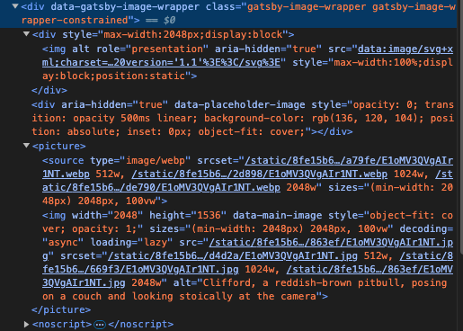

# JSを使用する制作環境を整える方法を調べる

[JavaScript開発環境構築（macOS編）](https://zenn.dev/erukiti/articles/setup-javascript-macos) 

- Node.jsのバージョン管理にはanyenvとnodenvというものを使うらしい
- homeBrewは定期的に`brew update``brew upgrade`を実行する

# やったこと

- 2024-04-10
  Homebrewのバージョン確認とアップデート
- 2024-04-16
  - anyenvをイントールする（バージョン管理ツールを管理するツールらしい）
    1. anyenv をインストールする
      必要があればexec $SHELL -lしてターミナルを再実行する
    1. anyenv を使って、それぞれの言語に対応した *env をインストールする
    1. anyenb install -lで入っているものを確認してみる
    1. anuenv install nodenv する（自分の場合はデフォルトで入っていた）
  - nodenvでNode.jsをインストールする
    - 原則として偶数は安定版・奇数が開発版らしい
- 2024-04-29
  - グローバルのNode.jsをあたらしくした（16.20.2）。
    - `nodenv global **.**.**`
  - 作業用のローカル環境のバージョンを元のものにした。
    - `nodenv local **.**.**`
- 2024-08-26
  - yarnとnpmはあんまり気にしないでいいらしい  
    [npmとyarnって何？結局どっちがいいの？？？](https://qiita.com/marumaru0113/items/3d136d84edabb7eae903)
- 2024-08-26
  - 現状のバージョンのGatsbyで環境を作ってみる
    - nodeJSの18.20.2をnodenvに入れる
    - テスト環境のバージョンを上記にする（`nodenv local 18.20.2`）
      - グローバルも変更
      - [nodenvでNode.jsのバージョンを切り替える](https://zenn.dev/donchan922/articles/b08a66cf3cbbc5)
- 2024-08-27
  - gatsbyのチュートリアルを進める
    - Reactのpropsはコンポーネント同士のプロパティのやりとりに使う
      - 静的な場合は`{props.名前{}`もしくは`{名前}`
      - クラスの場合は`{this.props.名前}`
    - JSのアロー関数とは
        - ES6以降にサポートされたfunctionを宣言する方法
        - `var func = function(hoge){console.log(hoge);}`と`var func =(hoge) => {console.log(hoge);}は同じ意味になる`
- 2024-08-31
  - gatsbyのチュートリアルを進める
    -   
    かなり最適化された形で画像を挿入してくれるみたい
    - GraphQLさわる
      - [http://localhost:8000/___graphql](http://localhost:8000/___graphql)でアクセスできるやつはgraphiQLというらしい
- 2024-09-02
  - seoコンポーネントを作った  
    なんとなくやれることが理解できた
    - export const Headではheadの中身に任意の情報を取り込むことができる
    - コンポーネント化することで、出力したい内容を任意に作成することができる
  - [入っているプラグインについて](https://px-wing.hatenablog.com/entry/2021/01/19/065523)
    - gatsby-transformer-remark  
      マークダウンファイルを解析する（remarkを使用する）
    - gatsby-source-filesystem  
      デフォルトで入っている。ローカルファイルシステウからgatsbyアプリケーションにデータを取り込む？
  - mdとmdx  
    mdxはマークダウンをreactにおいてjsとして扱えるようにしたものらしい。直近はあまり人気がないのか日本語のドキュメントの更新が少ない。なのでmdでやろうと思う。
  - `${__dirname}`  
    node.jsの変数で、実行ゆうのファイルを含むディレクトリの絶対パスが格納されている
    - gatsby-configに限らずだけど、jsで""の中などに変数を使用する場合は``に変更する必要がある
  - pagesの中のjsでgraphqlにクエリを投げると、dataの中に格納される（仕様？）  
    →[gatsbyのAPIらしい](https://www.gatsbyjs.com/docs/reference/built-in-components/gatsby-head/)
  - gatsby-plugin-imageを使用してオンライン上の画像を静的なコンテンツとして取り込んだ時、allFileのnodeに含まれる
  - src/componentsにでデータをひきこむときにはuseStaticQueryを使う
  - src/pageにデータを引き込む時にはページクエリをつかう
- 2024-09-03
  - gatsbyチュートリアルを進める
    - queryを触る
      - nodeとは結節の意味でファイルごとの切れ目とかの意味で使っているのかな
      - excerptを指示すると文字通り要約を返してくれる
      - プラグインごとにnodeが作成される
      - トランスフォーマープラグインは、既存のnodeをトランスフォームする？
- 2024-09-04
  - gatsbyのチュートリアルを進める
    - FileSystemRouteAPIを使う
      - ページを生成するためのnodeを選ぶ
      - ページのルートで使用するnodeのフィールドを選ぶ
      - ページコンポーネントをつくる（`src/page`）名前は{nodeType.field}.jsで命名すること
        -  `{}`はルートの動的な処理を指示できる
      - GraphQLのクエリ変数
        - ` mdx(frontmatter: { slug: { eq: "another-post" } }))`でスラッグが"another-post"のフィールドを呼び出せる
        - `{eq: $slug}`で変数を指定できる
      - {nodeType.field}.jsを作成すると、自動でいくつかの変数がページコンポーネント内で生成される
        - {}で指定したフィールドが同じ名前の変数に代入される（？）
        - そのフィールドのidが$idに代入される（？）
      - [markdownRemarkからhtmlを呼び出すには](https://zenn.dev/yuukis234/articles/1aa7b196b27b58)  
        - `dangerouslySetInnerHTML={{ __html: html }}`をつかう（普通に変数として読み出すと無害化されるので）
          `<div dangerouslySetInnerHTML={{ __html: html }} />`のようになんらかの要素の中で使用しないとエラーになる（？）
        - タグとかコンポーネントの中で変数を使いたい時は`{`/blog/${node.frontmatter.slug}`}`
        - フォルダの構造が変わると再起動する必要がある
      - gatsby-transformer-sharp 
        - 画像ファイル（.jpg、.png、.tiffなど）のノードを作成する（？）
      - gatsby-plugin-image
        - getImageでnodeからイメージの情報をとりだす？
        - GatsbyImageでレイアウトをする
      - チュートリアル終わり

# 覚えた方がいいこと

- jsの使い方
- nodejsの使い方
- npmの使い方
- バージョンの考え方


# そのほか

- [JSONにはコメントアウトの機能が備わっていないっぽい](https://qiita.com/yokra9/items/1ac03876415d7fd47a65#fn2) 
  なのであれこれ裏技が考案されているらしい。  
  ```
  {
    "$comment": "コメント"
  }
  ```
  そもそものJSONの書き方
  > 1.JSON は名前（キー）と値のペアがセットになった「オブジェクト」から構成されています。
  > 1.キーはダブルクォートでくくられた文字列です。
  > 1.値はダブルクォートでくくられた文字列、数値、真偽値、null 値、配列、またはオブジェクトです。
  > 1.キーと値はコロン（ : ）で区切ります。
  > 1.ペアとペアの間はカンマ（ , ）で区切ります。
  > 1.前後を中括弧（ { , }）で挟みます。


