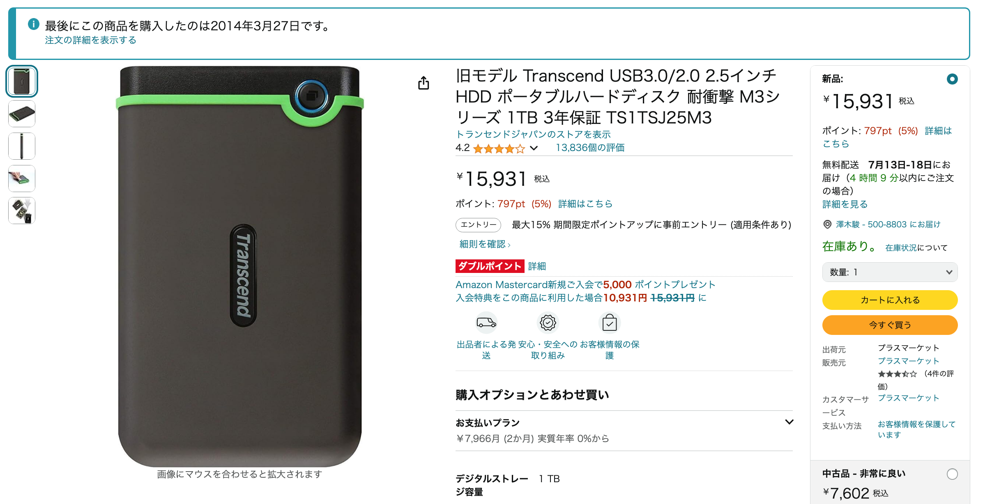
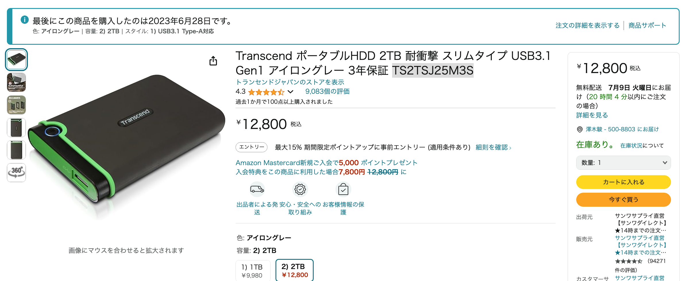

# 使用しているハードディスク

- [2014年製のTransendポータブルHDD M3シリーズの1TB](https://www.amazon.co.jp/dp/B005MNGQ6C?psc=1&ref=ppx_yo2ov_dt_b_product_details)  
    
  過去のデータのアーカイブのクローンとして使用中
- [2023年製のTransendポータブルHDD M3シリーズの2TB](https://www.amazon.co.jp/dp/B07B4KXTQK/ref=twister_B09B8M3ZCF?_encoding=UTF8&th=1)  
  
    
  MacBookAirのタイムマシンと過去のデータのアーカイブに使用中

# 使用しているソフトウェア

- TimeMacine
- FreeFileSync
# メモ
- [ストレージ初学者のためのホワイトペーパー](https://www.snia-j.org/cmm/images/2024/06/Storage_Beginners_White_Paper.pdf)
  - USB機器の整理と不具合っぽいやつの検証
    - USB2のポートに接続するとHDDを稼働するための電力が足りなくて不具合が出るっぽい
  - FreeFileSyncの動作のメモ
    - 同期でも消去が有効な場合がある
  - [タイムマシンの設定メモ](https://support.apple.com/ja-jp/guide/mac-help/mh15139/mac)
      - パーティションを切って使いたいときは先にタイムマシン用のにフォーマットにしてからexFatでつくる