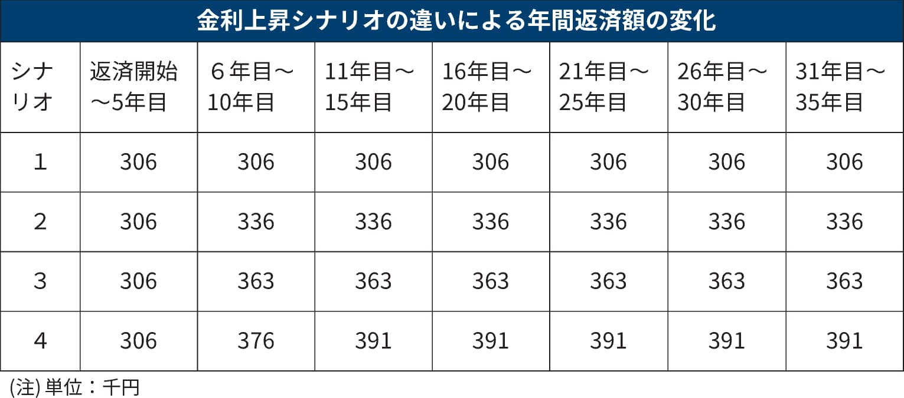

# 雑感

# 生活

- [中年夫婦が決断｢30→25平米｣仰天引っ越しの内情](https://toyokeizai.net/articles/-/748475) 
  こういう生活の態度をふたりで共有できているのがすごいなぁ。幸せであって欲しい。
- [楽天モバイルのスマホが乗っ取られる事案　同社が回線停止や楽天ID／パスワード変更などを呼びかけ](https://www.itmedia.co.jp/mobile/articles/2404/23/news178.html)  
  e-simが危ないかもという話題。アカウント情報の管理はちゃんとしよう。
- [エンジニアというITの専門家でありながら、小賢しいWeb系の詐欺に80%ぐらいはまって死にかけた話](https://qiita.com/isobe69/items/dad7c5e4d835998d855f)  
  これ気づけたのすげえわ。細かい違和感がたくさんありながらも、SNS認証に時間がかかる・認証画面に電話番号が表示されていない（詐欺サイトには電話番号の登録がない）が決定打でなんとかきづけたとか。 
  [パスキーというやつを活用したほうがいいらしい](https://blog.trustlogin.com/2023/passkey)
- [povoが楽天モバイルと全面対決、データ使い放題が月3278円　「300GB（90日間）」も (石野純也)](https://www.techno-edge.net/article/2024/04/25/3252.html)  
  副回線にいいのかな。auよりソフトバンクとかでこういうサービスがあるといいんだけど。

# 仕事

- [「この案件は特殊だった」は言い訳でしかない](https://baigie.me/nippo/2024/04/22/nogami-irregular/)  
  想像できることをプロジェクトで共有できるといいですね。そういうふうに進んだ仕事を知らないけど。
- [「Google Chat」が「Microsoft Teams」「Slack」とチャットできる機能を一般提供](https://forest.watch.impress.co.jp/docs/news/1586296.html)  
  いろいろなプラットフォームを一ひとつのインターフェイスから触れるってのは誰もが夢見るやつですね。多分有料。
  - [SlackとTeamsの投稿をMioで同期してみた](https://blog.cloudnative.co.jp/9630/) 
    そんなにつながるアプリは多くないみたい。

# 趣味

## デザイン

- [バーナード・ルドフスキーの名言「無学の工匠たちは、さまざまな時代、…」【本と名言365】](https://casabrutus.com/categories/culture/403863)  
  ポストモダンのはしりみたいなことなのかな。知らなんだ。「建築家なしの建築」。
- [ヤン・チヒョルトの名言「良いタイポグラフィは、活字そのものよりも…」【本と名言365】](https://casabrutus.com/categories/culture/403922)  
  > 良いタイポグラフィは、活字そのものよりもその使用方法によって決まる。
  多分忘れているだけで、前に読んだこういう考え方が自分のデザイン思想の根っこだと思う。
- [Yチェア、1万1,000脚を張り替えた男](https://www.axismag.jp/posts/2024/04/586637.html) 
  Yチェアの座面はペーパーコードというらしい（あのひも）。この方はいい記事をかくなぁ。

## 読書

## 制作

- [【熱望】javascript の for 文で var i を宣言するのはやめて下さい](https://qiita.com/uni928/items/2cc50c270b0735ad5ac4)  
  varで宣言してfor文を書くとメンテナンスが面倒になるとか、他にも不具合の原因になるぞ、という話
- [「タプル」～マンガでプログラミング用語解説](https://codezine.jp/article/detail/19246?p=5)  
  >「タプル」（tuple）は、複数の構成要素を一組にしたデータ型のことです。いくつかのプログラミング言語で存在していて、異なるデータ型をまとめてひとつの変数に代入して扱う目的で使用されることが多いです。関数の戻り値として、いくつかの値をまとめて返したいときにも利用されます。プログラミング言語によっては、配列などのデータ構造に格納できるデータ型が限定されます。たとえば数値を格納するように宣言した配列には、文字列を代入できません。タプルでは異なる型のデータをひとまとめにできるので便利に扱えます。
  sextupleなどのn倍（n-tuple）から転じた表現らしい。
- [HTML・CSSで実装するかわいいフキダシのアイデア](https://ics.media/entry/240425/)  
  ボックスシャドウでぼかし0にして袋を表現するのは便利かも。
- [テキストを1文字ずつアニメーションさせる時の注意点と実装例](https://www.tak-dcxi.com/article/text-animation-considerations-and-implementation-examples/)  
  やりたくなったら参考にしよう。
- [商用でも完全に無料ですごい！ デザインやイラストでかなり使える有料レベルの高品質なテクスチャ素材 -ResourceBoy](https://coliss.com/articles/freebies/textures-by-resourceboy.html#google_vignette) 
  便利かも。あんまり用事ないかも。
- [2024年版 HTMLで作るフォームバリデーション](https://ics.media/entry/240418/)  
  自前でフォームをつくる用事が思いつかない。プロパティをカスタムできる場合、参考にして追加してみてもいいかもしれない。
- [最新版！ Lottieアニメーションの実装方法](https://ics.media/entry/240403/)  
  SVG（ベクター画像）のアニメーションがつくれるらしい。
- [文章の折り返し指定のCSS最新版](https://ics.media/entry/240411/)  
  結論↓。
  '''CSS
  body {
  overflow-wrap: anywhere; /* 収まらない場合に折り返す */
  word-break: normal; /* 単語の分割はデフォルトに依存 */
  line-break: strict; /* 禁則処理を厳格に適用 */
  }
  '''
  - word-wrapではなく「overflow-wrap」。word-wrapはIE向けに開発されたものらしい。
  - word-breakは必要な箇所に部分的に適用するのが吉
  - ハイフネーションもできるらしい'  hyphens: auto;'
  - 禁則処理もつかえるとか

## ガジェット

- [Macのストレージ管理に必須！「ディスクユーティリティ」の正しい使い方を知っておこう！](https://pc.watch.impress.co.jp/docs/column/macinfo/1585995.html)  
  いまの自分のHDDの使い方は大きく間違ってはいないみたい。しかしながら接続が不安定なんだよな。
- [無印「インフラゼロハウス」に行ってきた　上下水道・電気がなくても暮らせる](https://www.watch.impress.co.jp/docs/news/1587028.html)  
  水の循環システムが目玉だと思う。2棟を複合的に使うっていうのが好みではないかも。

## アウトドア

## 展覧会

## お勉強

- [Excelで学ぶ、やさしいデータ分析](https://atmarkit.itmedia.co.jp/ait/articles/2404/24/news020.html) 
  問いを立てられないと、学びにならない。もっというと、したいことがない。

## 豆知識

- [Winnyの金子さんのED法について](https://yaneuraou.yaneu.com/2024/04/21/mr-isamu-kanekos-ed-method/) 
  金子さんのことはよく知らないけど、なんかすごいプログラマーだと認識していた。思っているよりすごいのかもしれない。
- [奇跡的イベントが発生中。2種の微生物が融合するという10億年に1度の進化が起きている](https://karapaia.com/archives/52331209.html#google_vignette) 
   大気中の窒素を固定できるような縁石藻（えんせきそう）が見つかったとか。これって結構すごくないですか。 
  ちなみにイベントというのはミトコンドリアや葉緑体のようにある細胞にほかの生き物が取り込まれて矯正する関係が確認されているらしい。
- [解読不能なデータを送り続けていたボイジャー1号が5カ月ぶりに解読可能な信号を地球へ送信、現在の動作状況の確認が可能に](https://gigazine.net/news/20240423-voyager-1-resumes-sending-signal/)  
  直せたらしい。すごいね。不具合のあったメモリに書き込まれていたプログラムをほかのメモリに分散して動かすようにしたらしい。

# お金儲け

- [地政学リスクで売られた日本株市場、米国株市場では半導体銘柄が崩れ…](http://hiroko.yutaka-shoji.co.jp/2024/04/blog-post_22.html) 
  株は崩れているけど、債券も冴えない。今週末はPCEデフレーターの発表。ドル円どこまでいくのか。
- [｢金利のある世界｣が到来したら起こる生活の変化](https://toyokeizai.net/articles/-/748632?page=5) 
  結構ビビってたけど、住宅ローンなどの変動金利にどのように影響が及んでいくのかを知らないな。知っておきたい。
  >●日銀が逆ザヤとなる政策金利……0.28％  
  >●日銀が経常赤字となる政策金利……0.58％  
  >●日銀が債務超過となる政策金利……2.75％
- [変動型住宅ローン、金利の上昇幅で変わる返済額](https://www.nikkei.com/article/DGXZQOUB169ET0W4A410C2000000/)  
  試算してくれているみたい。シナリオ4のような世界が実現するなら、世の中の賃金もきっと増えているでしょう。知らんけど。
  
  *上記記事から引用*

