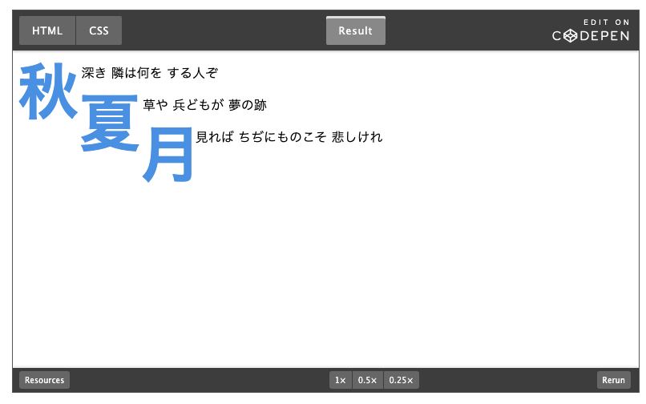

# 雑感

# 生活

- [地盤沈下するメキシコシティで、地下鉄システムが危機に直面している](https://wired.jp/article/mexico-city-metro-sinking-subsidence/)  
  埋め立てとか（埋め立ての骨材も含めた都市の過大な重量などが原因らしい）地下水の過剰な汲み上げによって沈んでいく都市がたくさんあるらしい。日本でも似たような事例があるのかな。
- [世界で初めて豚の腎臓を移植された62歳男性がわずか2カ月で死去](https://gigazine.net/news/20240513-first-recipient-transplant-pig-kidney-died/)  
  見出しが大変良くない。移植された腎臓が原因ではない可能性もあるみたい。続報が待たれる。
- [地下水に発がん性疑い物質　岐阜･各務原市､対策費計上](https://www.nikkei.com/article/DGXZQOFD029970S4A400C2000000/)  
  まじなんか。ちょっと嫌だな。各務原の方だと住んでる場所とズレるけど、実際どういうこととなんだろう。
  - [近年有害性が指摘されている有機フッ素化合物の「PFOS」と「PFOA」に対する最新の対策方法の提案。](https://www.oyo.co.jp/services/solution/pfos-pfoa-countermeasures/)  
    身近なところで言うと、テフロンのフライパンとか撥水加工に使われるフッ素化合物がこれにあたるらしい。はえ〜。
- [ジャック・ドーシーがBlueskyを辞めた理由をもうちょい詳しくエスパーする](https://note.com/kingyosun/n/n2cdc6ea4b776)  
  近しい印象でAC6のランクマで揉めている件を思い出した。卑近すぎるけど。権利問題とか倫理哲学みたいなところのリテラシーがないと読み取れない世界になっていっているように感じる。
- [ワンルームの丸見え玄関は｢曲がるカーテンレール｣で隠せる。部屋の仕切りにも](https://www.gizmodo.jp/2024/05/flexcurtainrail-review.html)  
  こう言うのものもあるんすね。なんとなく覚えておこう。
- [令和の日本社会に嗅覚はそこまで必要ない](https://blog.tinect.jp/?p=86311)  
  野生の時代から想像すると、すごいことだみたいな話から、現代人に必要な機能の移ろいを教えてくれた。すぐに怒れないとダメって世界もあったんすね。
- [春の食材には儚さがある。「春は風味を食べる季節」――料理に心が動いたあの瞬間の記録《自炊の風景》山口祐加](https://nhkbook-hiraku.com/n/n423153c66221)  
  いい表現ですね。そら豆たべたいなぁ。
- [妻大ショック｢夫の3回忌後｣出てきた遺産の正体](https://toyokeizai.net/articles/-/753954?page=4)  
  最初に相続した時の評価額で税金が決まるらしいので、評価額が下がると損失を招くらしい。なんか下に書いたやつ既にやってるな。
  1.  遺言作成（遺言に記載する）が望ましいが、せめてエンディングノートやメモに、どこにどんな財産があるのかだけでも記しておく
  2. 記したものを亡くなった後に確実に発見されるように手を打っておく。
  3. IDやパスワードを亡くなった後には家族が知れるようにしておく
  4. そもそも不要あるいは重要度が低いものは生前に整理、処分しておく（スマホやパソコンのデータ、SNSアカウントなども含め）
- [そうめんを「レンジパスタ容器」でゆでてみた！ゆで具合を実食レビュー](https://macaro-ni.jp/150490?page=2)  
  IH・電熱コンロ・電子レンジ、どれが効率いいいんだろ。
- [神戸市さん、データ利活用しすぎ……またまたやってくれました！ 無料で誰でも使える「統計ダッシュボード」拡充](https://internet.watch.impress.co.jp/docs/column/chizu3/1591404.html)  
  住みたい場所について調べるときに便利かも。
- [ChatGPT無料ユーザーが最新の「GPT-4o」を使う方法（ちょっとわかりづらいので解説）](https://ascii.jp/elem/000/004/198/4198881/)  
  ChatGPTの新しいモデルは、無料で3時間に10回やり取りができるらしい。
- [「親子の二人三脚」である、中学受験で転ばないための気づきを、言語化してみた。](https://blog.tinect.jp/?p=86389)  
  わりと言い尽くされていることのように感じるけど、こんなことがどうしてできないんだと「思ってしまう」ってかなり大事だよな。自分の気持ちの動きを良く観察したい。
    

# 仕事

- [マイナンバーカードとは](https://portal.mynumber.dev/)  
  マイナンバーカードにまつわるサービスを開発する人に向けたポータルサイト。多分関わることはないけど、リテラシーの要求水準が高い。誰かが個人でやってるのかこれ。

# 趣味

## デザイン

- [坂茂氏設計の豊田市博物館、木の「えんにち空間」が市民の新たな活動拠点に](https://xtech.nikkei.com/atcl/nxt/column/18/00585/050200219/?P=2)  
  いってみたい。美術館の隣。

## 読書

- [激動の時代、近代哲学の冒険者たちは何と格闘したのか？](https://nhkbook-hiraku.com/n/n2a0e364a9b26)  
  まだその続きの世界にいるような思いがある。
  > 一七世紀という時代は世界の底が抜けようとしていた時代です。科学革命が起こって、地球中心の閉じた宇宙が成り立たなくなり、無限宇宙になる。宗教戦争が勃発して、神がいるかどうかも怪しくなっていく。そうやって絶対が何も見えなくなった
- [日本のグラフィックデザイン一五〇年 ](https://www.heibonsha.co.jp/book/b640271.html)  
  おもしろそう。だけどこの手のテーマは割と読んでいて覚えていない。
- [原田治の名言「美術は、…」【本と名言365】](https://casabrutus.com/categories/culture/406492)  
  「ぼくの美術帖」おもしろそう。絵の源流って思いもよらないところにあるなぁ。
- [胃弱と文学とチャーハンと(英米文学者・阿部公彦) 【前編】](https://nhkbook-hiraku.com/n/n7152eba4a086)  
  胃の不快感を物語の不安さに結びつけるとか、腹が立つがだんだんキモいに転じていくとか、胃が弱い夏目漱石とか。こう言うものの見方があるんですね。
## 制作

- [あっ、そうだ！モダンCSSをまとめておこう](https://zenn.dev/hiraoku/articles/926cbb8bc35eaa#%3Anth-child()%E3%81%AE%E3%80%8Cof-s%E3%80%8D%E6%A7%8B%E6%96%87-%E3%80%9C-%E6%96%B0%E3%81%97%E3%81%84css%E3%82%BB%E3%83%AC%E3%82%AF%E3%82%BF%E3%81%AE%E5%8F%AF%E8%83%BD%E6%80%A7)  
  - コンテナクエリ  
    `@container (width >= 500px) {}`で500px以上だった場合のスタイルを指定できる
  - スタイルクエリ  
    `@container style(--sunny: true) {}`--sunnyがtrueの場合のスタイルがしてできる（カスタムプロパティってわりとなんでも入るんですね）。対応環境は要調査。
  - :has()セレクタ  
    `.product-list:has(.product.on-sale) {}`.product.on-saleを含む親要素のスタイルを指定できる。
  - :nth-child()の「of S」構文  
    `.container :nth-child(3 of .item) {}`.containerの子要素かつ、.itemが付与されている要素の３つ目のスタイルを指定できる。
  - text-wrap: balance  
    テキストの折り返しをいい感じにやってくれるらしい。パフォーマンスに影響があるとか。
  - `p::first-letter {initial-letter: 3;}`  
    
  - color-mix()  
    `color-mix(method（配色ルール）, color1[ p1（割合）], color2[ p2])`
  - ネスト  
    `.container{&:hover{}}`が成立する&--childとかはダメ。
  - カスケードレイヤ  
    - `@layer base, components, utilities;`宣言された順でレイヤーの優先度が高くなる（左が強い）
    - 例えば、例示のbuttonにマージンを与えるとこっちが優先されるのかな。
  - スコープCSS  
    `@scope (.card) {.button {}`.cardクラスを持つ要素の中の.buttonのみにスタイルを適用できる。
  - 三角関数  
    角度とかを数字の埋め込みではなく計算して指定できる（後任者とかに意図が伝わりやすいのかな）。
  - 個別の変換プロパティ  
    transformのtranslate、rotate、scaleを個別に指定できる。ただし、transformで設定するように適用順での記述はできない。
  - ポップオーバー  
    もろもろちゃんと設定してあるpopover APIが利用できるようになっているらしい。
    ```
<button class="popover-button" popovertarget="event-popup">イベントを作成</button>
<div id="event-popup" class="popover-content" popover>
  ここにポップオーバーの内容<br>
  コンテンツなどを表示する
</div>
    ```
  - 個別のプロパティによるアニメーション  
    アニメーションを適用できるプロパティが増えるよってこと？（display:noneとか）
  - スクロールドリブンアニメーション  
    スクロールに対応したアニメーション。なんかCSSだけで実現できるようなプロパティがあるのか。ちょっとわからん。
  - ビューのトランジション  
    ページ遷移をアニメーションで見せるやつって、やっぱりあらかじめ読み込んであるのかしら。
- [知っておくと便利なCSSの単位: ビューポートに基づく相対単位（vw, vh, lvh, svh, dvh, vb, viなど）の便利な使い方を解説](https://coliss.com/articles/build-websites/operation/css/relative-length-units-based-on-the-viewport.html)  
  - 1vw：ビューポート幅の1%。初期包含ブロック（htmlが配置される最上位のブロック）に対して相対的な数値らしく、スクロールバーまで含んだ幅になるので横スクロールが発生することがある。関係ないけどclamp関数というのが便利らしい。
  - 1vh：ビューポート高さの1%。上記と同じような問題が発生する。
  - 1vb、1vi：ルート要素の最初のブロックの幅（ブロックの大きさ）、幅（インライン方向の大きさ）に対応する？
  - 1min、1vmax：ビューポートの幅・高さの大きい方もしくは小さい方の1%に対応する。
  - 1lvh、1svh、1dvh：組み合わせで使う。l（ビューポートの大きい方）・s（アドレスバーやスクロールバーなどを含まないビューポート）・d（大きい-小さい）+vh（高さ）・vw（幅）やそのほか上記にあるものの頭につけると使える。
- [CSSの知っておくと便利な実装テクニック！ 相対カラー構文を使用して、1つのカラーに対して濃く薄くを簡単に設定できます](https://coliss.com/articles/build-websites/operation/css/relative-color-syntax.html)  
  まだそんなに多くの環境では使えない。`color: rgb(from green r g b);`もとの色から記述の文だけずらすみたいなことかな。使えるようになったら調べよう。
- [「ラッパークラスとラッパーオブジェクト」～マンガでプログラミング用語解説](https://codezine.jp/article/detail/19247?p=5)  
  > 「ラッパークラス」（wrapper class）や、「ラッパーオブジェクト」（wrapper object）は、オブジェクトではないけれど、オブジェクトとしてあつかいたい値を、包む（wrapする）クラスやオブジェクトのことです。
- []
## ガジェット

- [原付一種な電動キックボードで「改造したい5つ」のこと](https://tabkul.com/?p=294396&utm_source=rss&utm_medium=rss&utm_campaign=post-294396)  
  おもしろそう。原付相当の電動バイクは乗るのが楽しい。安上がりならやってみたいかも。
- [もう限界。Windows 11にやめてほしいこと8つ](https://www.gizmodo.jp/2024/05/8-things-i-wish-windows-11-would-stop-doing.html)  
  読んでいるだけでうんざりしてくるなこれ。メインで使ってないからまだいいけどたまに11さわると割とウザい。

## アウトドア

## 展覧会

## お勉強

## 豆知識

# お金儲け

  - [ドル円半値戻りの156円突破、日米金利差縮小もイエレン発言に反応か](http://hiroko.yutaka-shoji.co.jp/2024/05/156_14.html)  
    なんだか怪しい雰囲気になっている模様。状況を注視した方がいいかも。