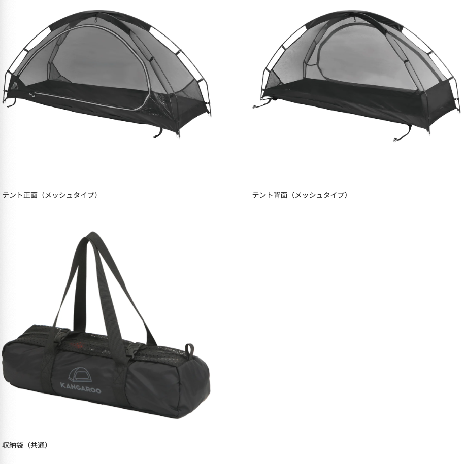

# 雑感

# 生活

# 仕事

# 趣味

## デザイン

## 読書

## 制作

## ガジェット

- [AppleのパーソナルAI「Apple Intelligence」やiOS 18・macOS Sequoia・iPadOS 18・watchOS 11・visionOS 2・tvOS 18が発表されたWWDC24まとめ](https://gigazine.net/news/20240611-apple-wwdc24/)  
  [5分でわかるアップル「WWDC24」発表まとめ--生成AIの「Apple Intelligence」、Vision Pro日本発売など](https://japan.cnet.com/article/35219928/)
  我が使用しているデバイスが実用に耐えるかを調べてからアップデートしてみようかな。

## アウトドア

- [【20%OFF】5/25（土）発売「カンガルーテント」の発売キャンペーン＆商品詳細を公開！](https://vastland.co.jp/blogs/special/kangaroo-tent-teaser)  
  今使っているやつがダメになったときの後釜になってくれるかも。  
  

## 展覧会

## お勉強

## 豆知識

# お金儲け

- [中味はさておき強かった雇用統計、今週CPIとFOMC、日銀も](http://hiroko.yutaka-shoji.co.jp/2024/06/cpifomc.html)  
  やっぱり「中身はさておき」という見方をする人が多いですね。  
  なんとなく「大統領選イヤー」の意味がわかった。大統領がかわるなり、政権与党がかわるなりが起こると、目下継続された経済政策の先行きが不透明になるので通貨安に繋がるという話だった。
  -  6/10(月)
    - 1-3月期 GDP 改定値(8:50)
    - 5月景気ウォッチャー調査(14:00)
    - 中華圏､端午節
    - 米NY連銀調査1年インフレ期待（5月）
    - 米アップル社のイベント(WWDC)開催(〜14日)
    - 休場:中国､香港､台湾､豪
  - 11(火)
    - 5月マネーストック(8:50)
    - 5月工作機械受注(15:00)
    - 新規上場:D&M カンパニー（189A グロース）
    - FOMC(〜12日)
   - 12(水)
    - 5月国内企業物価指数(8:50)
    - 日銀国債買い入れオペ（残存1-3年、3-5年、5-10年、25年超）
    - 中国 5月生産者物価(10:30)
    - 中国 5月消費者物価(10:30)
    - インド 5月消費者物価(21:00)
    - 米 5月消費者物価(21:30)
    - 6月FOMC
    - 米 5月財政収支(13日 3:00)
   - 13(木)
    - 4-6月期法人企業景気予測調査(8:50)
    - G7 サミット・拡大会議(〜15日イタリア)
    - 米 5月生産者物価(21:30)
   - 14(金)
    - 日銀金融政策決定会合～植田日銀総裁会見
    - 4月第三次産業活動指数(13:30)
    - メジャー SQ 算出日
    - 米 5月輸出入物価(21:30)
    - 米 6月ミシガン大学消費者マインド指数(23:00)