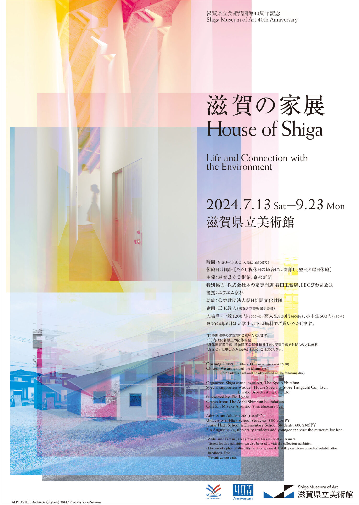

# 雑感

# 生活

- [蟻やネズミなどに効いた無料・低コスト駆除・対策ツールの作り方と感想](https://tabkul.com/?p=294894&utm_source=rss&utm_medium=rss&utm_campaign=post-294894)  
  ホウ酸シロップがいいかんじらしいのと、超音波（ただの高音に聞こえるけど）が色々な虫とかにも有効かもらしい。たしかに、コウモリとかそういうものに狙われていることを感知するために嫌ったりするのかな。
- [我が家を訪れた、あるテレビマンの情熱。](https://blog.tinect.jp/?p=86979)  
  あまりテレビに興味はないのだけど、そういう人もいるんだな。インターネットマン。
- [税金をドブに捨てた婚活セミナーに参加したときの話](https://blog.tinect.jp/?p=86973)  
  10年前の話であったことを最後に明かされる構成で、結果としての現状はどうだろうという。少子化というか、自己責任を声高に叫ばれる世の中で大きなリスクを負うための準備が追いつかないよな。
- [｢雨水で作ったビール｣飲んだ人が口々に言った事](https://toyokeizai.net/articles/-/768612?page=3)  
  雨水って蒸留水って言ってもゴミが混じってるジャーンとかって思っていたけど、ゴミが多いのは降り始めだけらしい。ミネラル分に乏しいので（軟水？）ビールの味わいにも影響があるとか。
- [こころの充足を求めて――「不安を味方にして生きる」清水研　#23[真の幸せへの道のり]](https://nhkbook-hiraku.com/n/nc0f8b8b0124a)  
  「感謝」の件はよくわかる。自分の生活は恵まれているし、多分だけど人生のなかで今が一番自由だ。なので未来が薄暗く見える。モチベーションはどこか。
- [おれたち日本人には「信仰」がわかるのだろうか？](https://blog.tinect.jp/?p=86947 )   
  [みんなには信じるものありますか？　おれは信仰の内側のことがわからない](https://goldhead.hatenablog.com/entry/2024/07/02/001901)  
  [わかってもわからなくても、信仰は生活のなかにあるよ](https://p-shirokuma.hatenadiary.com/entry/20240702/1719885320)  
  インターネット上のいいコミュニケーションを見ると目頭が熱くなりますね。それはそうと、自分も宗教のこういう考え方はいいなと思う反面（全く詳しくないけど）、内側にはいないとも思っている。シロクマ先生がいう、生活の中にある信仰っていうのはちょっときになる話題かも。「日本の庶民仏教」という本が紹介されていた。自分が好むデザインに似ているのかもしれない。
# 仕事

# 趣味

## デザイン

- [和田誠の名言「アイデアが二つ浮かんだ時…」【本と名言365】](https://casabrutus.com/categories/culture/412989)  
  和田誠は難しい人だったと聞いたことがあるけど、少し本が読んでみたくなった。  
  > ぼくが手掛けた装丁に見えるということよりも、その書物に合った装丁をするということの方が大切だと思う

## 読書

## 制作

- [理解しやすいコードの書き方～理解容易性の7つの観点～](https://qiita.com/goamix/items/ae1959c29036dc4929fe)  
    曖昧にして役割とか用途を雑に広げないみたいなことだろうな。抽象性の高いものって難しい。  
    - （変数や関数の）名称は分かりやすくする
    - （変数や関数の）役割は１つにする
    - （変数や関数の）参照は狭くする
    - （変数や関数の）状態は変えられなくする
    - （関数やクラスの）面積は小さくする
    - （関数やクラスの）階層は浅くする
    - （関数やクラスの）秩序は整える

## ガジェット

- [家庭で手軽にサウナが楽しめるサウナストーブ「IRORI」登場](https://www.axismag.jp/posts/2024/07/597423.html)  
  ちょっといい感じ。ここまででかくなくてもいい気がするけど。それ以前に体質が戻らないと使えないな。
- [TP-Link、モバイル回線の利用にも対応した無線LANルーター「Archer MR600」](https://www.itmedia.co.jp/pcuser/articles/2407/04/news124.html)  
  SIMカードをぶち込んで使えるらしい。はぇ〜。

## アウトドア

- [超～軽量33gの電動空気入れ登場！もう口でふくらましてる場合じゃないぞ](https://www.bepal.net/archives/431457)  
  小さいポンプ、確かに欲しいかも。

## 展覧会

- [滋賀県立美術館での建築展「滋賀の家展」の入場チケットをプレゼント。滋賀県の視点で“家”に注目して、1960年代の住宅産業との繋がりから現代建築家の実践までを紹介。模型・図面・写真に加えて家具やインタビュー映像なども展示](https://architecturephoto.net/210887/)  
  
  倉俣史朗いく帰りに寄ってみようかな。7/13-9/23

## お勉強

## 豆知識

- [「切断手術」で仲間を救うアリ、ヒト以外で初の発見、成功率9割](https://natgeo.nikkeibp.co.jp/atcl/news/24/070300361/?P=2)  
  怪我をした足を切断して、グルーミングで傷口を清潔にするらしい。社会性の生物って面白いですね。

# お金儲け

- [6月半期末の影響どこまで？ドル円161円台～NIKE株20％急落、フランス選挙は1日東京午前に大勢判明](http://hiroko.yutaka-shoji.co.jp/2024/07/6161nike201.html)  
  トランプが来るかものドル高もあるらしい（なんか利上げを要請したいんだとか）、バイデンは出馬を取りやめかもとか。
  - 1日（月）  
      ISM悪かったらしい
    - 日銀短観（第2四半期）
    - 中国財新製造業PMI（6月）
    - ドイツ消費者物価指数（6月）
    - 米ISM製造業景気指数（6月）
    - ナーゲル独連銀総裁、ドイツ経済について講演
    - ラガルドECB総裁、ECBフォーラム2024「変革の時代における金融政策」開会挨拶
    - ECBフォーラム2024「変革の時代における金融政策」（3日まで）
    - 豪州、所得税減税と最低賃金引き上げを実施
  - 2日（火）
    - 日本10年利付国債入札
    - 豪中銀議事録（6月18日開催分）
    - ユーロ圏消費者物価指数（6月）
    - 米求人件数（5月）
    - シュナーベルECB理事、会議「地政学的ショックとインフレ」出席
    - エルダーソンECB理事、ECBフォーラム2024討論会出席
    - デギンドスECB副総裁、ECBフォーラム2024「ユーロ圏のインフレ：上昇と低下」講演
    - ラガルドECB総裁、パウエルFRB議長、ECBフォーラム2024討論会出席
  - 3日（水）  
    非製造業ISMも悪かったらしいけど、ドル円は一時下げて、全戻し
    - 連合春闘最終回答集計結果公表
    - 新紙幣発行（1万円札が渋沢栄一、5千円札は津田梅子、千円札は北里柴三郎）
    - 日銀需給ギャップと潜在成長率
    - 豪小売売上高（5月）
    - 中国財新非製造業PMI（6月）
    - 米ADP雇用者数（6月）
    - 米ISM非製造業景気指数（6月）
    - FOMC議事録（6月11日-12日開催分）
    - デギンドスECB副総裁、ECBフォーラム2024「金融政策サイクル」講演
    - チポローネECB理事、ECBフォーラム2024「ユーロ圏の生産性」講演
    - レーンECBチーフエコノミスト、ウィリアムズNY連銀総裁、ECBフォーラム2024「自然利子率」講演
    - クノット・オランダ中銀総裁、
    - ECBフォーラム2024「国際金融システムが直面している問題」討論会参加
    - ラガルドECB総裁、ECBフォーラム2024「変革の時代における金融政策」閉会挨拶
  - 4日（木）
    - 日本30年利付国債入札
    - スイス消費者物価指数（6月）
    - 英DMPインフレ調査（6月）
    - ECB議事録（6月6日開催分）
    - チポローネECB理事、イベント出席
    - ◯◯イギリス総選挙
    - 独立記念日祝日のため米株式・債券市場は休場
  - 5日（金）
    - カナダ雇用統計（6月）
    - 米雇用統計（6月）
    - ラガルドECB総裁、討論会出席
    - ナーゲル独連銀総裁、デジタルユーロについて講演
    - ウィリアムズNY連銀総裁、イベント講演