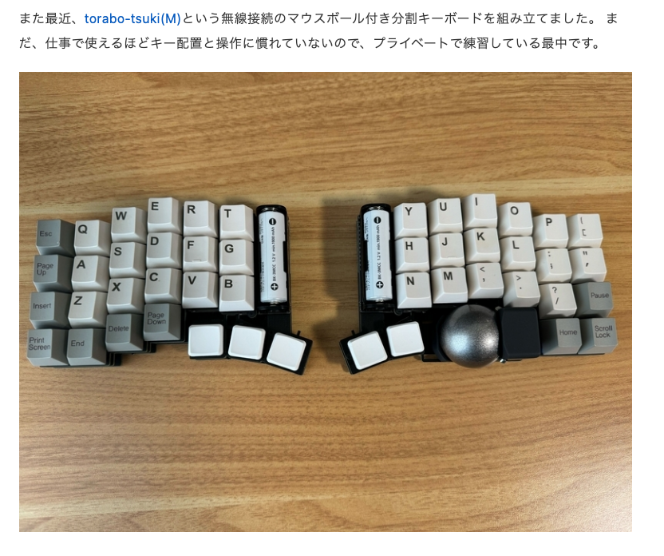
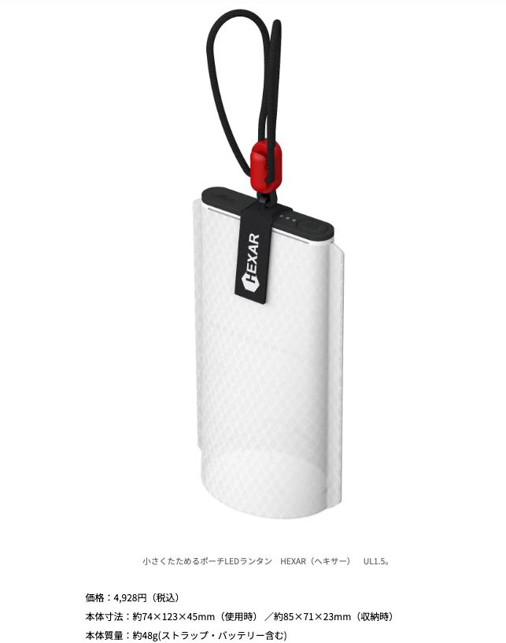

# 雑感

# 生活

- [最近買ったバイク用品等のレビュー(インプレッション)](https://kojintekibikematomeblog.com/archives/%e6%9c%80%e8%bf%91%e8%b2%b7%e3%81%a3%e3%81%9f%e3%83%90%e3%82%a4%e3%82%af%e7%94%a8%e5%93%81%e7%ad%89%e3%81%ae%e3%83%ac%e3%83%93%e3%83%a5%e3%83%bc%e3%82%a4%e3%83%b3%e3%83%97%e3%83%ac.html)  
  薄毛、気になるといえば気になる。発毛剤と育毛剤は処方される場所も違うらしい。毛髪にコストがかけられるのか。
- [AIを力に都知事選に挑んだ安野貴博さん　「GitHub」の実験で得た「デジタル民主主義」への手応え](https://www.tokyo-np.co.jp/article/340005)  
  意見の収集や反映をAIで処理して、マニュフェストをGitで管理したという。この人ちょっと面白いですよね。すごいなぁ。

# 仕事

# 趣味

## デザイン
## 読書

## 制作

- [「サードパーティークッキー」～マンガでプログラミング用語解説](https://codezine.jp/article/detail/19498?p=5)  
  > 「サードパーティークッキー」（third party cookie）は、アクセスしたWebサイトとは、異なるドメインから発行されたクッキーのことです。サードパーティーは第三者を意味します。  サードパーティークッキーは、Webページに埋め込まれている広告などの配信元から発行されることが多いです。広告配信サイトでは、このサードパーティークッキーを利用して、個人を特定して追跡することが可能でした。

## ガジェット

- [俺に骨伝導イヤホンの質問するならこれ読んで](https://honeshabri.hatenablog.com/entry/bone-conduction)  
  おおむね同じ意見。自分はつけ続けると耳の裏が痛くなるタイプ。寝たり、もたれたりするために短いタイプが欲しい。
- [【エンジニアの日常】エンジニア達の自慢の作業環境を大公開 Part5](https://tech.findy.co.jp/entry/2024/07/16/083000)  
  
  トラックボール付きのキーボードが欲しい。どれも見ている感じドラッグとかの操作に難がありそうなんだよな。そして概して高い。ううむ。  
  [torabo-tsuki(トラボ付き)はトラックボール付きの無線分割キーボードキットです。](https://github.com/sekigon-gonnoc/torabo-tsuki?tab=readme-ov-file)
## アウトドア
- [重量はたった48gで小さい！最長120時間点灯できる手のひらサイズのポーチランタンが気になるっ](https://www.bepal.net/archives/443516)  
  

## 展覧会

## お勉強

## 豆知識

- [3億8500万年前の世界最古の森の化石が発見される](https://karapaia.com/archives/52328571.html)  
  現代の木の形のアーキタイプのような種類の化石（アーケオプテリス）が見つかったらしい。その昔、木は無敵で何者にも分解されなかったらしい。

# お金儲け

- [トランプ氏暗殺未遂、ドル金利は上がるか？～0.5％利下げ織り込みも](http://hiroko.yutaka-shoji.co.jp/2024/07/05.html)  
  まじでびっくりした。これでほぼトラだと見る向きがさらに増えた。
  - 15日（月）
    - 海の日祝日で東京市場は休場
    - 中国GDP（第2四半期）
    - 中国小売売上高・鉱工業生産（6月）
    - 中国新築住宅価格・中古住宅価格・不動産投資（6月）
    - 中国中期貸出制度（MLF）1年物金利
    - 米NY連銀製造業景気指数（7月）
    - 中国共産党第20期中央委員会第3回総会（3中総会、18日まで）
    - 米共和党全国大会（激戦州ウィスコンシン州ミルウォーキー、18日まで）
  - 16日（火）
    - 日銀議事録（2014年1月-6月開催分）
    - ECB四半期銀行貸出調査
    - カナダ消費者物価指数（6月）
    - 米小売売上高（6月）
  - 17日（水）
    - NZ消費者物価指数（第2四半期）
    - 英消費者物価指数・生産者物価指数・小売物価指数（6月）
    - 米地区連銀経済報告（ベージュブック）
    - ウォラーFRB理事、カンザスシティ連銀主催イベントで経済見通しについて講演
  - 18日（木）
    - 豪雇用統計（6月）
    - 英週平均賃金（5月）
    - ECB政策金利、ラガルドECB総裁 記者会見
    - 米フィラデルフィア連銀景気指数（7月）
  - 19日（金）
    - 日本消費者物価指数（6月）
    - ECB専門家予測調査