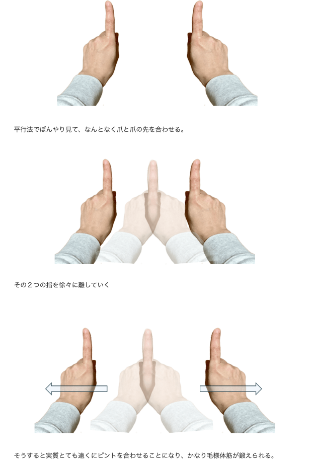

# 雑感

# 生活

- [「助けて尻の穴壊れる」世界中で発生のブルースクリーンが最悪のタイミングで起きてしまった話](https://togetter.com/li/2404516)  
  週末にあったクラウドのセキュリティソフトが発端のシステムトラブルで、ウォシュレットが止まったらしい。
- [学校からの注意喚起、いまむかし――料理と食を通して日常を考察するエッセイ「とりあえずお湯わかせ」柚木麻子](https://nhkbook-hiraku.com/n/n37c93ba60fbd)  
  なんかあったかなぁ。子供の頃、柳ヶ瀬は悪の巣窟だと教えられた。飴の包み紙で全校集会。妊娠した同級生が音もなく退学する。人の話を聞いていないな。
- [エンジニアを10年以上やって視力2.0を保つ秘訣](https://zenn.dev/sutefu23/articles/a975c7eeead980)  
  
  立体視を練習すべしらしい。画像のは寄り目でできた。
- [増えるパーキンソン病、謎多き原因や治療法についに進展続々](https://natgeo.nikkeibp.co.jp/atcl/news/24/071700379/?P=3)  
  原因になってるっぽいタンパク質が見つかったのだとか。治るようになるといいなぁ。
- [脳は経験するできごとの数で時間を認識する](https://www.gizmodo.jp/2024/07/brain-study-suggests-we-perceive-time-through-activities-not-by-minutes-or-hours.html)  
  脳は時間の前後を認識できないって聞いたことあるけど、量で確認していたのね。たしかに、永遠のように感じる時間は忙しい。
- [AIを開発するために必要なデータが急速に枯渇、たった1年で高品質データの4分の1が使用不可に](https://gigazine.net/news/20240723-ai-data-restrictions/)  
  ジャンクなデータが混じったせいかと思ったけど、ロボット避けが急速に増えているらしい。
- [オンライン受診→処方薬が受け取れる。｢Amazonファーマシー｣がスタート](https://www.gizmodo.jp/2024/07/amazon-pharmacy-1.html)  
  未来に向けた物流のインフラさえ整えば、地方の暮らしに安心できる材料の一つになるのかもしれない。本当は国内の企業にやってほしいけど。
- [スピリチュアル教祖は過疎地の買い物難民を救えない](https://blog.tinect.jp/?p=87140)  
  世の中にはかくもすごい人がいるんですね。地方在住だからあまり他人ごとに思えない。
- [20～30代が将来「認知症」にならないためにやるべき6つのこと](https://gigazine.net/news/20240725-six-ways-brain-health-dementia/#goog_rewarded)  
  脳をよく使おう（学んだりひとと関わったり）・体を大事にしよう。

# 仕事

- [バッチファイルでzip圧縮する（PowerShellを使用）](https://qiita.com/koiwaiwaiko/items/516c55bf4f8aeade5eb7)  
  Macでもそういうのあるんかな。できそうなもんだけど。

# 趣味

## デザイン

## 読書

- [中谷宇吉郎の名言「雪の結晶は、天から送られた手紙である」【本と名言365】](https://casabrutus.com/categories/culture/415815)  
  どみとりーともきんすのあのコマが眼に浮かぶなぁ。
- [武田百合子の名言「おべんと御飯か、 猫御飯であれば、私は嬉しい。 そこに…」【本と名言365】](https://casabrutus.com/categories/culture/416653)  
  たぶん、好きなタイプの本。「ことばの食卓」。
- [2000年前のキケロ「老年論」に驚かされるばかりだった。](https://blog.tinect.jp/?p=87163)  
  [『情報の歴史』はおもしろいんだよ](https://goldhead.hatenablog.com/entry/2024/07/25/131002)  
  どちらも面白そう。どこかに「人生の短さについて」があると思うけど、古典ってすげぇよな。なんか読んでみようかな。
## 制作

- [CSSのコンテナースタイルクエリーstyle()の使い方](https://ics.media/entry/240723/)  
  コンテナクエリ+CSS変数でいろいろできそう。
- [別タブへのリンク記述`「target=”_blank”とrel=”noopener noreferrer”」`の見直しを](https://cinci.jp/blog/20240723-review-target-blank-noopener-noreferrer-practices)  
  外部サイトに繋げるときは場合によっては使いましょう、内部リンクでは基本的には不要らしい。
- [Webサイトを使いやすく改善する、知っておくと便利なCSSのテクニック](https://coliss.com/articles/build-websites/operation/css/css-one-liners-for-almost-every-project.html)  
    -  ビューポート内のコンテンツの幅を制限する  
       `body {  max-width: clamp(320px, 90%, 1000px);margin: auto; /* より良いエクスペリエンスのための追加分 */}`
    -  テキストのサイズを大きくする
    - 行間のスペースを広げる
    -  画像のサイズを制限する  
      `img {  max-width: 100%;}`
    -  コンテンツ内のテキストの幅を制限する  
      `p {  max-width: 65ch;}`
    -  見出しをよりバランスよくする  
      `h1, h2, h3, h4, h5, h6 {  text-wrap: balance;}`
    -  ページスタイルに合わせたフォームのカラー  
      `body {  accent-color: #080; /* 好きなカラーに変更してください */}`
    -  テーブルの表を分かりやすくする  
      `:is(tbody, table) > tr:nth-child(odd) {  background: #0001; /* ダークテーマなら#fff1がお勧め */}`
    -  テーブルのセルとヘッダのスペース
    -  アニメーションと動きを減らす  
      `@media (prefers-reduced-motion) {*, *::before, *::after {animation-duration: 0s !important;transition: none !important; /* より良いエクスペリエンスのための追加分 */scroll-behavior: auto !important; /* より良いエクスペリエンスのための追加分 */}}`

## ガジェット

- [Appleのプロ用カメラアプリ、ターゲットはプロじゃないかも](https://www.gizmodo.jp/2024/07/apple_finalcutcamera_blackmagicamera.html)  
  Final Cut Cameraは無料らしい。普通のカメラみたいにいろいろ設定できるとか。

## アウトドア

## 展覧会

## お勉強

## 豆知識

- [深海の底で酸素の発生を確認、金属の塊が「暗黒酸素」を作り出していた](https://karapaia.com/archives/52333464.html)  
  海底資源を使ってしまうのってどうなん？っていう文脈で見たけど、たしかにそうだよなぁ。わからないことが多すぎるのだもの。
- [天敵から逃げるときに輪になって前転するヘビ見つかる](https://www.gizmodo.jp/2024/07/snake-rolls-forward-1.html)  
  自然界の車輪だ。山中先生！

# お金儲け
- [リスクオフ相場でドル円、更に下落となるか？～リスクオフでドル買い圧力も強い中](http://hiroko.yutaka-shoji.co.jp/2024/07/blog-post_22.html)  
  今週のテーマはリスクオフ、なので資源国通貨やコモディティ、株価などを眺めておくといいのかな。とはいえ、リスクオフのドル高・円高で下がりづらい面もあるとか。
  - 22日（月）  
    バイデン、出馬やめるってよ
    - 中国最優遇貸出金利（ローンプライムレート）
    - EU外相理事会
  - 23日（火）
    - トルコ中銀政策金利
  - 24日（水）  
    びっくり円高。日銀の利上げ観測記事が上がっているらしい。
    - 英製造業PMI・非製造業PMI速報値（7月）
    - ドイツ製造業PMI・非製造業PMI速報値（7月）
    - ユーロ圏製造業PMI・非製造業PMI速報値（7月）
    - 米製造業PMI・非製造業PMI速報値（7月）
    - カナダ中銀政策金利
  - 25日（木）  
    朝から夜までびっくり円高。米国指標の上振れで夜にドル高。方向感がわからない。来週火曜日が問題だろうか。
    - 月例経済報告（7月）
    - 米GDP速報値（第2四半期）予想＋1.9％（Q１は＋1.4％←速報値2.5％から修正）
      ～米GDPは好調さを維持する見込み=米第2四半期GDP
      https://fx.minkabu.jp/news/306291
    - 米個人消費（第2四半期）
    - G20財務相中央銀行総裁会議（ブラジル、26日まで）
  - 26日（金）
    - NZ小売売上高（6月）
    - 東京都消費者物価指数（7月）
    - ECB調査ユーロ圏インフレ期待（6月）
    - 米個人所得支出（6月）
    - 米個人消費支出（PCE）物価指数 （6月）
    - パリ五輪開幕 (8月11日まで)