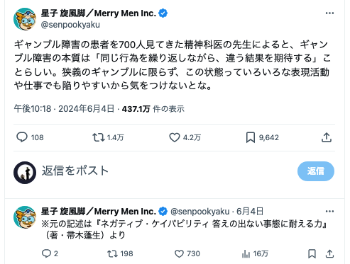

# 雑感

# 生活

- ギャンブル障害の本質は「同じ行為を繰り返しながら、違う結果を期待する」という点にあるという説もあるらしい（『ネガティブ・ケイパビリティ 答えの出ない事態に耐える力』（著・帚木蓬生）より）  
  
- [お墓は継承しない？　広がる樹木葬、「家」から「個」へ](https://www.nikkei.com/article/DGXZQOCD179YE0X10C24A7000000/)  
  普通のお墓の利用が2〜3程度らしい。墓参り、あんまり記憶にないけど世の中的にはどうなんだろうか・
- [戦場におけるストレスコントロール　（無料版１）](https://note.com/minase_ton_beri/n/naec1bd000ebe?sub_rt=share_sb)  
  7〜8時間の睡眠が大事らしい。
# 仕事

# 趣味

- [Amazonの「7980円の家庭用製麺機」は本当に使えるのか！？ プロと一緒に製麺してみた！](https://www.goodspress.jp/reports/616655/2/)  
  悪くないらしい。コツとしては趣味の製麺で見たような、グルテンを育てるような工程が大事らしい。

## デザイン

## 読書

## 制作

## ガジェット

- [かばんの中で熱くなったり、夜中に明るくなったりするのはゴメンだ。Windowsのスリープ復帰を抑制する設定あれこれ](https://pc.watch.impress.co.jp/docs/topic/feature/1613511.html)  
  BIOSの操作が必要らしい。Windowsメインじゃないけどメモ。

## アウトドア

- [カンガルースタイルのメリットは？今人気な理由からおすすめのテントまで紹介](https://www.bepal.net/archives/433897)  
  タープの下にテントを設置することをカンガルースタイルと呼ぶらしい。

## 展覧会

## お勉強

## 豆知識

# お金儲け

- [雇用統計悪化で米金利急低下、9月FOMC 0.5％利下げ確率急上昇](https://note.com/hiroko_lounge/n/ne0b98e678035)  
  日銀の利上げによって、日本株がどうなるのか（日銀の利上げについては意見が割れているように見える）  
  そもそも（日銀の利上げとは関係なく）ドル円は下落基調（円高貴重）になりつつある  
  米国は景気後退機入り濃厚  
  - 5日（月）
     - 日銀議事録（6月13日-14日開催分）8:50
     - 中国財新非製造業PMI（7月）
      - 米ISM非製造業景気指数（7月）23:00
     - FRB上級銀行融資担当者調査（SLOOS）
     - デイリー・サンフランシスコ連銀総裁、
     - 金融政策と経済について講演（質疑応答あり）
  - 6日（火）
     - 日本毎月勤労統計（実質賃金（6月）
     - 豪中銀政策金利・四半期経済予測　13:30
     - 英中銀資産購入ファシリティー（APF）四半期報告
  - 7日（水）
     - 外貨準備高（7月末）
     - 外国為替平衡操作実施状況（日次ベース）（4月-6月）
     - NZ雇用統計（第2四半期）
     - 中国貿易統計（7月）
     - カナダ中銀議事録（7月24日開催分）
  - 8日（木）
     - 日銀金融政策決定会合「主な意見」（7月30日-31日開催分）8:50
     - NZ中銀インフレ予想（第3四半期）
     - ブロック豪中銀総裁、講演
  - 9日（金）
     - 中国消費者物価指数・生産者物価指数（7月）
     - カナダ雇用統計（7月）