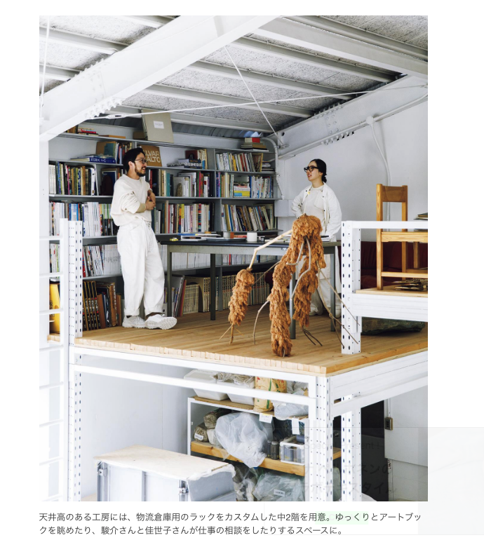

# 雑感

# 生活

- [人生は限りがあると意識する――「不安を味方にして生きる」清水研　#25[死を味方にして生きる]](https://nhkbook-hiraku.com/n/nb8206caef113)  
  大事な思い出を腹に抱えて生きていこうな。誰だってこれでよかったのか、という思いで死んでいくのかな。
- [乳酸飲料は家でつくれる](https://dailyportalz.jp/kiji/homemade-sour-milk-beverage/page/2)  
  牛乳と大量の砂糖、乳酸とエッセンス、クエン酸でできるらしい。ちょっとやってみたい。
- [老化しない動物、ハダカデバネズミの謎。](https://www.1101.com/n/s/oitoshi_nakedmolerat/index.html)  
  おもしろいなぁ。なんかの本で人を見にくい生き物に品種改良するための材料に選ばれてなかったっけ。あんまりひどいことは考えるものじゃないですね（自分がね）。
- [低感情社会、皆がニコニコしていなければならない社会](https://p-shirokuma.hatenadiary.com/entry/20240903/1725360174)  
  感情の表出を忌む気持ちはあるかも。そもそもある出来事に対して負を感じることをやめたいと思っているのかも。こういう状況ってますます進んでいくのかなぁ。
- [「一晩寝たら解決策が浮かぶ」という現象のメカニズムが一部解明される、脳は睡眠中に1日の出来事を1秒未満に圧縮して整理している](https://gigazine.net/news/20240903-sleep-brain-process/)  
  まるで生成AIじゃないか。すごいなぁ。
- [プロの研究者によるレベル1000のデイリーポータルＺ～「みんなの民俗学 ヴァナキュラーってなんだ？」](https://dailyportalz.jp/kiji/book-review-kodai01)  
  文化人類医学と民俗学は起こりが違うものらしい。「日本随筆大成」も面白そう。
- [店を傾ける経営者に共通しているのが「数字が苦手で、会計に無知」](https://blog.tinect.jp/?p=87542)  
  家計も同じようなものだよな。一人暮らしの生活費の収支と将来のゴールからの逆算みたいな。
- [北口榛花さん実践｢うつ伏せ｣は最強の疲れ解消法](https://toyokeizai.net/articles/-/822432?page=5)  
  背筋を伸ばして座って、腰を前に押し出す。うつ伏せで寝て足をおしりにつける。
- [オンライン詐欺の最新手口17種とその対策をまとめてチェック](https://internet.watch.impress.co.jp/docs/column/dlis/1621274.html)  
  ちんこでものを考えないように気をつけよう。あとよくをかかない。
# 仕事

- [ウェブアクセシビリティ方針まとめ](https://masizime.com/accessibility-summary/)  
  どういう方針で、どこまで対応するか（例えば外部システムから出力される内容は適用しないとか、pdfは無視するとか）が掲載されているページがまとめられている。
- [「我が社がサイバー攻撃の被害に！」なときに使えるコミュニケーションのコツ集　IPAが公開](https://www.itmedia.co.jp/news/articles/2409/03/news154.html)  
  考えただけでぞっとするなぁ。これを乗り越えられるのはすごいな。

# 趣味

## デザイン

- [やきもののまち東美濃が舞台『ART in MINO』が10月から開催。安藤雅信、アオイヤマダら参加](https://www.cinra.net/article/202409-whn-artinmino_edteam)  
  暇だったら見に行ってみようか。なにもわからない気がする。
- [【あの人の仕事場から学ぶインテリア / Case04】自分らしさを貫くDIYリノベでこだわり空間に](https://casabrutus.com/categories/design/414393)  
    物流用のラックなら、確かに丈夫だな。なるほど。  
      

## 読書

## 制作

- [Table内の3点リーダーってどういう仕組み？max-width: 0ってﾄﾞﾕｺﾄ？](https://qiita.com/kd_rn/items/d66519d4a0c99f846ef0)  
  `display: table-cell`の影響下に限り、`max-width: 0;`がカラムの幅よりコンテンツが大きいか小さいかの判定に使用できる（？）とはいえ、テーブルの表示で`text-overfllow: ellipsis`が必要な場合ってなんだろう？
- [JavaScriptで実現するFLIPアニメーションの原理と基礎](https://ics.media/entry/240902/)  
  基本的には今やってることと変わらなさそう。適用されているCSSを取得して、編集するらしい。
- [Chrome DevToolsを使いこなしてフロントエンド開発を加速させる](https://zenn.dev/praha/articles/1b5097407ee6b4)  
    知らなかったやつ抜粋。
    - 特定のノードのスクリーンショットをキャプチャする（右クリックでできるらしい）
    - CSSアニメーションをスロー再生する
    - ページのCSSの改善点を教えてもらう（ミートボールメニュー > More tools > CSS overview）
## ガジェット

- [ホンダ｢N-VAN e:｣電動化で激変した走りに驚愕](https://toyokeizai.net/articles/-/821067?page=7)  
  充電設備の課題さえクリアできれば、ひじょーに魅力的ですなぁ。
## アウトドア

- [トイレの処理は？シャワーはどうしてる？ちょっと大きなヨーロッパ製キャンピングカーの水回りと給排水事情](https://www.bepal.net/archives/462224)  
  ヨーロッパにおいては給排水に答えてくれる施設があるらしい。
- [イカを岸から釣れる！伝統のルアーフィッシング「エギング」の魅力を語ってみた](https://www.bepal.net/archives/457927)  
  はえ〜。つったいかが墨を吐いたら、洗い流すこと。
## 展覧会

## お勉強

## 豆知識

# お金儲け

- [死ぬまで減らない「不老不死」の金融資産の作り方](https://www.nikkei.com/article/DGXZQOUB269A00W4A820C2000000/?n_cid=SNSTW005)  
  2000万、年利4%でも、年間80万か。げんじつぅ。