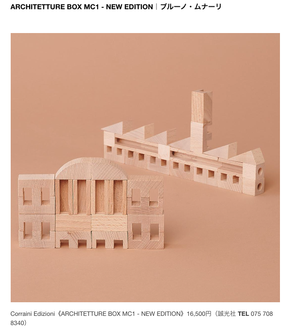

# 雑感

# 生活

- [断熱対策のポイントは“サッシ枠”にあり。夏も冬も活躍する「ワクピタテープ」が地味にスゴい](https://www.goodspress.jp/news/626567/2/)  
  毎年見送るけど、今年はやってみようかな。どうだろう。
- [『ドカ食いダイスキ！もちづきさん』から始める歯切れの悪い意見](https://p-shirokuma.hatenadiary.com/entry/20240916/1726482473)  
  明確に白黒を分けることを、クリアカットというらしい。レッテル張りで理解を浅くしてしまうのは、たしかに貧しい。答えを出しきれないものを、そのまま抱えておけるようになりたい。  
  > 歯切れの悪い話は、歯切れの悪いままで抱えておきませんか。簡単に決めつけず、結論を急がずに。
# 仕事

- [エンジニアとして働く中で気づけた大切だと思うこと](https://qiita.com/YOS0602/items/916ce3a05336d94e1644)  
  最近知ったかをしてしまっている気がする。気をつけたい。
  - 感謝を忘れない
  - 否定は柔らかく表現する
  - 他人も物事も知った気にならない
  - ネガティブなこともポジティブに捉える
  - 呼ばれてないのに飛び出さない
  - 自己主張の前に一瞬考える
  - 定期的に内省する
  - イライラしても言葉に出さない
  - 全部自分でやらない
  - こころとからだの健康が何よりも大切
  - 人の話をちゃんと聞く
  - ひとつのことだけに集中する
  - 継続できる学び方を見つける

# 趣味

## デザイン

- [坂茂へのインタビュー動画。高松宮殿下記念世界文化賞の受賞を記念して2024年9月に公式で公開されたもの](https://architecturephoto.net/215643/)  
  - 大工になりたかったらしい
  - FAXなどの紙管が捨てられなかったのがきっかけらしい
  - フラーとフライオットーが好きらしい（時流に乗らない、独自のスタイルがある建築家）
  - 独自の構造やシステムを求めていた結果紙管の建築にたどり着いたのだとか
  - これが災害や戦争の被災者の支援にならないかと考えた
  - 仮設住宅から本設に耐えられる住宅になっていくべきと考えた
  - 弱い材料・制限がある材料に興味がある
    - 制約のなかで、その中でしかできないものを作りたい
- [遊びの天才、ブルーノ・ムナーリの積み木【今日の逸品】](https://casabrutus.com/categories/design/421922)  
  
  いいですね。かわいらしい。

## 読書

## 制作

- [role 属性とは、aria-* 属性とは、WAI-ARIA とは、いったい何なのか、いつ使うべきなのか](https://qiita.com/ymrl/items/6c9c059208ea11e6d7bc)  
  まず、セマンティックにhtmlをかけるようになろうだな。
  - HTMLのネイティブの機能だけではアクセシブルにできないとき  
    SVGの埋め込みとかが該当するらしい
  - HTMLの標準の仕様では実現できない・実現が難しいことをやろうとしているとき
  - コードに大きな変更を加えづらい状況で、少しでもアクセシビリティを高めようとしているとき
  - いずれの場合も、支援技術での確認が必要

## ガジェット

- [Macがスリープ中にバッテリーが爆減りしだしたので解決するためにした事](https://zenn.dev/yamasaw/articles/de6c37f7b68e61)  
  スリープモードにモードがあるみたいで、それを変更してあげると改善されるかもらしい。下記は記事を参考にして自分が施した設定。
  - `sudo pmset -a hibernatemode 25`
  - `sudo pmset -a standbydelayhigh 600 standbydelaylow 600`

## アウトドア

## 展覧会

## お勉強

## 豆知識

# お金儲け
