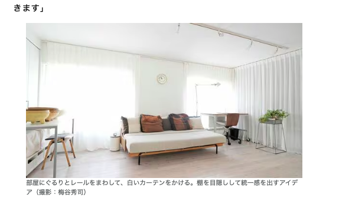

# 雑感

# 生活

- [ベアフットシューズのおすすめ7選！使用シーンと活用方法を紹介](https://www.bepal.net/archives/460260)  
  くつを買い替えたい気持ちが出てきているのだけど、こういう靴がいいのかもしれない。
- [60代半ば､都心から郊外へ｢美学ある｣団地暮らし](https://toyokeizai.net/articles/-/827481?page=5)  
  カーテンを回すってのがええな。
  

# 仕事

# 趣味

## デザイン

## 読書

- [うっかり通勤電車の中で読んでしまい、涙がとまらない　内堀弘『ボン書店の幻』](http://blog.livedoor.jp/tokinowasuremono/archives/53549268.html)  
  ちょっと読んでみたくはあるな。図書館にいくのは夜の方がいいか。

## 制作

- [スタイルをカスタマイズ可能な新しい `<select>` 要素](https://azukiazusa.dev/blog/customizable-select-element/)  
  まだ広範には適用されるものではないとか。つかえたら便利なのかな。
- [私がマージンをできるだけ使いたくない理由](https://qiita.com/kentosity/items/2c338ef259946ff4d8ae)  
  これは確かにそう思う。レイアウトは親要素で何とかしたい。
## ガジェット

## アウトドア

## 展覧会

## お勉強

## 豆知識

# お金儲け
