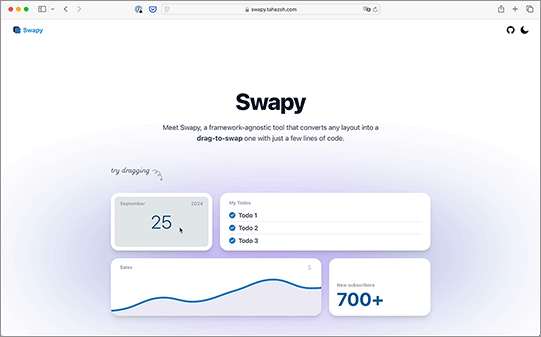

# 生活

- [ベアフットシューズのおすすめ7選！使用シーンと活用方法を紹介](https://www.bepal.net/archives/460260)  
  くつを買い替えたい気持ちが出てきているのだけど、こういう靴がいいのかもしれない。
- [60代半ば､都心から郊外へ｢美学ある｣団地暮らし](https://toyokeizai.net/articles/-/827481?page=5)  
  カーテンを回すってのがええな。
  
- [実年齢は35歳だけど人生経験の少なさと精神的な幼さが35歳のソレじゃなくて辛い→RPGみたく経験値を積んだら年齢が上がっていくシステムならいいのに](https://togetter.com/li/2438773)  
  ワイの悪口はやめて欲しい。  
  
- [ロールモデル不在のなかで、私たちはどう年を取っていくべきか](https://blog.tinect.jp/?p=87716)  
  今の40〜50代のきつさが言葉になっている感じがする。これはしんどい。
- [会沢高圧、MITと住宅向け「蓄電コンクリート」実証へ](https://www.nikkei.com/article/DGXZQOUC2455J0U4A920C2000000/)  
  こういうニュースを見ていると、技術が日夜進歩しているのがわかる。がんばれ。教えてくれてありがとう。
- [「カチャカ」のエレベーター利用でビル内物流を効率化--三菱電機ビルソリューションズと実証](https://japan.cnet.com/article/35224367/)  
  この発想はなかった。ファイナルラストワンマイルだ。
- [高湿度な寒冷地向けの除湿機を調べた話｜鍵はデシカントと排水ホース](https://tabkul.com/?p=295928&utm_source=rss&utm_medium=rss&utm_campaign=post-295928)  
  調べるときは、類似する条件を設定するといい感じの情報に辿り着けるんですね。覚えておこう。
- [人は自分と違う意見を持つ人たちの考えを自信たっぷりに誤解していることが判明](https://karapaia.com/archives/456027.html)  
  わかった気にならない、は大事ですね。
- [汚染された湖を浄化する、廃棄物を利用した浮遊型湿地システム](https://wired.jp/article/sz-floating-wetlands-made-of-trash/)  
  生活排水の処理にこういうものができないかなと思っていたんだけど、実現できるんですね。ダンドル・サルビアを使っているらしい。
- [せっかく運動しても痩せなければ意味なしは「間違い」、定期的に運動すると脂肪が健康的なものになることが研究で判明](https://gigazine.net/news/20240929-long-term-exercisers-healthier-belly-fat/)  
  脂肪が貯まる場所がいい位置になるらしい（＝内臓脂肪の蓄積が抑えられる）。
- [ほぼ｢五公五民｣の国民負担率は本当に高いのか](https://toyokeizai.net/articles/-/829913?page=5)  
  たしかに、比べたことがないな。フランスが7割、アメリカが3割だとか。

# 仕事

- [開発効率化：半分の工数で作る工夫](https://baigie.me/nippo/2024/09/24/streamlining_sakai/)  
  うまく調教すると、画像を食わせてHTML/CSSを吐き出すAIが作れるのか。
  - AIの力を借りて初期構築を高速化
  - Tailwind CSSで爆速コーディング
  - ライブラリの活用でスライドショーを高速実装（splide）
  - デザインチェックの効率化
# 趣味

## デザイン

- [企画展「ゴミうんち展」会場風景／Exhibition view of "pooploop"](https://www.2121designsight.jp/documents/2024/09/pooploop-open.html)  
  これ面白そうだよな。われわれの生活にはまだまだ未利用の資源がある。

## 読書

- [うっかり通勤電車の中で読んでしまい、涙がとまらない　内堀弘『ボン書店の幻』](http://blog.livedoor.jp/tokinowasuremono/archives/53549268.html)  
  ちょっと読んでみたくはあるな。図書館にいくのは夜の方がいいか。
- [ないことにされたくないロスジェネ・オタク差別・web2.0の記憶](https://p-shirokuma.hatenadiary.com/entry/20240926/1727360153)  
  思い出せるように書いておく、撮っておく。他者のそういう記録に触れるのはおもしろいことだ。

## 制作

- [スタイルをカスタマイズ可能な新しい `<select>` 要素](https://azukiazusa.dev/blog/customizable-select-element/)  
  まだ広範には適用されるものではないとか。つかえたら便利なのかな。
- [私がマージンをできるだけ使いたくない理由](https://qiita.com/kentosity/items/2c338ef259946ff4d8ae)  
  これは確かにそう思う。レイアウトは親要素で何とかしたい。
- [これで簡単に実装できる！ カードやパネルをドラッグアンドドロップで移動できるレイアウトに変換するスクリプト -Swapy]()  
  
## ガジェット

- [しつこいWindows 11の「広告」表示を減らし、設定を見直そう](https://pc.watch.impress.co.jp/docs/topic/feature/1625458.html)  
  かなり鬱陶しいので、覚えておきたい。

## アウトドア

- [コットテントのおすすめ10選！コットテントの特徴や選び方も解説](https://www.bepal.net/archives/457863)  
  いまどき、いろんな製品があるんですね。ありがたい。
- [ハイキングや登山、低山ハイクでの疲労軽減以外にも活躍！トレッキングポールの種類と使い方](https://www.bepal.net/archives/465388)  
  
  なるほどなぁ。
- [2ステップで完成！ ポールを立てたい時に便利、15秒でできる巻き結び](https://www.goodspress.jp/reports/628499/2/)  
  - 【ステップ1】ロープをポールに1周させる
  - 【ステップ2】輪っかを作ってポールに巻きつける

## 展覧会

## お勉強

## 豆知識

# お金儲け
