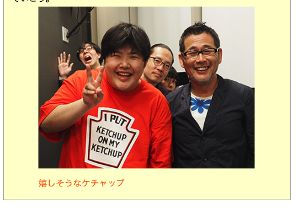
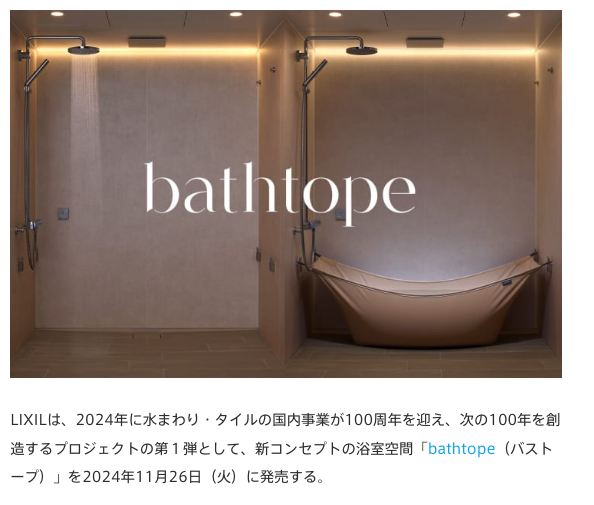
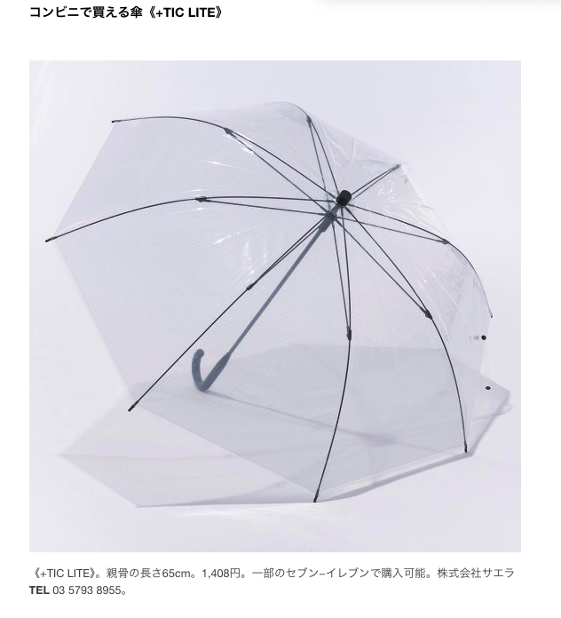
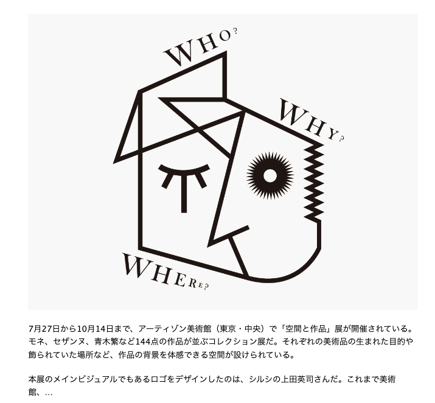
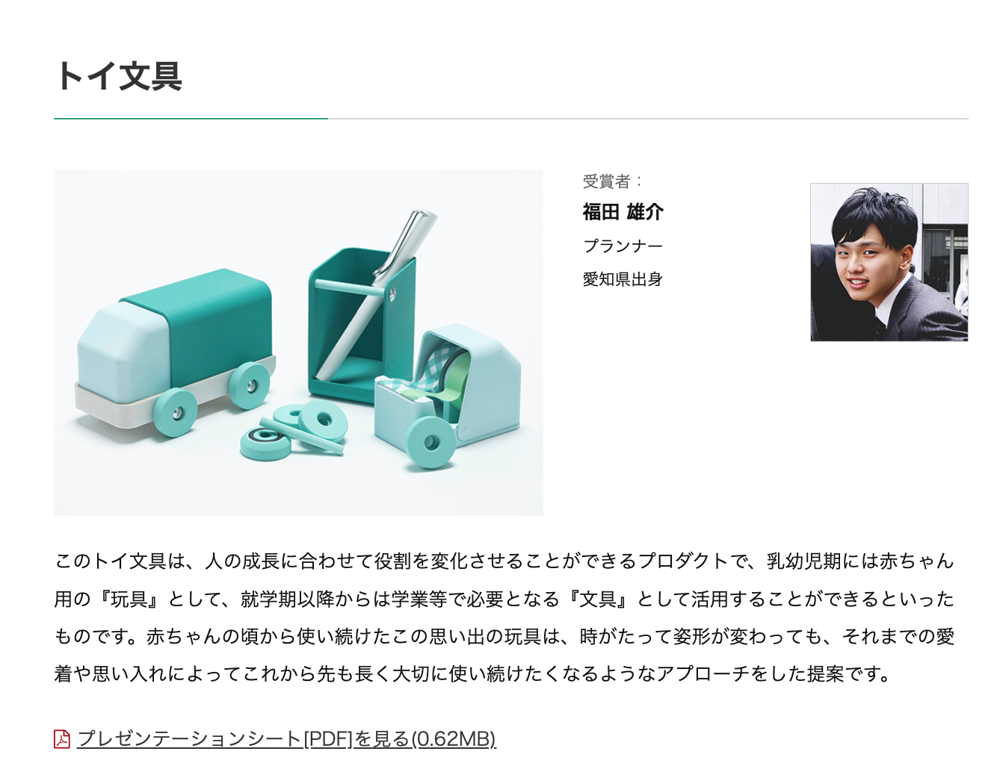

# 生活

- [熟年離婚で陥る｢老後破綻｣の知られざるリスク](https://toyokeizai.net/articles/-/830677?page=5)  
  やる前に、お金の話をちゃんとする、あとはちょっと離れて過ごしてみる、とか。
- [デイリーポータルZ 22年の軌跡](https://dailyportalz.jp/kiji/22years-history)  
  2000年代前半の濃厚さたるや。いがいとおぼえているなぁ・
  - [水曜どうでしょう藤村DがデイリーポータルZに再ツッコミ！～一体どういうおつもりですか？～](https://dailyportalz.jp/kiji/170622199963)  
  
  デイリーポータルZはタレント揃いだ。ここにおく気はなかったけど、最後の画像で笑ってしまった。
- [子どもが産まれて3Dプリンターをめっちゃ使うようになった話——「育治具」作りからキーボードケース販売まで](https://fabcross.jp/category/make/20241009_child_3dprinting.html)  
  自作キーボードの人だ。3Dプリンタ、リベンジしてみようかなぁ。
- [子どもが小さいころの独自の言葉を今でも親だけが使っている](https://dailyportalz.jp/kiji/kodomo-chiisai-koro-kotoba/page/2)  
  なんかあったかなぁ。愛らしい言葉の数々よ。
- [携帯番号に「060」が採用されるワケ　「電話番号とは何か」を歴史とともに振り返る](https://www.itmedia.co.jp/mobile/articles/2410/09/news148.html)  
  こういうのを読むと、NTTを民営化した理由が気になるな。半分公営みたいなもんらしいけど。
- [栄養ドリンク元祖｢赤まむしドリンク｣の現在](https://toyokeizai.net/articles/-/832161?page=4)  
  ちんぽに効く類の飲み物ではないらしい。昨日、みかけた。
- [被災地の被害状況をチェーン店が営業しているかどうかで判断する「ワッフル・ハウス指数」とは？](https://gigazine.net/news/20241010-waffle-house-index/)  
  ワッフルハウスというアメリカのチェーン店は災害に強い組織体制で運営されているので、その営業状況をみると災害被害の目安になるのだとか。営利師主義的に見えるけど、みんなハッピーだよな。
- [鳥貴族が買収｢謎の焼鳥チェーン｣人情派な儲け方](https://toyokeizai.net/articles/-/832448?page=6)  
  焼き鳥大吉は行ったことないのかな。面白いですね。全国区のチェーン店を10名で管理できる、運営体制を作ったのがすごいな。
- [宮崎にきたらそのへんのスーパーで鶏のたたきを買って食べて](https://dailyportalz.jp/kiji/tori-no-tataki-in-Miyazaki)  
  [地域限定！　宮崎の「鳥刺し」が美味しすぎる](https://dailyportalz.jp/kiji/miyazaki-torisashi01)  
  宮崎行きテェ。あんまり食べるのよくないんだろうけど、うまいんだよなぁ。
# 仕事

- [【映画感想】スオミの話をしよう ☆☆☆](https://fujipon.hatenadiary.com/entry/2024/10/10/084709)  
  映画館で観るべき映画ってなんだろうな。古き良き映画をやろうとした、という評価だったけど。何か映画を見に行こうか。

# 趣味

- [「ゼルダの伝説 知恵のかりもの」が面白すぎて自分がゲーマーだったことを思い出せた話](https://blog.tinect.jp/?p=87854)  
  なんだかおもしろそう。ゲームやりだすと止まらないから、あんまりやりたくない。やりたいけど。

## デザイン

- [畳んで収納できる、布製浴槽 LIXILのフレキシブルな浴室空間「bathtope」](https://www.axismag.jp/posts/2024/10/616886.html)  
  これちょっとゴイスーだよな。あまり使わなくなってカビる未来もみえるけど。
  
- [コンビニ傘の革命児！ グッドデザイン賞受賞の使い捨てない傘。【今日の逸品】](https://casabrutus.com/categories/fashion/424874)  
  昔、先生が高い傘を買うと大事にできる、という話をしていた。自分にとってはこれがそうで、長いこと愛用している。当時は1,000円くらいだったと思う。
  
- [「空間と作品」展 ロゴ](https://mag.sendenkaigi.com/brain/202411/editors-check/030725.php)  
  ロゴがいい感じ。キュビズムかなぁ。  
  
- [TOKYO MIDTOWN AWARD 2024 デザインコンペ結果発表](https://www.tokyo-midtown.com/jp/award/result/2024/design.html)  
  おもちゃになったり、文具になったりすることで、長い時間軸で、人との関係を築けるのだとか。なるほどなぁ。ただ、やっぱ傾向が変わった気もする。
  
    
## 読書

- [『東大ファッション論集中講義』が読みやすかった](https://p-shirokuma.hatenadiary.com/entry/20241003/1727965429)  
  シャネル的なものが女性を解放したみたいな話はなんとなく知っているけど、反面それが社会的規範への入り口になっているみたいな面とか、内面かされたコルセットとか、ちょっと面白そう。ファッションは難しい。挨拶みたいなものか。

## 制作

- [詐欺が横行している](https://ideasilo.wordpress.com/2024/10/07/%E8%A9%90%E6%AC%BA%E3%81%8C%E6%A8%AA%E8%A1%8C%E3%81%97%E3%81%A6%E3%81%84%E3%82%8B/)  
  WordPressで揉めている件、中の方の人からこういう意見があった。オープンソースのコミュニティに対するリスペクトを忘れないでいたい。

## ガジェット

- [ユニット化して別荘と軽キャンで使うFFヒーター「LVYUAN ZM-AIR D5」注文、燃費や使い方など準備編](https://tabkul.com/?p=296028&utm_source=rss&utm_medium=rss&utm_campaign=post-296028)  
  FFヒーターというものがあるらしい。多分つかわないけど、覚えておこう。

## アウトドア

## 展覧会

## お勉強

## 豆知識

- [V12をトヨタ・センチュリーに載せたエンジニアたちの意地はどこからきている？ その2【清水×高平のエンジンどうでしょう】](https://motor-fan.jp/mf/article/264363/)  
  なんにもわからんけど、くっそ面白い。v12は夢だった。コンプレックスだった。
- [イルカは遊び相手に笑顔を浮かべ、仲間もそれに笑顔を返している (2/2)](https://nazology.kusuguru.co.jp/archives/162968/2)  
  犬やイルカは笑う。笑い合う。
- [海岸線の侵食を止める——帯電させた砂で「ナチュラルセメント」を開発](https://fabcross.jp/news/2024/20241008_fighting-coastal-erosion.html)  
  とんでもない技術だなぁ。すげえや。海辺に微弱電流を流すと、化学反応が起こり、炭酸カルシウムなどが形成され、それによって護岸できるかもという。しかも可逆的な変化だと。
- [子イヌはいつ何ができるようになるのか、科学が教えるしつけの鍵](https://natgeo.nikkeibp.co.jp/atcl/news/24/092600521/?P=1)  
  犬の発達心理学みたいな世界があるんですね。おもしろい。
# お金儲け
